# Contributing to Good Job Coop

Thanks for your interest! This project ships two implementations of the same
physics core — a Python / Plotly Dash web UI and a Rust / egui native desktop
app — so most changes need to land in both. This guide explains the
conventions that keep them in sync.

## Local setup

```bash
# Python (3.11+ recommended; tested on 3.14)
python -m venv .venv && source .venv/bin/activate
pip install -e ".[dev]"
pytest tests/ -q
python -m waytogocoop.app            # http://localhost:8050

# Rust (stable toolchain, cargo 1.70+)
cargo test                            # all crates
cargo run --release -p moire-desktop  # desktop app
```

## Repository layout

- `src/waytogocoop/` — Python package.
  - `computation/` — pure NumPy physics (moire, gap, FFT, magnetic, topological, isotope). No UI deps.
  - `components/` — reusable Dash components (`figure_factory`, `controls`, panels).
  - `pages/` — one module per URL route. `register_page()` at module load.
  - `assets/` — CSS auto-loaded by Dash (responsive breakpoints live here).
  - `state.py` — URL state sharing (`encode_state`, `decode_state`, `register_url_sync`).
  - `app.py` — Dash app factory.
- `crates/moire-core/` — Rust physics library (no UI deps, mirrors `computation/`).
- `crates/moire-desktop/` — egui/eframe desktop app.
  - `render/` — 2D and 3D rendering (software rasterizer, axes, colorbar, screenshot).
  - `ui/` — sidebar, viewport, menu bar, About dialog, info panel.
  - `app.rs` — `MoireApp` recompute-on-change state machine.
- `docs/images/` — screenshots referenced from README.

## Keeping Python ↔ Rust physics in sync

Both implementations compute the same physics. The rule is: any change to a
physics kernel must land in **both** stacks in the same PR, with tests on
each side exercising the same inputs. Both stacks already mirror their test
class/module structure (`tests/test_moire.py` ↔ `crates/moire-core/src/moire.rs` inline tests).

```mermaid
flowchart LR
    subgraph Shared
        API[Physics API<br/>Moire, Gap, FFT,<br/>Magnetic, Topological]
    end

    subgraph Python [Python stack]
        PC[computation/*.py]
        PT[tests/test_*.py]
    end

    subgraph Rust [Rust stack]
        RC[moire-core/src/*.rs]
        RT[inline #&#91;cfg&#40;test&#41;&#93; modules]
    end

    PC --- API
    RC --- API
    PT --- PC
    RT --- RC

    style API fill:#2c3e50,stroke:#5dade2,color:#fff
```



**Colormap convention** (must stay identical): `viridis` for unsigned scalars,
`coolwarm` / `RdBu_r` for signed gap modulation, `inferno` / `hot` for FFT
power spectra, `plasma` for susceptibility. See
`crates/moire-core/src/colormap.rs` and `src/waytogocoop/components/figure_factory.py`.

## Adding a new figure / tab

**Python** — add a builder function to `components/figure_factory.py`, then
wire it in the appropriate page under `pages/`. Builders should:

- Accept explicit x/y arrays in Å (or k-space arrays in 1/Å for FFT).
- Set `xaxis_title`, `yaxis_title` with unit symbols.
- Include a `hovertemplate` with unit-labelled fields.
- For real-space heatmaps: use `yaxis=dict(scaleanchor="x", scaleratio=1, constrain="domain")` for strict 1:1 aspect.
- Respect the `dark: bool` theme parameter.

**Rust** — add a new `Tab` variant in `app::Tab`, handle it in
`ui/viewport.rs::view_meta` (axis + colorbar metadata) and
`app::recompute` / `app::rerender_surface` (which texture to draw).

## Speculative vs established physics

Three subsystems use simplified or speculative models not directly validated
for TI / iron-chalcogenide heterostructures:

- Isotope effects on gap / coherence length
- Topological proximity & Majorana modes
- Abrikosov vortex lattice + Zeeman / Pauli limits

Figures produced by these subsystems carry a `(SPECULATIVE)` tag in the
title. Keep that tag when extending them, and mention the caveat in the page
or tab body if the user could mistake the output for a quantitative prediction.

## Presets & URL state

Presets live inside the page module (`_PRESETS` dict). For URL state sharing,
call `register_url_sync(url_id, bindings)` where each binding is
`(component_id, property, state_key)`. The viewer page's bindings are the
canonical reference.

`controls.open_in_viewer_button(page_id, bindings)` creates a cross-page
link that navigates to `/viewer?q=<base64>` with the current material pair.

## Testing

- Python: `pytest tests/ -q` — 200+ tests.
- Rust:   `cargo test` — 125 core + 11 desktop tests.
- Visual: run each app locally. For the Rust desktop, menu `Help → About`
  should open the dialog; Ctrl+S should write a PNG in cwd. For Dash,
  hovering any heatmap should show unit-labelled coordinates.

## Future work

- **wgpu 3D renderer** — the current 3D view uses a CPU-side software
  rasterizer (`render/surface3d.rs`) with per-face diffuse shading. A proper
  wgpu pipeline would land as a new module `render/gpu/` with
  `pipeline.rs` (WGSL shader), `mesh.rs` (buffer upload), `camera.rs`
  (view/projection matrices), integrated via `egui-wgpu`. Keep the current
  software path behind a `--features software-raster` flag for CI and
  headless tests.
- **CSV / JSON export** on data-heavy pages (Fourier peaks, parameter
  sweep). Pattern: add a dbc.Button that triggers a `dcc.Download` with the
  serialized dataset.
- **More URL-sync coverage** — `state.py` infrastructure is in place; only
  `moire_viewer` wires it today. Wire the remaining pages page-by-page so
  every control is shareable.

## Code style

- Python: `ruff check src/ tests/` must pass.
- Rust:   `cargo clippy --all-targets` and `cargo fmt` must pass.
- No emojis in code, comments, or figure titles unless they carry meaning
  (ℹ, ✓, ☾, ☀ are used in the Rust menu and are OK).
- Keep comments short: one line explaining *why*, not *what*.
