# Good Job Coop!

**Moire Engineering of Cooper-Pair Density Modulation States**

A visualization and computation tool for exploring moire-induced Cooper-pair density modulation in topological-insulator / iron-chalcogenide heterostructures, with magnetic field analysis (Abrikosov vortex lattices, Zeeman splitting, screening currents), topological surface-state physics (proximity-induced gap decay, Majorana zero modes, topological phase diagrams), and speculative isotope-engineering capabilities for precision moire tuning.

Two implementations are provided:
- **Python Web UI** (Plotly Dash) -- accessible via browser on any platform
- **Rust Native App** (egui/eframe) -- native desktop for Linux, macOS, and Windows

Based on [Moire Engineering of Cooper-Pair Density Modulation States](https://arxiv.org/abs/2602.22637) (Wang, Xia, Paolini et al., 2026).

---

## Quick Start

```bash
# Python web UI (http://localhost:8050)
python -m venv .venv && source .venv/bin/activate
pip install -e ".[dev]"
python -m waytogocoop.app

# Rust native desktop (on any platform with a cargo toolchain)
cargo run --release -p moire-desktop
```

Once the Python app is running, the **Moire Viewer** at `/viewer` is the best entry point — pick a substrate/overlayer pair from the preset dropdown ("Sb₂Te₃ / FeTe (paper default)" is a good start) and adjust the twist angle to see the moire period shrink. Hover any heatmap for unit-labelled `(x Å, y Å, value)` readouts. Click **Open in Moire Viewer** on the Fourier page to re-load the same material pair in real space.

The Rust desktop app uses the same physics core. Menu bar: **File → Save screenshot** (Ctrl+S), **Edit → Reset parameters** (Ctrl+R), **View → Reset 3D camera** (R), **Toggle wireframe** (W). **F1** opens the About dialog with the arxiv link.

### Screenshots

Screenshots are kept in [`docs/images/`](docs/images/). Capture new ones with Ctrl+S from the Rust app or Plotly's camera button in the Python app.

- **Moire Viewer (Python)** — real-space pattern with hover readouts and 3D surface toggle.
- **Fourier Analysis (Python)** — FFT log₁₀(|F|²) colorbar and clickable peaks table.
- **Proximity 3D (Python)** — volumetric isosurface annotated with the z=0 interface plane and the ξ_prox decay length.
- **Rust Desktop 2D** — pattern with axis ticks and a vertical colorbar.
- **Rust Desktop 3D** — shaded surface with optional wireframe and world axes.

---

## What This Software Does

Good Job Coop analyzes how superconducting states are spatially modulated when a thin topological insulator film is grown on an iron-chalcogenide substrate. The lattice mismatch between the two layers creates a moire superlattice -- a long-wavelength interference pattern -- that imprints a periodic variation onto the superconducting Cooper-pair density. This tool lets you predict, visualize, and explore those modulations for different material combinations.

In practice, you select a substrate and an overlayer material, optionally set a twist angle, and the software computes:

1. **The moire superlattice geometry** -- real-space interference pattern from the two overlaid crystal lattices
2. **The moire periodicity** -- the characteristic wavelength of the emerging pattern
3. **The Cooper-pair density modulation (CPDM)** -- how the superconducting gap varies spatially across the moire unit cell
4. **The Fourier spectrum** -- reciprocal-space analysis revealing the dominant modulation wavevectors
5. **Speculative isotope effects** -- how isotopic enrichment of substrate or overlayer elements shifts the superconducting gap, lattice constant, coherence length, and Debye-Waller contrast
6. **Magnetic field analysis** -- Abrikosov vortex lattice generation in perpendicular fields, vortex-core gap suppression via Ginzburg-Landau profiles, Meissner screening currents, Zeeman splitting and Pauli paramagnetic limiting from in-plane fields, and speculative moire-vortex lattice beating
7. **Topological proximity effects** -- 3D extension of the proximity-induced superconducting gap into the topological insulator via BTK interface transparency, with volumetric isosurface and z-slice visualization
8. **Topological phase diagrams** -- Fu-Kane criterion for topological-trivial transitions as a function of Zeeman energy and gap magnitude, Chern number estimates, and speculative Majorana zero-mode probability densities localized at vortex cores

Results are displayed as interactive heatmaps, line plots, 3D isosurfaces, quiver plots, phase diagrams, and parameter sweeps that update in real time as you adjust material parameters.

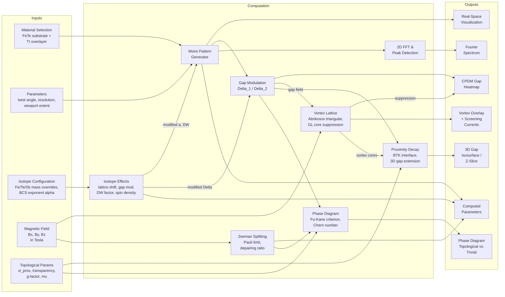

### Concrete Examples by Substrate Combination

All examples below use FeTe (a = 3.82 angstrom, square lattice) as the substrate, which is the superconducting platform in each heterostructure.

#### Sb2Te3 / FeTe -- the primary system

- **Overlayer**: Sb2Te3 (a = 4.264 angstrom, hexagonal)
- **Lattice mismatch**: 11.6%
- **Moire periodicity**: ~36.7 angstrom (~3.7 nm)
- **Observed CPDM**: Two superconducting gaps (Delta_1 ~ 2.58 meV, Delta_2 ~ 3.60 meV) both modulated at the moire wavelength. This is the strongest CPDM signal among the studied systems.
- **Use case**: Baseline configuration. Select "Sb2Te3" as overlayer and "FeTe" as substrate with zero twist angle to reproduce the moire pattern observed in STM experiments. Use the parameter sweep to explore how small twist angles would change the periodicity, or the Fourier page to identify the moire reciprocal lattice vectors.

#### Bi2Te3 / FeTe -- tuned for longer periodicity

- **Overlayer**: Bi2Te3 (a = 4.386 angstrom, hexagonal)
- **Lattice mismatch**: 14.8%
- **Moire periodicity**: ~29.6 angstrom (~3.0 nm)
- **Observed CPDM**: Weaker modulation amplitude than Sb2Te3/FeTe, demonstrating that CPDM strength can be tuned by swapping the overlayer material. The shorter moire period relative to the superconducting coherence length reduces the modulation depth.
- **Use case**: Compare side-by-side with Sb2Te3/FeTe to see how a larger lattice mismatch shrinks the moire period and weakens the density modulation. The parameter sweep page is particularly useful here -- sweep the overlayer lattice constant from 4.26 to 4.39 angstrom to see the continuous transition between the two systems.

#### Sb2Te / FeTe -- intermediate variant

- **Overlayer**: Sb2Te (a = 4.272 angstrom, hexagonal)
- **Lattice mismatch**: 11.8%
- **Moire periodicity**: ~36.1 angstrom (~3.6 nm)
- **Expected CPDM**: Very close to the Sb2Te3/FeTe system due to the nearly identical lattice constant (4.272 vs. 4.264 angstrom). The slightly larger mismatch yields a marginally shorter moire period.
- **Use case**: Explore the sensitivity of the moire pattern to small changes in overlayer lattice constant. Switching between Sb2Te3 and Sb2Te in the viewer shows how a 0.008 angstrom change in the overlayer spacing shifts the moire periodicity by ~0.6 angstrom -- a demonstration of the fine tunability available through material selection.

#### Custom configurations

Beyond the built-in presets, both the web UI and desktop app allow you to override any lattice constant with a custom value. This enables exploration of hypothetical or strained heterostructures, for example:

- **Strained Sb2Te3**: Set the Sb2Te3 lattice constant to 4.10 angstrom (compressive strain) to see how the moire period increases to ~55.7 angstrom as the mismatch shrinks.
- **Twist-angle engineering**: Apply a 2-degree twist to the Sb2Te3/FeTe system and observe the moire pattern transition from a pure-mismatch regime to a twist-dominated regime where L ~ a/theta.
- **Matched lattices**: Set both layers to the same lattice constant to verify that the moire pattern vanishes (infinite periodicity), confirming the mismatch-driven origin.

---

## Table of Contents

- [What This Software Does](#what-this-software-does)
  - [Concrete Examples by Substrate Combination](#concrete-examples-by-substrate-combination)
- [Theory Background](#theory-background)
  - [Moire Patterns in Crystal Lattices](#moire-patterns-in-crystal-lattices)
  - [Cooper Pairs and Superconductivity](#cooper-pairs-and-superconductivity)
  - [Cooper-Pair Density Modulation](#cooper-pair-density-modulation-cpdm)
  - [Moire Engineering of CPDM States](#moire-engineering-of-cpdm-states)
  - [Materials](#materials)
  - [Key Equations](#key-equations)
- [Magnetic Field Analysis](#magnetic-field-analysis)
  - [Abrikosov Vortex Lattice](#abrikosov-vortex-lattice)
  - [Vortex-Core Gap Suppression](#vortex-core-gap-suppression)
  - [Zeeman Splitting and Pauli Limiting](#zeeman-splitting-and-pauli-limiting)
  - [Meissner Screening Currents](#meissner-screening-currents)
  - [Speculative: Moire-Vortex Lattice Interaction](#speculative-moire-vortex-lattice-interaction)
- [Topological Surface State Physics](#topological-surface-state-physics)
  - [Proximity-Induced Superconductivity](#proximity-induced-superconductivity)
  - [3D Cooper-Pair Density](#3d-cooper-pair-density)
  - [Speculative: Majorana Zero Modes](#speculative-majorana-zero-modes)
  - [Speculative: Topological Phase Diagrams](#speculative-topological-phase-diagrams)
- [Speculative Isotope Engineering](#speculative-isotope-engineering)
  - [Isotopic Tuning Mechanisms](#isotopic-tuning-mechanisms)
  - [Isotope Database](#isotope-database)
  - [Recommended Isotopic Configurations](#recommended-isotopic-configurations)
  - [Nuclear Spin Engineering](#nuclear-spin-engineering)
- [Features](#features)
- [Architecture](#architecture)
- [Installation and Usage](#installation-and-usage)
- [Project Structure](#project-structure)
- [References](#references)
- [License](#license)

---

## Theory Background

### Moire Patterns in Crystal Lattices

When two periodic lattices are overlaid with a slight mismatch -- either a difference in lattice spacing or a relative twist angle -- an emergent long-wavelength pattern appears called a *moire pattern*. In crystalline materials, a moire superlattice arises whenever two atomic layers with differing periodicities are stacked. The moire pattern has a much larger periodicity than either constituent lattice, and this new length scale can profoundly alter the electronic properties of the combined system.

A particularly interesting situation occurs when the two layers have *different crystal symmetries*. In the heterostructures studied here, a hexagonal Te sublattice (from a topological insulator such as Sb2Te3) sits atop a square Te sublattice (from FeTe). The geometric interference between these two incompatible symmetries generates a rhombic moire superlattice whose periodicity is governed by the lattice mismatch between the layers.

### Cooper Pairs and Superconductivity

Superconductivity is a quantum state of matter in which electrical resistance drops to exactly zero below a critical temperature T_c. The microscopic origin, as described by Bardeen-Cooper-Schrieffer (BCS) theory, involves the formation of *Cooper pairs*: bound states of two electrons with opposite momenta and spins, mediated by lattice vibrations (phonons) or other bosonic excitations. These pairs condense into a macroscopic quantum state described by a complex order parameter Delta (the superconducting gap), whose magnitude measures the binding energy of the Cooper pairs and whose phase is coherent across the entire superconductor.

In a conventional homogeneous superconductor, the gap Delta is spatially uniform. However, certain exotic superconducting phases exhibit spatial modulation of the order parameter, meaning that the density of Cooper pairs varies periodically in real space.

### Cooper-Pair Density Modulation (CPDM)

A Cooper-pair density modulation (CPDM) state is a superconducting phase in which the superconducting order parameter varies periodically in real space. Unlike a pair-density wave (PDW) that spontaneously breaks translational symmetry, a CPDM state inherits its spatial modulation from an external periodic potential -- in this case, the moire superlattice.

In the Sb2Te3/FeTe heterostructure, scanning tunneling microscopy and spectroscopy (STM/STS) reveal two distinct superconducting gaps: Delta_1 ~ 2.58 meV and Delta_2 ~ 3.60 meV. Both gaps undergo periodic spatial modulation synchronized with the moire superlattice pattern. The Cooper-pair density rises and falls in a repeating pattern whose wavelength matches the moire periodicity.

### Moire Engineering of CPDM States

The key insight of moire engineering is that the CPDM wavelength and amplitude can be *tuned* by choosing different material combinations that change the lattice mismatch:

- A single quintuple layer (1 QL) of the topological insulator Sb2Te3 is epitaxially grown on a six-unit-cell-thick (6 UC) film of FeTe.
- The hexagonal Te sublattice of Sb2Te3 (a ~ 4.26 angstrom) interferes with the square Te sublattice of FeTe (a ~ 3.82 angstrom), creating a rhombic moire superlattice.
- When Sb2Te3 is replaced by Bi2Te3 (a ~ 4.38 angstrom), the different lattice mismatch produces a moire pattern with altered periodicity and a weaker CPDM magnitude, demonstrating tunability.

This epitaxial strategy for synthesizing moire superlattices from materials with different crystal symmetries reveals a mechanism for engineering CPDM states in designer bilayer heterostructures.

### Materials

| Material | Role | Crystal Symmetry | In-plane lattice constant *a* |
|----------|------|------------------|-------------------------------|
| FeTe     | Antiferromagnetic substrate (T_c ~ 13.5 K when stoichiometric) | Tetragonal (P4/nmm), square Te sublattice | ~3.82 angstrom |
| Sb2Te3   | Topological insulator overlayer | Rhombohedral (R-3m), hexagonal Te sublattice | ~4.264 angstrom |
| Bi2Te3   | Alternative TI for tuning moire periodicity | Rhombohedral (R-3m), hexagonal Te sublattice | ~4.386 angstrom |
| Sb2Te    | Related Sb-Te binary compound | Rhombohedral, hexagonal sublattice | ~4.272 angstrom |

**FeTe** is the parent compound of the iron-chalcogenide superconductor family. Bulk FeTe is antiferromagnetic and non-superconducting due to excess interstitial iron atoms. When grown as a thin film and the excess iron is removed (e.g., by annealing in Te vapor), stoichiometric FeTe exhibits superconductivity with T_c ~ 13.5 K.

**Sb2Te3** and **Bi2Te3** are three-dimensional topological insulators: they are insulating in the bulk but host conducting surface states protected by time-reversal symmetry. A single quintuple layer (QL) consists of five atomic planes stacked as Te-Sb-Te-Sb-Te (or Te-Bi-Te-Bi-Te), held together by covalent bonds within the layer and van der Waals forces between layers.

### Key Equations

**Moire periodicity from a twist angle** (same lattice constant, relative rotation by angle theta):

```
L = a / (2 * sin(theta / 2))
```

For small angles, this simplifies to L ~ a / theta.

**Moire periodicity from lattice mismatch at zero twist angle** (two different lattice constants, no rotation):

```
L = (a1 * a2) / |a1 - a2|
```

For example, using a1 = 4.264 angstrom (Sb2Te3) and a2 = 3.82 angstrom (FeTe):

```
L = (4.264 * 3.82) / |4.264 - 3.82| = 16.29 / 0.444 ~ 36.7 angstrom ~ 3.7 nm
```

**Note:** The actual moire geometry in the Sb2Te3/FeTe system is more complex because the two lattices have different symmetries (hexagonal vs. square). The simple 1D formula provides an approximate scale. The full 2D moire pattern is rhombic, described by commensurate supercell vectors.

**Gap modulation model:**

```
Delta(r) = Delta_avg + delta_Delta * cos(Q_moire . r + phi)
```

where Q_moire are the moire reciprocal vectors, delta_Delta is the modulation amplitude, and phi is the phase shift relative to the moire potential.

---

## Magnetic Field Analysis

Applying an external magnetic field to the heterostructure introduces several competing physical effects that interact with the moire-modulated superconducting state. The software models both established physics (vortex lattices, Zeeman splitting, Meissner screening) and speculative phenomena (moire-vortex beating, field-tunable CPDM, commensuration pinning).

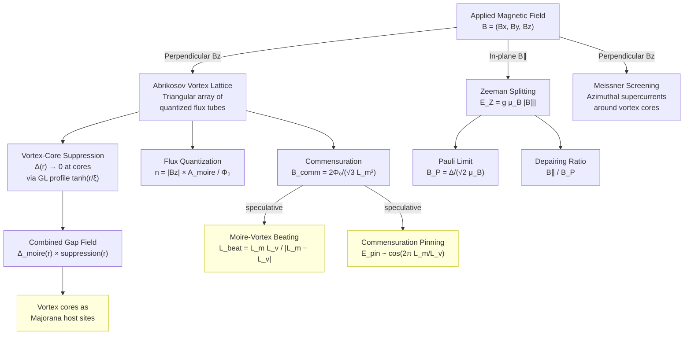

### Abrikosov Vortex Lattice

A type-II superconductor in a perpendicular magnetic field B_z admits quantized magnetic flux tubes (vortices), each carrying one flux quantum Phi_0 = h/(2e) = 2.068 x 10^-15 Wb. These vortices self-organize into a triangular (Abrikosov) lattice with a field-dependent spacing:

```
a_v = sqrt(2 Phi_0 / (sqrt(3) |Bz|))
```

At B_z = 1 T this gives a_v ~ 489 angstrom. At higher fields the vortex spacing shrinks; when a_v approaches the moire period L_m, the two lattices can interact.

The software generates the full triangular vortex lattice within the simulation viewport: positions are computed on a hexagonal grid with alternating row offsets, clipped to the viewport bounds. At zero field, no vortices are generated.

**Flux quantization per moire cell.** For a hexagonal moire unit cell with area A_m = (sqrt(3)/2) L_m^2, the number of flux quanta threading each cell is:

```
n = |Bz| * A_m / Phi_0
```

This dimensionless ratio indicates how many vortex cores fall within each moire unit cell -- a key parameter for moire-vortex commensuration.

**Commensuration field.** The field at which the vortex lattice period matches the moire period is:

```
B_comm = 2 Phi_0 / (sqrt(3) L_m^2)
```

For the Sb2Te3/FeTe system (L_m ~ 36.7 angstrom), B_comm exceeds 100 T -- far above experimentally accessible fields -- meaning the vortex and moire lattices are strongly incommensurate at typical laboratory fields. For engineered systems with larger moire periods (e.g., small-angle twisted bilayers with L_m > 100 nm), commensuration becomes accessible.

### Vortex-Core Gap Suppression

Each vortex core locally destroys superconductivity. The software models this with a Ginzburg-Landau order-parameter profile:

```
suppression(r) = product_v tanh(|r - r_v| / xi)
```

where the product runs over all vortex positions r_v and xi is the Ginzburg-Landau coherence length (default 20 angstrom for FeTe). The suppression field is 1 far from any vortex core and approaches 0 at each core.

The combined gap field multiplies the moire-modulated gap by the vortex suppression:

```
Delta_combined(r) = Delta_moire(r) * suppression(r)
```

This produces a gap landscape that is periodic at the moire wavelength but punctured by zeros at each vortex core -- the starting point for hosting topological excitations (see [Majorana Zero Modes](#speculative-majorana-zero-modes)).

### Zeeman Splitting and Pauli Limiting

An in-plane magnetic field B_parallel = (Bx, By) couples to electron spin via the Zeeman effect. For the topological surface state with an enhanced g-factor (g ~ 30 for Sb2Te3/Bi2Te3 surface states, literature range 20--50):

```
E_Z = g * mu_B * |B_parallel|
```

where mu_B = 5.788 x 10^-2 meV/T is the Bohr magneton. The Pauli paramagnetic limit -- the field at which Zeeman splitting equals the pair-breaking energy -- is:

```
B_P = Delta / (sqrt(2) * mu_B)
```

For Delta_avg = 3.09 meV this gives B_P ~ 37.8 T. The depairing ratio B_parallel / B_P quantifies how close the system is to pair breaking.

The Zeeman energy is also a key input to the topological phase criterion (see [Topological Phase Diagrams](#speculative-topological-phase-diagrams)).

### Meissner Screening Currents

Each vortex is surrounded by circulating supercurrents that screen the magnetic flux. The software models the London-limit current density around each vortex:

```
J_theta(r) ~ (Phi_0 / (2 pi mu_0 lambda_L^2 r)) * exp(-r / lambda_L)
```

where lambda_L is the London penetration depth (~5000 angstrom for FeTe, ~500 nm). The current is azimuthal around each vortex and decays exponentially on the lambda_L scale. The (J_x, J_y) vector field is computed at every grid point and displayed as a quiver (arrow) plot.

### Speculative: Moire-Vortex Lattice Interaction

> **SPECULATIVE** -- The following phenomena use simplified models and have not been validated experimentally for these heterostructures.

When the vortex lattice and the moire superlattice are incommensurate, three speculative effects emerge:

**1. Moire-vortex beating.** The interference between the two periodic lattices creates a secondary superlattice with a beating period:

```
L_beat = L_m * L_v / |L_m - L_v|
```

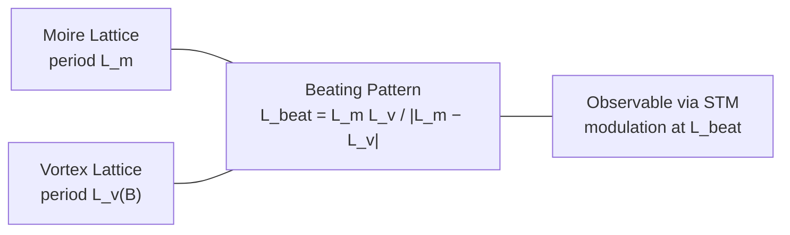

This beating pattern would be observable as a long-wavelength modulation in STM conductance maps. The software generates a 2D hexagonal beating pattern normalized to [0, 1].

**2. Field-tunable CPDM amplitude.** Vortex cores suppress the local gap, reducing the CPDM modulation depth:

```
A_CPDM(B) = A_0 * (1 - |Bz| / B_c2)
```

where B_c2 = 47 T is the upper critical field for FeTe. At higher fields, more vortex cores puncture the moire pattern, progressively washing out the Cooper-pair density modulation.

**3. Commensuration pinning energy.** When the vortex-to-moire period ratio approaches a rational number, pinning is enhanced:

```
E_pin ~ cos(2 pi L_m / L_v)
```

Peaks in pinning energy at rational ratios (1/1, 1/2, 2/3, ...) would manifest as anomalies in the critical current vs. field curve.

---

## Topological Surface State Physics

The topological insulator overlayer (Sb2Te3, Bi2Te3) hosts protected Dirac surface states that acquire a proximity-induced superconducting gap from the FeTe substrate. The software models the spatial extent of this proximity effect in three dimensions, and computes speculative topological invariants and Majorana zero-mode densities.

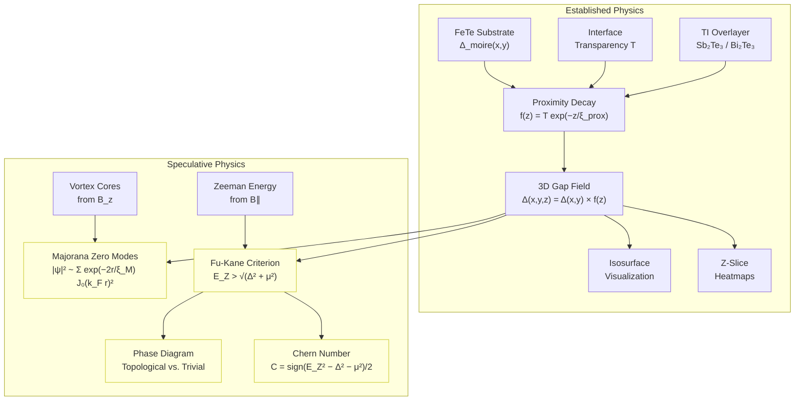

### Proximity-Induced Superconductivity

When a superconductor is placed in contact with a normal material (here, a topological insulator), Cooper pairs leak across the interface, inducing a superconducting gap that decays with distance from the interface. The software uses a BTK (Blonder-Tinkham-Klapwijk) transparency model:

```
f(z) = 1.0                          for z < 0  (inside superconductor)
f(z) = T                            for z = 0  (at interface)
f(z) = T * exp(-z / xi_prox)        for z > 0  (into topological insulator)
```

where T is the interface transparency (default 0.8, range 0.1--1.0) and xi_prox is the proximity coherence length (default 100 angstrom, literature range 50--200 angstrom for 5--20 nm penetration depth).

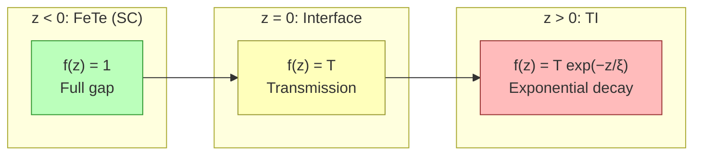

Key physical constants:
- xi_prox = 100 angstrom (default proximity coherence length)
- T = 0.8 (default interface transparency)
- Dirac surface state velocity: v_F = 5 x 10^5 m/s

### 3D Cooper-Pair Density

The 2D moire-modulated gap field Delta(x, y) is extended to three dimensions by multiplying with the proximity decay profile:

```
Delta(x, y, z) = Delta_moire(x, y) * f(z)
```

If a vortex suppression field is present, it is applied before the z-extension:

```
Delta(x, y, z) = Delta_moire(x, y) * suppression(x, y) * f(z)
```

The resulting 3D volumetric field can be visualized as:
- **Isosurface rendering**: A 3D surface of constant gap magnitude, showing how the moire modulation extends into the TI and is punctured by vortex tubes
- **Z-slice heatmaps**: 2D cross-sections at selected z-values, showing the moire pattern fading with distance from the interface

### Speculative: Majorana Zero Modes

> **SPECULATIVE** -- The Majorana probability density uses a qualitative envelope model. The exact wavefunction requires a full Bogoliubov-de Gennes calculation, which is beyond the scope of this tool.

A vortex core in a topological superconductor can host a Majorana zero mode (MZM) -- a zero-energy bound state that is its own antiparticle. Following the theoretical framework of Fu and Kane (PRL 100, 096407, 2008), the software computes a qualitative probability density:

```
|psi_MZM(r)|^2 ~ sum_v exp(-2|r - r_v| / xi_M) * J_0(k_F |r - r_v|)^2
```

where:
- r_v are vortex core positions
- xi_M = 50 angstrom is the Majorana localization length (speculative; actual value depends on microscopic parameters)
- J_0 is the zeroth-order Bessel function of the first kind
- k_F = 0.1 angstrom^-1 is the approximate surface Fermi wavevector

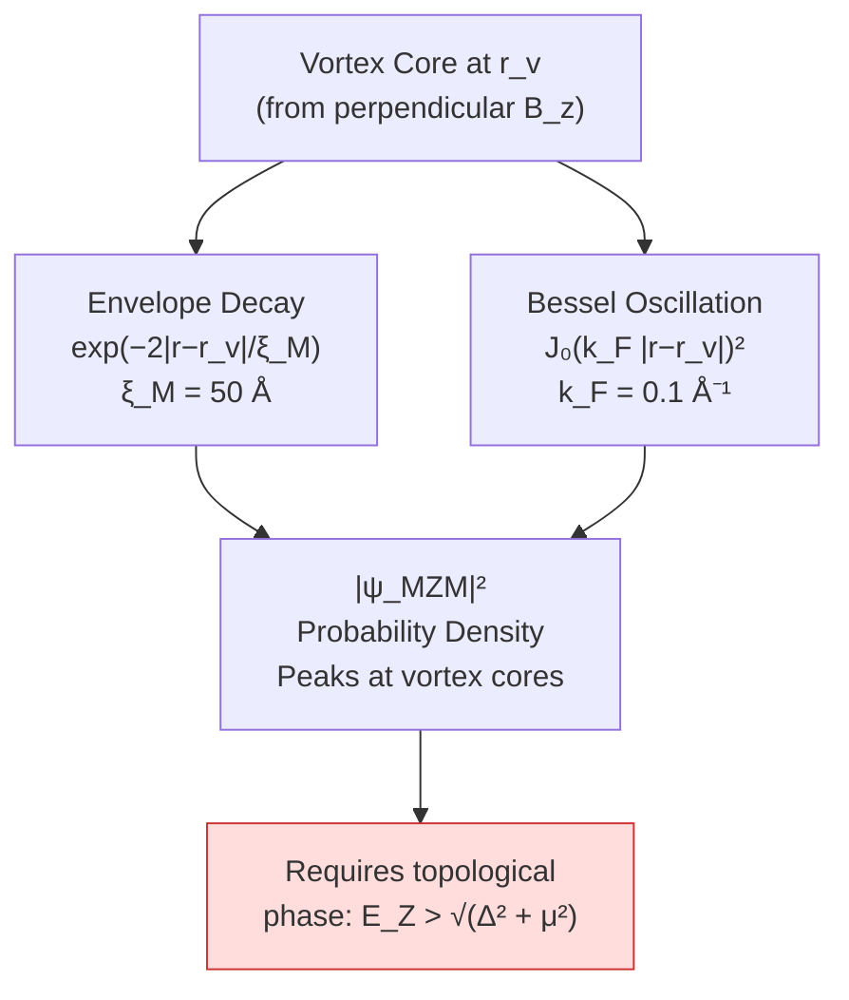

The MZM density peaks sharply at each vortex core (localized within ~xi_M) and exhibits oscillatory tails from the Bessel function. This provides a qualitative guide to where Majorana modes would be expected in STM measurements, though the actual wavefunction amplitude requires self-consistent numerical solution.

### Speculative: Topological Phase Diagrams

> **SPECULATIVE** -- The Fu-Kane criterion and Chern number estimates use simplified models. Actual topological protection depends on subtler conditions (disorder, finite-size effects, orbital contributions).

**Fu-Kane criterion.** The system is in a topological superconducting phase when the Zeeman energy exceeds the combined gap and chemical potential:

```
Topological:  E_Z > sqrt(Delta^2 + mu^2)
Trivial:      E_Z < sqrt(Delta^2 + mu^2)
```

where mu is the chemical potential offset from the Dirac point (default 0). The software sweeps over (B, Delta) parameter space, computing E_Z = g * mu_B * B at each point and classifying each pixel as topological (1) or trivial (0). The result is a 2D phase diagram with the experimental Delta_avg marked for reference.

**Chern number estimate.** In the topological phase, the system carries a nonzero Chern number:

```
C = sign(E_Z^2 - Delta^2 - mu^2) / 2
```

yielding C = +0.5 in the topological phase, C = -0.5 in the trivial phase, and C = 0 at the phase boundary. This would manifest as a quantized anomalous Hall plateau.

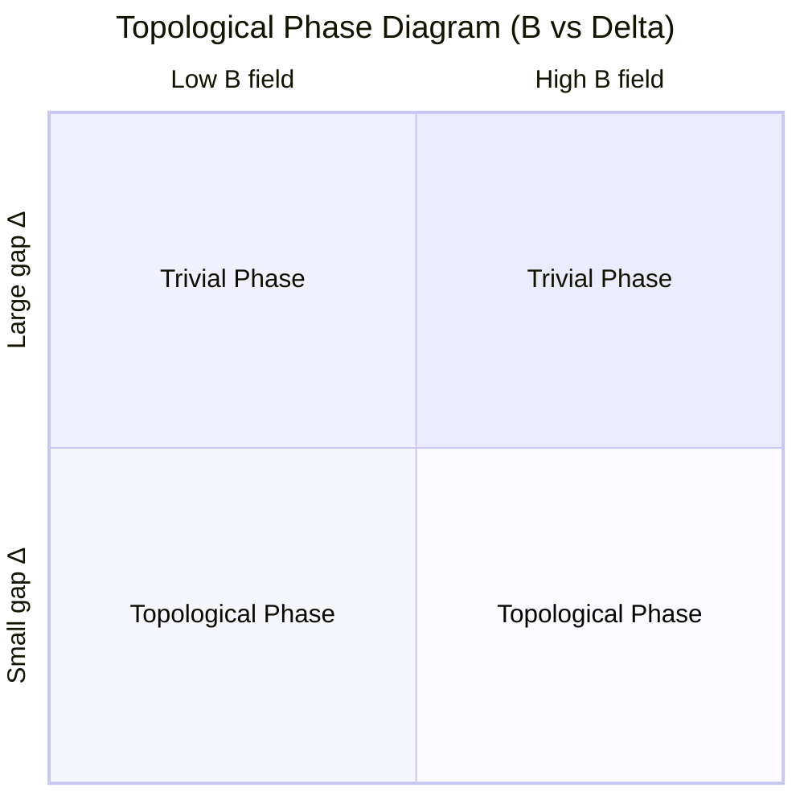

**Topological magnetoelectric effect.** The software also computes the surface polarization arising from the axion angle theta = pi of the topological insulator:

```
P = (e^2 / (2 pi hbar)) * theta * B
```

This quantized magnetoelectric response is a bulk signature of the topological insulator and would be observable via anomalous Hall measurements.

---

## Speculative Isotope Engineering

> **SPECULATIVE** -- The isotope-effect models use simplified physics (zero-point lattice expansion, BCS isotope effect, Debye-Waller damping) to estimate how isotopic substitution might affect moire patterns and superconducting gap modulation. Results are qualitative and have not been validated against experiment for these specific heterostructures. The models are grounded in published isotope-effect measurements on related iron-chalcogenide systems.

The software includes a speculative isotope-engineering module that models how enriching the substrate or overlayer with specific isotopes could tune CPDM properties. This provides a second axis of control beyond lattice-constant and twist-angle engineering.

### Isotopic Tuning Mechanisms

Four physical mechanisms connect isotopic composition to moire-modulated superconductivity:

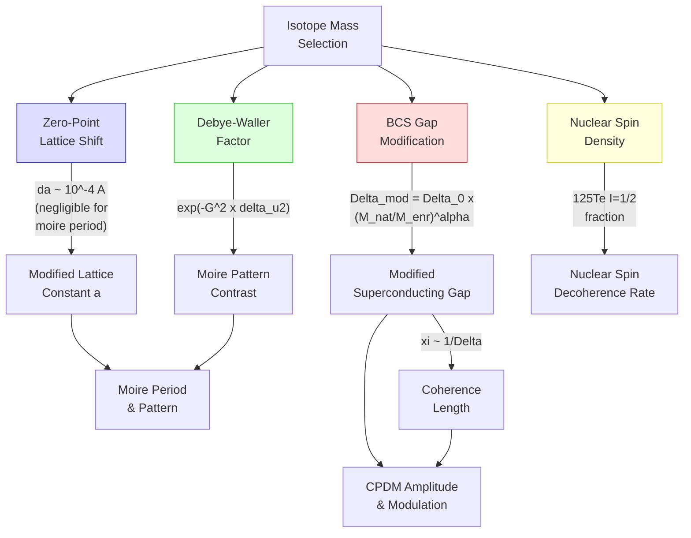

**1. BCS Gap Modification (dominant effect)**

The BCS isotope effect shifts the superconducting gap as:

```
Delta_mod = Delta_0 * (M_natural / M_enriched)^alpha
```

The isotope exponent alpha varies across iron-based superconductors:

| System | alpha | Source |
|--------|-------|--------|
| FeSe (54Fe/56Fe) | 0.81 +/- 0.15 | Khasanov et al., arXiv:1002.2510 |
| SmFeAsO (iron) | ~0.35 | Liu et al., Nature 459, 64 (2009) |
| (Ba,K)Fe2As2 (iron) | -0.18 (inverse) | Shirage et al., PRL 103, 257003 |
| Corrected consensus | 0.35 -- 0.4 | PRB 82, 212505 |
| FeTe (tellurium) | unknown | No measurement exists |

The software defaults to alpha = 0.4 (corrected consensus) with a slider range of [-0.5, 1.0] to explore both normal and inverse isotope effects. Lighter isotopes (e.g. 54Fe) increase the gap; heavier isotopes (e.g. 58Fe) decrease it.

**2. Zero-Point Lattice Expansion**

Isotopic mass affects zero-point vibrational amplitude, which shifts the equilibrium lattice constant through anharmonic effects:

```
da = -a * (3 * gamma * k_B * T_D) / (4 * E_coh) * (1 - sqrt(M_natural / M_enriched))
```

For the heavy elements in this system (Fe ~56 amu, Te ~128 amu), the lattice shifts are of order 10^-4 angstrom -- negligible compared to the 0.44 angstrom mismatch driving the moire pattern. This mechanism is implemented for completeness but does not meaningfully affect CPDM predictions.

**3. Debye-Waller Factor**

Isotopic mass changes the mean-square atomic displacement, modifying the strength of the periodic potential that generates the moire pattern:

```
DW_ratio = exp(-G^2 * delta<u^2>)
```

Heavier isotopes reduce thermal vibrations, producing a ~1--5% sharper moire pattern. Lighter isotopes slightly wash out the pattern contrast.

**4. Nuclear Spin Density**

125Te (I = 1/2, 7.07% natural abundance) is the only spin-bearing stable tellurium isotope. All other Te isotopes (122, 124, 126, 128, 130) have I = 0. The software computes the 125Te spin fraction for a given enrichment, relevant for:
- Nuclear spin decoherence at the TI/SC interface (Majorana physics)
- NMR/NQR probe sensitivity (125Te Knight shift measurements)

### Isotope Database

The software includes a comprehensive isotope database (AME2020 / NUBASE2020) for all constituent elements:

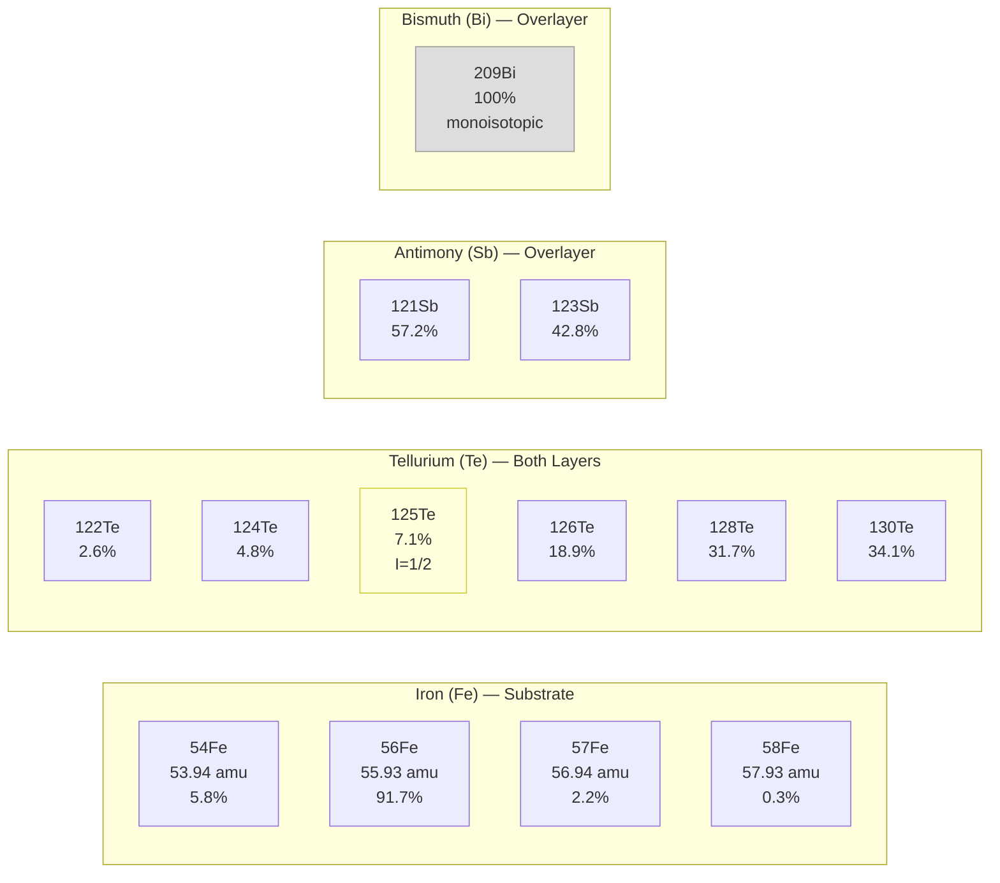

Each element also carries bulk thermodynamic properties used in the isotope-effect models:

| Element | Debye Temp (K) | Gruneisen Parameter | Cohesive Energy (eV/atom) |
|---------|:--------------:|:-------------------:|:-------------------------:|
| Fe      | 260            | 1.5                 | 4.0                       |
| Te      | 165            | 1.7                 | 2.1                       |
| Sb      | 210            | 1.1                 | 2.7                       |
| Bi      | 120            | 1.2                 | 2.2                       |

### Recommended Isotopic Configurations

Based on published literature on isotope effects in iron-chalcogenide superconductors, topological insulators, and related systems, the following configurations are ranked by expected impact on CPDM properties:

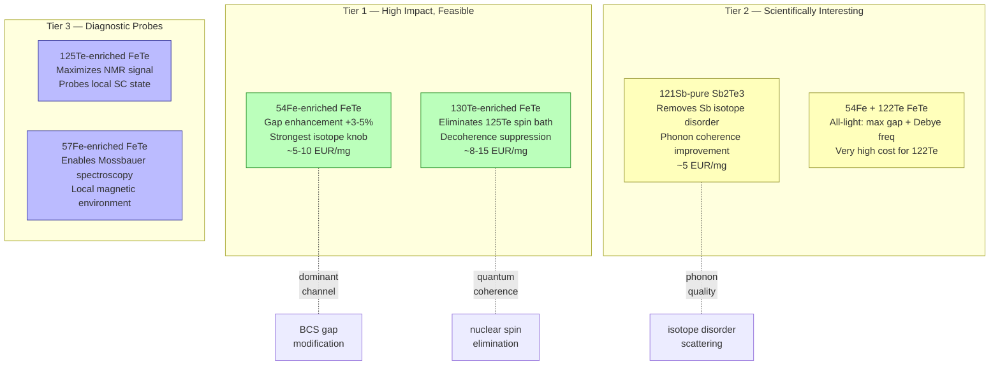

**Key findings from literature:**

- The codebase uses alpha = 0.4 (corrected consensus). For FeTe specifically, alpha could range from 0.35 to 0.81, meaning isotope gap effects may be underestimated by up to 2x.
- Lattice constant isotope shifts are ppm-level for these heavy elements -- irrelevant for moire period tuning in the 11--15% mismatch regime.
- No Te isotope effect on superconductivity has been measured for FeTe or Fe(Te,Se). This represents a key experimental gap.
- The inverse isotope effect (alpha < 0) observed in (Ba,K)Fe2As2 is supported by theory where the ground state is a "phonon-dressed unconventional superconductor."
- 130Te enrichment is the cheapest Te isotope modification and eliminates the nuclear spin bath.

### Nuclear Spin Engineering

125Te is the only stable Te isotope with a nuclear spin (I = 1/2). In natural tellurium it comprises 7.07% of atoms, creating a dilute nuclear spin bath that contributes to decoherence -- potentially relevant for Majorana zero modes at TI/SC interfaces.

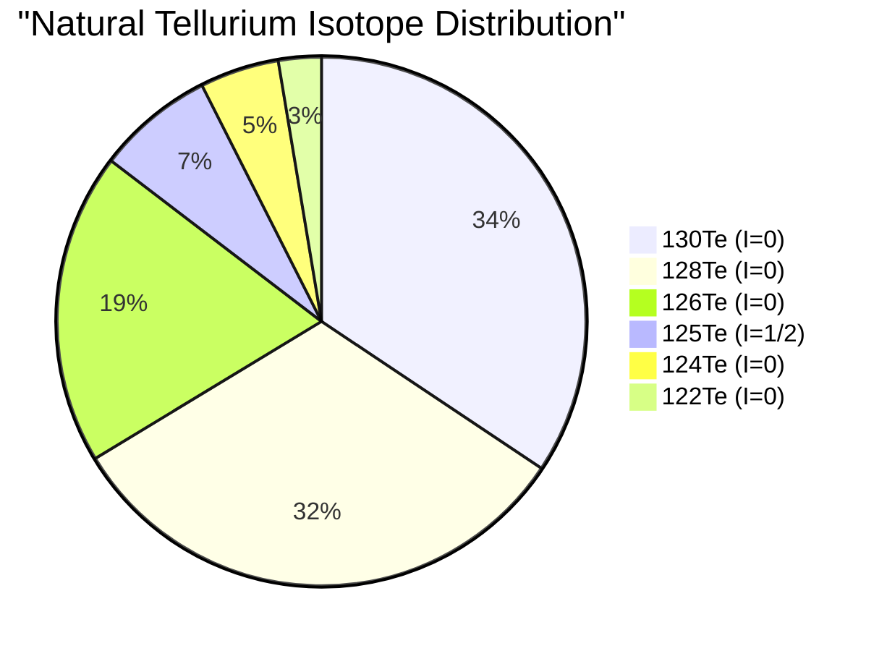

Enriching to 130Te (or any I=0 isotope) eliminates this spin bath entirely. The software computes and displays the 125Te spin fraction for any isotope configuration, enabling direct comparison of nuclear spin environments across enrichment strategies.

Published 125Te NMR on Fe(Te,Se) under pressure (arXiv:2505.11732) reveals that nematic fluctuations -- not antiferromagnetic ones -- dominate the superconducting state, making 125Te a valuable local probe. Conversely, depleting 125Te by enriching to spin-free isotopes would reduce nuclear-spin-induced decoherence, analogous to 28Si purification for silicon qubits.

---

## Features

### Core Computation
- **Moire pattern visualization**: Real-space rendering of the moire superlattice formed by overlaying hexagonal and square lattices with configurable lattice constants, via plane-wave superposition of reciprocal lattice vectors.
- **Periodicity calculator**: Compute moire periodicity from lattice constants (a1, a2) and twist angle (theta).
- **Material presets**: Built-in lattice parameters for Sb2Te3, Bi2Te3, FeTe, and Sb2Te with crystallographic data (space groups, c-axis constants).
- **Gap modulation profile**: Visualize how the two superconducting gaps (Delta_1 = 2.58 meV, Delta_2 = 3.60 meV) are spatially modulated across the moire unit cell.
- **CPDM amplitude**: Exponential scaling A_CPDM = exp(-xi/L_m) relating coherence length to moire period.
- **Interactive parameter tuning**: Adjust lattice constants, twist angle, and gap parameters with sliders and see results update in real time.
- **Fourier analysis**: 2D FFT power spectrum revealing moire reciprocal lattice vectors with automated peak detection.
- **Parameter sweeps**: Explore how moire periodicity and CPDM amplitude vary with lattice constant or twist angle.
- **Substrate comparison**: Side-by-side visualization of all three overlayer materials on FeTe.

### Speculative Isotope Engineering
- **Per-element mass sliders**: Continuously adjust effective atomic mass for Fe, Te, and Sb across the full isotope range.
- **BCS isotope exponent**: Adjustable alpha from -0.5 (inverse effect) to 1.0, with literature-based marks at key values (-0.18 inverse, 0.4 consensus, 0.5 classical BCS, 0.81 FeSe-measured).
- **Four-channel isotope effects**: Simultaneous computation of lattice shift, gap modification, Debye-Waller contrast, and coherence length scaling.
- **125Te nuclear spin fraction**: Tracks the spin-bearing isotope fraction for decoherence assessment.
- **Natural vs. enriched comparison**: Toggle overlay showing isotope-modified pattern against the natural-abundance baseline.

### Magnetic Field Analysis
- **Abrikosov vortex lattice**: Triangular lattice generation for any perpendicular field B_z, with period a_v = sqrt(2 Phi_0 / (sqrt(3) |Bz|)). Vortex positions overlaid on the moire pattern.
- **Vortex-core gap suppression**: Ginzburg-Landau order-parameter profile tanh(r/xi) suppresses the superconducting gap at each vortex core (xi = 20 angstrom for FeTe).
- **Combined gap field**: Moire-modulated gap multiplied by vortex suppression, showing the interplay between periodic CPDM and localized vortex cores.
- **Flux quantization**: Number of flux quanta per moire unit cell as a function of field.
- **Commensuration analysis**: Computes B_comm where vortex period matches moire period, and tracks the commensuration ratio L_m / L_v.
- **Zeeman splitting**: In-plane field Zeeman energy with configurable g-factor (default 30, range 1--50).
- **Pauli paramagnetic limit**: B_P = Delta / (sqrt(2) mu_B) and depairing ratio for pair-breaking assessment.
- **Meissner screening currents**: Vector field (J_x, J_y) of circulating supercurrents around vortex cores, displayed as quiver plots with London penetration depth decay.
- **Speculative moire-vortex beating**: Secondary superlattice from interference between incommensurate moire and vortex lattices.
- **Speculative field-tunable CPDM**: Amplitude suppression A_CPDM(B) = A_0 (1 - |Bz|/B_c2) modeling vortex-induced contrast reduction.
- **Speculative commensuration pinning**: Periodic pinning energy landscape E_pin ~ cos(2 pi L_m / L_v).
- **Speculative local susceptibility**: chi(r) enhanced at vortex cores where the gap is suppressed.

### Topological Surface State Physics
- **3D proximity gap**: BTK interface model extending the 2D moire gap into the TI volume with exponential z-decay and configurable transparency.
- **Isosurface visualization**: 3D rendering of constant-gap surfaces showing moire modulation depth as a function of distance from the SC/TI interface.
- **Z-slice heatmaps**: 2D cross-sections at any depth into the topological insulator, showing progressive gap suppression.
- **Dirac surface state dispersion**: Linear cone E(k) = hbar v_F |k| with v_F = 5 x 10^5 m/s.
- **Speculative Majorana zero modes**: Qualitative probability density |psi_MZM|^2 localized at vortex cores with decay length xi_M and Bessel oscillations at k_F.
- **Speculative topological phase diagram**: 2D sweep over (B, Delta) space classifying each point as topological or trivial via the Fu-Kane criterion E_Z > sqrt(Delta^2 + mu^2).
- **Speculative Chern number**: Half-integer topological invariant C = +/-0.5 in the topological/trivial phase.
- **Speculative magnetoelectric polarization**: Quantized surface polarization P = (e^2 / 2 pi hbar) theta B from the axion angle theta = pi.

### Visualization
- **Multiple view modes**: 2D heatmap, contour, interactive 3D surface rendering, 3D isosurfaces, and vector quiver plots.
- **Dual-panel display**: Moire pattern and gap modulation shown simultaneously.
- **Five magnetic visualization modes**: Vortex lattice overlay, combined gap field, screening current quiver plot, local susceptibility map, and Majorana probability density.
- **3D proximity viewer**: Isosurface and z-slice views of the proximity-induced gap extending into the topological insulator.
- **Phase diagram explorer**: 2D colormap of the topological-trivial phase boundary with adjustable chemical potential and g-factor.
- **Real-time info panel**: Displays lattice mismatch, moire period, CPDM amplitude, vortex period, flux quanta per moire cell, commensuration field, Zeeman energy, and all isotope modifications.

---

## Architecture

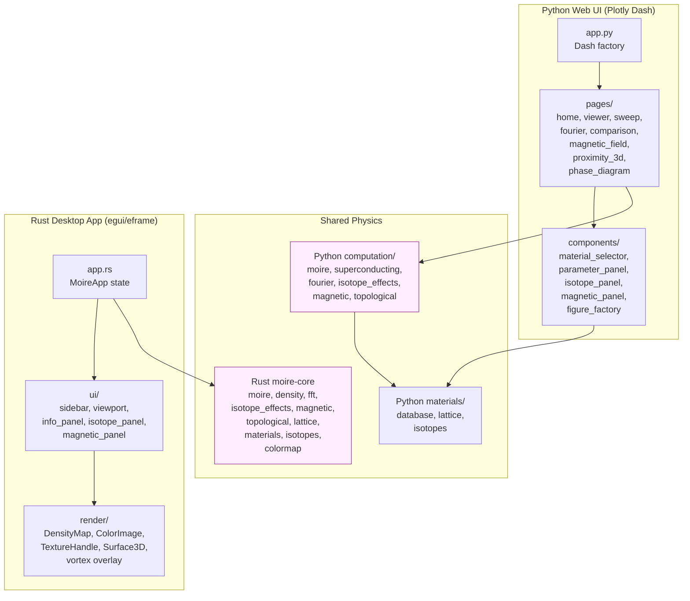

Both implementations share identical physics. The Python version computes patterns via NumPy vectorized operations; the Rust version uses equivalent scalar loops with native performance. Key computation modules:

| Module | Python | Rust | Purpose |
|--------|--------|------|---------|
| Moire pattern | `computation/moire.py` | `moire-core/src/moire.rs` | Plane-wave superposition V(r) = product of lattice potentials |
| Gap modulation | `computation/superconducting.py` | `moire-core/src/density.rs` | Spatial gap field Delta(r) and CPDM amplitude |
| Fourier analysis | `computation/fourier.py` | `moire-core/src/fft.rs` | 2D FFT power spectrum and peak detection |
| Isotope effects | `computation/isotope_effects.py` | `moire-core/src/isotope_effects.rs` | Lattice shift, BCS gap, DW factor, spin fraction |
| Magnetic field | `computation/magnetic.py` | `moire-core/src/magnetic.rs` | Vortex lattice, GL suppression, Zeeman, screening currents, beating |
| Topological | `computation/topological.py` | `moire-core/src/topological.rs` | Proximity decay, 3D gap, Majorana modes, phase diagrams, Chern number |
| Material data | `materials/database.py` | `moire-core/src/materials.rs` | Lattice constants, space groups, roles |
| Isotope data | `materials/isotopes.py` | `moire-core/src/isotopes.rs` | Masses, abundances, Debye temps, Gruneisen params |

---

## Installation and Usage

### Python Web UI (Plotly Dash)

**Requirements:** Python 3.10+

```bash
# Clone the repository
git clone https://github.com/user/waytogocoop.git
cd waytogocoop

# Create a virtual environment (recommended)
python -m venv .venv
source .venv/bin/activate   # Linux/macOS
# .venv\Scripts\activate    # Windows

# Install the package
pip install -e .

# Run the web UI
python -m waytogocoop.app
```

The web UI will be available at `http://localhost:8050`.

**Pages:**

| Page | Path | Description |
|------|------|-------------|
| Home | `/` | Project overview and material database table |
| Moire Viewer | `/viewer` | Interactive pattern and gap visualization with isotope controls |
| Parameter Sweep | `/sweep` | Sweep lattice constant or twist angle vs. periodicity and CPDM amplitude |
| Fourier Analysis | `/fourier` | 2D FFT power spectrum with peak detection |
| Substrate Comparison | `/comparison` | Side-by-side all overlayers on FeTe |
| Magnetic Field | `/magnetic` | Vortex lattice, combined gap, screening currents, susceptibility, Majorana density |
| 3D Proximity | `/proximity3d` | Isosurface and z-slice views of proximity-induced gap into TI |
| Phase Diagram | `/phase` | Topological-trivial phase boundary sweep over (B, Delta) space |

### Rust Native App (egui/eframe)

**Requirements:** Rust toolchain ([rustup](https://rustup.rs/))

```bash
cd waytogocoop

# Build and run
cargo run --release -p moire-desktop
```

Supported platforms: Linux (X11/Wayland), macOS, Windows.

### Running Tests

```bash
# Python
source .venv/bin/activate
pip install -e ".[dev]"
pytest tests/ -v

# Rust
cargo test
```

---

## Project Structure

```
waytogocoop/
  README.md
  CLAUDE.md
  pyproject.toml                    # Python project config
  Cargo.toml                       # Rust workspace root

  src/waytogocoop/                  # Python Web UI
    app.py                          # Dash entry point
    config.py                       # Physical constants and defaults
    materials/
      database.py                   # Material registry (FeTe, Sb2Te3, Bi2Te3, Sb2Te)
      lattice.py                    # Lattice vector generation (square/hexagonal)
      isotopes.py                   # Isotope masses, abundances, spin fractions
    computation/
      moire.py                      # Plane-wave moire pattern generation
      superconducting.py            # Gap modulation and CPDM amplitude
      fourier.py                    # 2D FFT and peak detection
      isotope_effects.py            # Speculative isotope calculations
      magnetic.py                   # Vortex lattice, Zeeman, screening, beating
      topological.py                # Proximity decay, Majorana, phase diagrams
    pages/
      home.py                       # Landing page with material table
      moire_viewer.py               # Interactive moire + gap viewer
      parameter_sweep.py            # Lattice/twist parameter sweeps
      fourier_analysis.py           # Reciprocal-space analysis
      substrate_comparison.py       # Side-by-side overlayer comparison
      magnetic_field.py             # Magnetic field analysis with 5 viz modes
      proximity_3d.py               # 3D proximity gap isosurface/z-slice
      phase_diagram.py              # Topological phase diagram sweeps
    components/
      material_selector.py          # Dropdown material picker
      parameter_panel.py            # Slider controls
      isotope_panel.py              # Isotope enrichment controls
      magnetic_panel.py             # Magnetic field and proximity controls
      figure_factory.py             # Plotly figure builders

  crates/
    moire-core/                     # Rust computation library (no UI deps)
      src/
        materials.rs                # Material database
        lattice.rs                  # Lattice2D type and generation
        moire.rs                    # MoireConfig -> MoireResult
        density.rs                  # Cooper-pair density modulation
        fft.rs                      # 2D FFT via rustfft
        isotopes.rs                 # Isotope data and spin fractions
        isotope_effects.rs          # Speculative isotope calculations
        magnetic.rs                 # Vortex lattice, Zeeman, screening, beating
        topological.rs              # Proximity decay, Majorana, phase diagrams
        colormap.rs                 # viridis/inferno/coolwarm
    moire-desktop/                  # Rust egui desktop app
      src/
        app.rs                      # MoireApp state, recompute-on-change
        ui/
          sidebar.rs                # Parameter controls
          viewport.rs               # Pattern/density/FFT rendering
          info_panel.rs             # Computed results display
          isotope_panel.rs          # Isotope enrichment controls
          magnetic_panel.rs         # Magnetic field and proximity controls
        render/                     # DensityMap -> ColorImage -> TextureHandle
          overlay.rs                # Vortex marker overlay

  tests/                            # Python tests
    test_materials.py
    test_moire.py
    test_superconducting.py
    test_isotopes.py
    test_magnetic.py                # Vortex lattice, Zeeman, screening, beating
    test_topological.py             # Proximity decay, Majorana, phase diagrams
```

---

## References

### Primary

1. Z. Wang, B. Xia, S. Paolini, Z.-J. Yan, P. Xiao, J. Song, V. Gowda, H. Rong, D. Xiao, X. Xu, W. Wu, Z. Wang, and C.-Z. Chang, "Moire Engineering of Cooper-Pair Density Modulation States," [arXiv:2602.22637](https://arxiv.org/abs/2602.22637) (2026).

2. J. Bardeen, L. N. Cooper, and J. R. Schrieffer, "Theory of Superconductivity," Phys. Rev. 108, 1175 (1957).

3. M. Z. Hasan and C. L. Kane, "Colloquium: Topological insulators," Rev. Mod. Phys. 82, 3045 (2010).

### Vortex Physics and Topological Superconductivity

4. A. A. Abrikosov, "On the Magnetic Properties of Superconductors of the Second Group," Sov. Phys. JETP 5, 1174 (1957).

5. L. Fu and C. L. Kane, "Superconducting Proximity Effect and Majorana Fermions at the Surface of a Topological Insulator," Phys. Rev. Lett. 100, 096407 (2008).

6. G. E. Blonder, M. Tinkham, and T. M. Klapwijk, "Transition from metallic to tunneling regimes in superconducting microconstrictions," Phys. Rev. B 25, 4515 (1982).

7. J. D. Sau, R. M. Lutchyn, S. Tewari, and S. Das Sarma, "Generic New Platform for Topological Quantum Computation Using Semiconductor Heterostructures," Phys. Rev. Lett. 104, 040502 (2010).

8. C. W. J. Beenakker, "Search for Majorana Fermions in Superconductors," Annu. Rev. Condens. Matter Phys. 4, 113 (2013).

### Isotope Effects in Iron-Based Superconductors

9. R. Khasanov et al., "Iron isotope effect on the superconducting transition temperature and the crystal structure of FeSe1-x," [arXiv:1002.2510](https://arxiv.org/abs/1002.2510) (2010).

10. R. H. Liu et al., "A large iron isotope effect in SmFeAsO1-xFx and Ba1-xKxFe2As2," Nature 459, 64 (2009).

11. P. M. Shirage et al., "Inverse Iron Isotope Effect on the Transition Temperature of the (Ba,K)Fe2As2 Superconductor," Phys. Rev. Lett. 103, 257003 (2009).

12. A. Bussmann-Holder et al., "The isotope effect as a probe of superconductivity in SrTiO3 and iron-pnictide/chalcogenide-based superconductors," PMC6447578 (2019).

13. S. Zhang et al., "Role of SrTiO3 phonon penetrating into thin FeSe films in the enhancement of superconductivity," PMC6377624 (2019).

### Stoichiometric FeTe Superconductivity

14. C. C. Homes et al., "Stoichiometric FeTe is a superconductor," Nature (2026).

### Tellurium NMR and Nuclear Spin

15. S.-H. Park et al., "125Te and 77Se NMR of FeSe0.47Te0.53 under pressure," [arXiv:2505.11732](https://arxiv.org/abs/2505.11732) (2025).

16. M. Y. Seyidov et al., "125Te NMR in Bi2Te3 and Sb2Te3," Z. Anorg. Allg. Chem. (2022).

### Isotope Phonon Engineering

17. D. Bessas et al., "Lattice dynamics in Bi2Te3 and Sb2Te3: Te and Sb density of phonon states," Phys. Rev. B 86, 224301 (2012).

18. S. Koga et al., "Isotope superlattice phonon engineering in diamond," Phys. Rev. B 104, 054112 (2021).

19. L. Lindsay and D. A. Broido, "Three-phonon phase space and lattice thermal conductivity in semiconductors," J. Phys.: Condens. Matter (2008); Phys. Rev. B 88, 144306 (2013).

---

## License

This project is provided for research and educational purposes.
