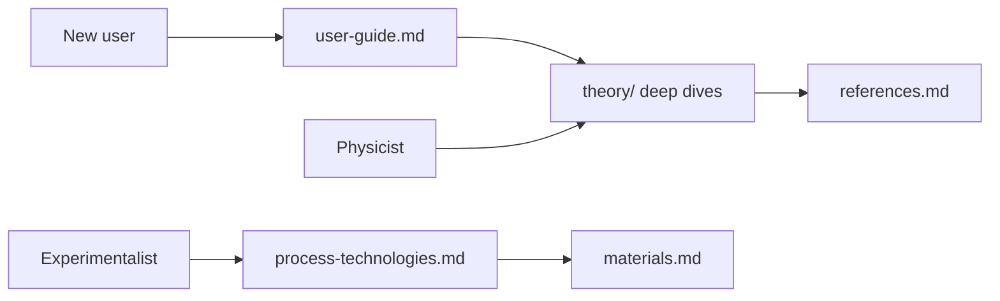

# Documentation

[← Project README](../README.md)

The [root README](../README.md) is the front door: project overview, screenshot gallery, quick start, and a compact theory summary with a "Read more" link into each page here. This `docs/` tree holds the deep dives — derivations, model assumptions, per-page usage guides, reference tables, and historical and experimental context. Pages covering speculative modules carry a bold status line and use the same convention as the in-app `(SPECULATIVE)` tags: treat those outputs as exploratory illustrations, not quantitative predictions. The primary paper is Wang et al., Nature 652, 335 (2026) / arXiv:2602.22637 — see the [annotated entry](references.md#ref-wang-2026) in the bibliography. Screenshots under [images/](images/README.md) are regenerated from physics by the capture pipeline, never hand-captured.

## Learn

Theory pages share one template: Overview → Model → Assumptions & validity → Speculative components (if any) → Implementation table (Python + Rust file pointers) → References.

| Page | What it covers |
|------|----------------|
| [Theory overview](theory/README.md) | Map of the computation modules and the validated-vs-speculative status table |
| [Moire patterns](theory/moire-patterns.md) | Plane-wave superposition, derivations of the twist and mismatch period formulas, hexagonal-on-square geometry |
| [Gap modulation](theory/gap-modulation.md) | The Delta(r) model, the CPDM-vs-PDW distinction, exp(-xi/L) scaling of the modulation amplitude |
| [Fourier analysis](theory/fourier-analysis.md) | 2D FFT conventions, log-power scaling, moire peak detection |
| [Isotope effects](theory/isotope-effects.md) | Speculative — four mechanisms (lattice shift, BCS gap, Debye-Waller, nuclear spin) and the isotope-exponent alpha table |
| [Magnetic field](theory/magnetic.md) | Abrikosov vortex lattice, GL core suppression, Zeeman splitting and Pauli limit, screening currents; speculative moire-vortex beating flagged |
| [Topological](theory/topological.md) | Speculative — BTK proximity decay, 3D gap extension, Fu-Kane criterion, Majorana zero modes, Chern number |
| [Graphene stacks](theory/graphene-stacks.md) | Stacking as reciprocal-space phases, heterostrain, supermoire, magic angles; speculative flat-band dome |
| [BM model](theory/bm-model.md) | Bistritzer-MacDonald momentum lattice, band structure along K to Gamma to M to K-prime, DOS, chiral-limit test anchor |
| [Curvature](theory/curvature.md) | Curved-sheet height fields, Monge-gauge strain, valley-antisymmetric pseudo-magnetic field; speculative gap suppression |

## Use

| Page | What it covers |
|------|----------------|
| [User guide](user-guide.md) | Walkthrough of all nine web pages and the Rust desktop app: controls with defaults, how to read each output, keyboard shortcuts, web-vs-desktop feature matrix |

## Look up

| Page | What it covers |
|------|----------------|
| [Materials](materials.md) | The seven-material database, per-element isotope tables (AME2020 masses, abundances, spins), Debye/Gruneisen properties, how to add a material |
| [Glossary](glossary.md) | Short definitions of terms as used in this repository, with model defaults in parentheses |
| [References](references.md) | Annotated bibliography — every citation used in code and docs, grouped by topic, each with a note on which module uses it |

## Context

| Page | What it covers |
|------|----------------|
| [History](history.md) | How moire patterns, superconductivity, topological matter, twistronics, and modulated pairing converged on the 2026 experiments |
| [Process technologies](process-technologies.md) | MBE growth, Te-vapor annealing of FeTe, STM/STS gap mapping, isotope enrichment, graphene fabrication, characterization methods |

## Reading paths

Three suggested routes through the docs, depending on where you are coming from:

The [glossary](glossary.md) supports all three paths; each theory page links back to it and to the [annotated references](references.md).
