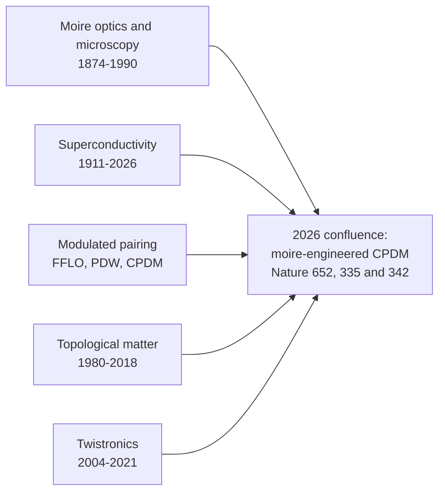
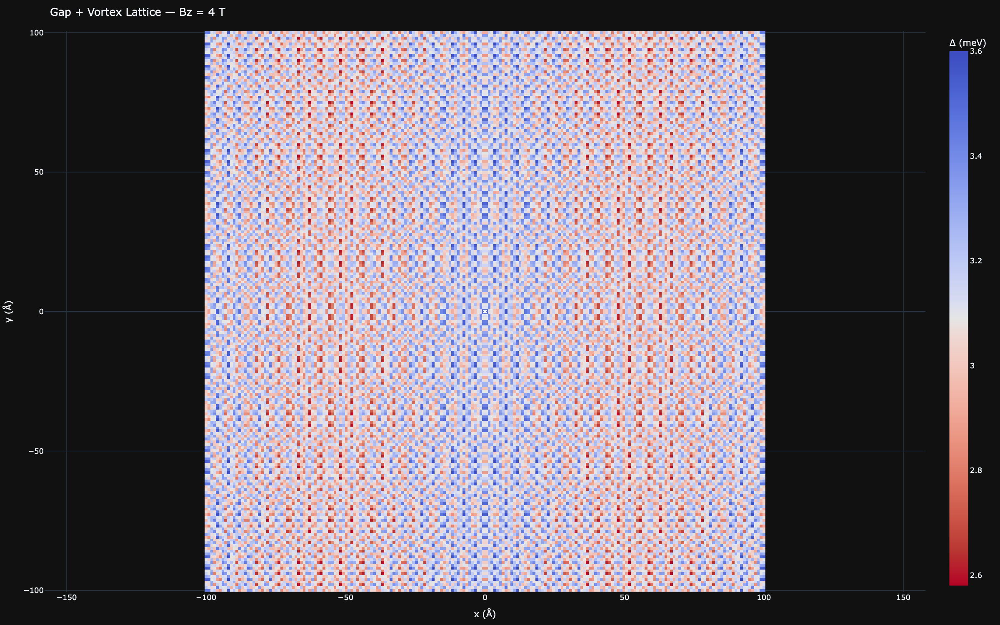
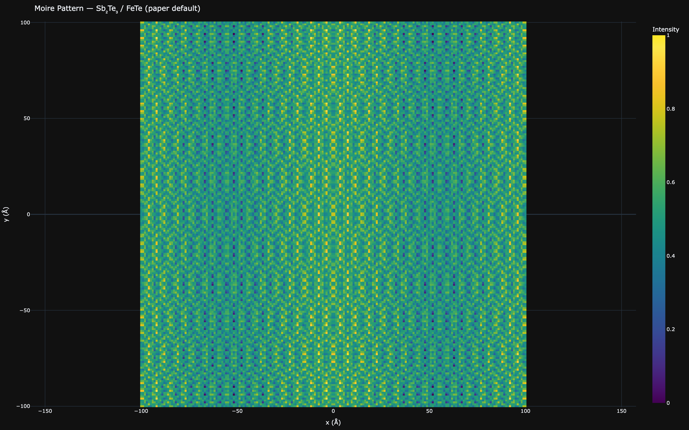

# Historical Context

[← Documentation index](README.md)

The experiment this repository models — a moire superlattice imprinting a periodic modulation onto a superconducting gap in a topological-insulator/iron-chalcogenide heterostructure — sits at the junction of five research threads that developed almost independently for over a century. This page traces each thread to the point where it enters the codebase. The primary paper is [Wang et al., Nature 652, 335 (2026)](references.md#ref-wang-2026); everything stated here about it and its companion paper traces to this repository's own description of them.

## Moire before physics

The word *moire* comes from the French name for watered silk — a fabric whose pressed, rippled finish shimmers because two nearly identical thread patterns overlap at a slight misalignment. The optical effect long predates its physics: any pair of periodic structures superposed with a small mismatch in period or angle produces beat fringes at a much longer wavelength. For two 1D gratings with spacings $a_1$ and $a_2$, the beat period is

$$L = \frac{a_1 a_2}{|a_1 - a_2|},$$

which is exactly the mismatch formula this codebase uses for the zero-twist case.

The first quantitative scientific use is usually credited to Lord Rayleigh, who in "On the manufacture and theory of diffraction-gratings" (Phil. Mag. 47, 81 and 193, 1874) overlaid two diffraction gratings and used the resulting fringes to judge the fidelity of the ruling — turning the artifact into a metrology tool. A defect invisible at the grating pitch shows up magnified in the fringes; moire is a built-in error amplifier.

For most of the intervening century, moire was better known as a *nuisance*: halftone printing, where an image is built from a periodic dot screen, produces ugly interference rosettes whenever two screens (or a screen and a rescanned image) are misaligned — the same beat mathematics, encountered as an artifact to be suppressed rather than a signal to be read. Anyone who has photographed a monitor has reproduced the effect.

In the 1960s Gerald Oster and collaborators systematized moire metrology; their Scientific American article "Moire Patterns" (Oster & Nishijima, Sci. Am. 208(5), 54, 1963) popularized the mathematics of fringe formation for measuring strain, displacement, and refractive-index gradients — applications that kept the technique alive in experimental mechanics for decades.

Crystals joined the story through electron microscopy. Bassett, Menter & Pashley ("Moire patterns on electron micrographs, and their application to the study of dislocations in metals", Proc. R. Soc. A 246, 345, 1958) showed that two overlapping crystal films produce magnified moire fringes in transmission electron micrographs, resolving lattice defects far below the instrument's direct resolution — moire as a *lattice amplifier*.

Scanning tunneling microscopy closed the loop on layered materials: Kuwabara, Clarke & Smith (Appl. Phys. Lett. 56, 2396, 1990) observed an anomalous ~7.7 nm superperiodicity on graphite and attributed it to a rotational moire between a misoriented surface layer and the crystal beneath — the same twist-moire geometry that twistronics would make famous two decades later.

The mathematics has not changed since Rayleigh: superpose the periodic potentials of two lattices and read off the long-wavelength beat. That is literally what this codebase computes — each layer's potential is a sum of plane waves over its reciprocal lattice vectors (four for a square lattice, six for a hexagonal one), and the moire pattern is the normalized product of the two.

*→ In this codebase: [Moire patterns](theory/moire-patterns.md) — plane-wave superposition in `src/waytogocoop/computation/moire.py` (`generate_moire_pattern`) and both period formulas.*

## Superconductivity, 1911–2026

Heike Kamerlingh Onnes found the resistance of mercury vanishing below 4.2 K in 1911. Meissner and Ochsenfeld showed in 1933 that superconductors *expel* magnetic flux, and the London brothers (1935) explained the expulsion with a phenomenological penetration depth — the same $\lambda_L$ that appears in this repo's screening-current model (default 5000 Å, a model default in the literature range for thin films, not a measured value for this heterostructure). Ginzburg-Landau theory (1950) introduced the complex order parameter and coherence length $\xi$; the $\tanh(r/\xi)$ vortex-core profile in the magnetic module is a GL result, and Gor'kov's 1959 derivation of GL from BCS near $T_c$ is what licenses using the two theories interchangeably the way this codebase does.

**1950 was also the year the microscopic mechanism cracked open.** Working independently, Emanuel Maxwell (Phys. Rev. 78, 477, 1950) and the Rutgers group of Reynolds, Serin, Wright & Nesbitt (Phys. Rev. 78, 487, 1950) measured the transition temperature of separated mercury isotopes and found

$$T_c \propto M^{-\alpha}, \qquad \alpha \approx \tfrac{1}{2}.$$

If $T_c$ depends on nuclear mass, the lattice must participate in the pairing — the smoking gun that pointed [Bardeen, Cooper & Schrieffer (1957)](references.md#ref-bardeen-1957) toward phonon-mediated pairing, for which BCS theory predicts exactly $\alpha = 1/2$. Few experiments in condensed matter have had a higher ratio of consequence to apparatus: a mass spectrometer's worth of separated isotopes and a liquid-helium cryostat settled the mechanism question that had stood for four decades.

These two 1950 papers are the direct ancestors of this repository's isotope module, and the classic value survives in the UI as the labeled "0.5 (BCS)" mark on the isotope-exponent slider (`src/waytogocoop/components/isotope_panel.py`). The repo's default of $\alpha = 0.4$ reflects the corrected consensus its README cites for iron-based superconductors, bracketed by measurements that disagree even in sign: $0.81 \pm 0.15$ for the Fe isotope effect in FeSe ([Khasanov et al.](references.md#ref-khasanov-2010)), $\sim 0.35$ in SmFeAsO ([Liu et al.](references.md#ref-liu-2009)), and an *inverse* $-0.18$ in (Ba,K)Fe2As2 ([Shirage et al.](references.md#ref-shirage-2009)). No Te isotope measurement exists for FeTe at all — one reason the module is flagged speculative.

The same year as BCS, [Abrikosov (1957)](references.md#ref-abrikosov-1957) predicted that type-II superconductors admit quantized flux lines arranging into a lattice. The flux quantum $\Phi_0 = h/2e$ — the factor of 2 confirming *paired* electrons — was measured in 1961 (Deaver & Fairbank; Doll & Näbauer), the vortex lattice was detected by neutron diffraction in 1964, and Essmann & Träuble imaged it directly by Bitter decoration in 1967 (Phys. Lett. A 24, 526). Caroli, de Gennes & Matricon showed in 1964 (Phys. Lett. 9, 307) that each vortex core binds discrete quasiparticle states — the very states that, half a century later, would be scrutinized as possible Majorana modes in Fe(Te,Se) vortices.

Magnetic pair-breaking acquired its other classic bound in 1962: Clogston and Chandrasekhar independently derived the Pauli paramagnetic limit, the field at which Zeeman energy overwhelms the condensation energy. Both lineages survive verbatim in this repo's magnetic module — the triangular vortex lattice, flux quantization per moire cell, and `pauli_limiting_field` / `zeeman_energy` in `src/waytogocoop/computation/magnetic.py`.

*A triangular Abrikosov vortex lattice superposed on the moire-modulated gap, as computed by the magnetic module.*

Two revolutions followed. Bednorz & Müller's cuprates (1986) and YBCO above 77 K (1987) broke the BCS ceiling and made *unconventional* pairing the central question — and, as the next section describes, made spatially *modulated* pairing a serious research program.

The iron age opened with Kamihara and Hosono's LaFeAsO1-xFx at 26 K (2008) and, months later, superconductivity at ~8 K in the structurally simplest member, FeSe (Hsu et al., PNAS 105, 14262, 2008). In 2012, a single unit cell of FeSe grown on SrTiO3 showed a dramatically enhanced gap (~20 meV; Wang Q.-Y. et al., Chin. Phys. Lett. 29, 037402), with later claims of much higher transition temperatures that remained debated — but the lesson stuck: *interfaces and monolayers can transform iron-chalcogenide superconductivity*.

FeTe, the parent compound of this family and the substrate in this repository, resisted the longest: bulk FeTe is antiferromagnetic and non-superconducting because of excess interstitial iron. Per this repository's description, [Yan et al., Nature 652, 342 (2026)](references.md#ref-yan-2026) showed that thin-film FeTe made stoichiometric — the excess iron removed, e.g. by annealing in Te vapor — superconducts at $T_c \approx 13.5$ K, finally providing the superconducting square-lattice substrate that the moire experiment stands on.

*→ In this codebase: [Gap modulation](theory/gap-modulation.md), [Isotope effects](theory/isotope-effects.md), and [Magnetic field](theory/magnetic.md) — BCS-style gap physics in `computation/superconducting.py`, the isotope lineage in `computation/isotope_effects.py`, Abrikosov's lattice in `computation/magnetic.py`.*

## Modulated pairing: FFLO → PDW → CPDM

A uniform superconductor pairs electrons at opposite momenta, so the condensate carries none. In 1964–65 Fulde & Ferrell (Phys. Rev. 135, A550) and Larkin & Ovchinnikov (Sov. Phys. JETP 20, 762) asked what happens when a strong exchange field splits the spin Fermi surfaces: pairing at *finite* momentum becomes favorable, and the order parameter oscillates in real space. The two proposals differ instructively — Fulde-Ferrell modulates the *phase* ($\Delta e^{iq\cdot r}$), Larkin-Ovchinnikov the *amplitude* ($\Delta\cos(q\cdot r)$); the cosine gap model in this codebase is LO-like in form, though its wavevector is imposed by the moire lattice rather than chosen by the condensate. The FFLO state was the first theoretical superconductor with a spatially modulated gap, though it proved notoriously hard to realize — it needs a superconductor near its Pauli limit yet clean enough for the delicate finite-momentum pairing to survive, and decades of candidate sightings in organic and heavy-fermion materials remained contested.

The idea returned through the cuprates. Numerical work on the t-J model found stripe states with spatially oscillating, sign-alternating d-wave pairing (Himeda, Kato & Ogata, Phys. Rev. Lett. 88, 117001, 2002), and pair-density-wave (PDW) order was proposed to explain the puzzling dynamical layer decoupling in La2-xBaxCuO4 (Berg et al., Phys. Rev. Lett. 99, 127003, 2007); the intertwined-orders picture is reviewed in Fradkin, Kivelson & Tranquada, Rev. Mod. Phys. 87, 457 (2015).

Direct observation required measuring the *condensate* rather than single particles. Hamidian et al. used scanned Josephson tunneling microscopy — a superconducting STM tip through which Cooper pairs tunnel directly — to detect a Cooper-pair density wave in Bi2Sr2CaCu2O8+x (Nature 532, 343, 2016), and Du et al. imaged the energy-gap modulations of the cuprate PDW state with the same technique (Nature 580, 65, 2020).

The analysis pipeline in those experiments — map the gap in real space, Fourier-transform, look for peaks at the modulation wavevector — is exactly the workflow this repository's Fourier page reproduces on simulated data (`src/waytogocoop/computation/fourier.py`, `fft_2d` and `identify_peaks`). A PDW then appeared in a completely different setting — the kagome superconductor CsV3Sb5 (Chen et al., Nature 599, 222, 2021) — hinting the phenomenon was more general than cuprate physics.

June 2023 brought a remarkable quartet of back-to-back papers in a single Nature issue, reporting PDW order in the heavy-fermion superconductor UTe2 (Gu et al., 618, 921; Aishwarya et al., 618, 928), in monolayer Fe(Te,Se) on SrTiO3 (Liu et al., 618, 934), and in the iron-based superconductor EuRbFe4As4 (Zhao et al., 618, 940). Modulated pairing had gone from exotic theory to something found across material families. In 2025, a Nature paper titled "Cooper-pair density modulation state in an iron-based superconductor" reported such a state in Fe(Te,Se) and established the CPDM terminology ([Kong et al. 2025](references.md#ref-kong-2025), attributed by title, venue, and DOI).

The distinction matters, and this repository's README frames it precisely: unlike a pair-density wave, which *spontaneously* breaks translational symmetry, a CPDM state *inherits* its spatial modulation from an external periodic potential — in this system, the moire superlattice. A PDW picks its own wavelength; a CPDM is told its wavelength by the lattice geometry. That is what makes the 2026 experiment an act of *engineering* rather than discovery of a spontaneous order: per the repo's description of [Wang et al. (2026)](references.md#ref-wang-2026), both gaps ($\Delta_1 \approx 2.58$ meV, $\Delta_2 \approx 3.60$ meV) modulate at the moire wavelength, and swapping the overlayer changes that wavelength on demand.

*→ In this codebase: [Gap modulation](theory/gap-modulation.md) — the imprinted-modulation model $\Delta(r) = \Delta_{avg} + \delta\Delta\cos(Q_{moire}\cdot r + \phi)$ in `computation/superconducting.py` (`gap_modulation`, `cpdm_amplitude`).*

## Topological matter

The quantum Hall effect (von Klitzing, 1980) revealed conductance quantized beyond any plausible material imperfection, and TKNN (1982) explained why: the quantization is *topological*, an integer (Chern number) that cannot change smoothly — the ancestor of the rough `chern_number_estimate` in this repo's topological module. Haldane (1988) showed a lattice could do this without any net magnetic field; Kane & Mele (2005) showed spin-orbit coupling could do it while preserving time-reversal symmetry, predicting the quantum spin Hall effect, realized in HgTe quantum wells (Bernevig-Hughes-Zhang 2006; König et al. 2007).

Three-dimensional topological insulators followed, with the Bi2Se3/Bi2Te3/Sb2Te3 family predicted and confirmed by ARPES in 2009 — the very materials this repository uses as overlayers (see the review by [Hasan & Kane](references.md#ref-hasan-kane-2010), and the axion-electrodynamics response of [Qi, Hughes & Zhang](references.md#ref-qi-2008) behind the module's magnetoelectric estimate). That a topological insulator would end up as the *overlayer* in a moire superconductivity experiment was not on anyone's roadmap in 2009; the family was chosen there, as here, for its robust surface states and van der Waals growth.

The pivotal idea for this codebase is [Fu & Kane (2008)](references.md#ref-fu-kane-2008): put a conventional s-wave superconductor in contact with a topological-insulator surface and the proximity-induced state resembles a spinless p+ip superconductor whose vortex cores bind Majorana zero modes — a potential substrate for topological quantum computation. The repo's `computation/topological.py` implements a deliberately simplified, qualitative version of this picture (exponential proximity decay, a Fu-Kane-inspired phase index, Gaussian-envelope Majorana probability densities), not a microscopic solution.

The Majorana search itself is a cautionary tale, and it is why those simplifications are labeled the way they are. Mourik et al. (Science 336, 1003, 2012) reported zero-bias conductance peaks in InSb nanowires *consistent with* Majorana modes — carefully hedged language that much of the field's subsequent enthusiasm outran. A 2018 Nature paper claiming fully quantized Majorana conductance (Nature 556, 74) was retracted in 2021 after problems with the data analysis came to light, and a decade of follow-up work established that disorder and trivial Andreev bound states can mimic essentially every claimed Majorana signature, zero-bias peaks included.

Meanwhile Fe(Te,Se) itself became a leading Majorana platform — topological surface superconductivity (Zhang et al., Science 360, 182, 2018) and evidence for Majorana bound states in vortex cores (Wang et al., Science 362, 333, 2018) — with the same "evidence for" caveats attached. This history is the reason the repository's topological and Majorana outputs carry a **(SPECULATIVE)** tag: they are exploratory illustrations, not quantitative predictions, in a field where even experimental signatures have repeatedly proven ambiguous.

One more 2013 result closes a personal loop: the quantum anomalous Hall effect was first observed in Cr-doped (Bi,Sb)2Te3 by Chang et al. (Science 340, 167, 2013) — and C.-Z. Chang is the senior author of the 2026 moire-CPDM paper this repository is built around (README reference 1).

*→ In this codebase: [Topological](theory/topological.md) — proximity decay, phase index, and Majorana densities in `computation/topological.py` (`proximity_decay_profile`, `majorana_probability_density`, `topological_phase_index`).*

## Twistronics, 2004–2021

Graphene was isolated in 2004 (Novoselov et al., Science 306, 666), and its Dirac electronic structure is reviewed in [Castro Neto et al. (2009)](references.md#ref-castro-neto-2009). Two 2007 results seeded what came next. Meyer et al. found that free-standing graphene is not flat but intrinsically rippled ([Nature 446, 60](references.md#ref-meyer-2007)) — the origin of this repo's ripple defaults (`RIPPLE_HEIGHT_DEFAULT`, `RIPPLE_WAVELENGTH_DEFAULT` in `src/waytogocoop/config.py`). And Lopes dos Santos, Peres & Castro Neto (Phys. Rev. Lett. 99, 256802) built the first continuum theory of a graphene bilayer with a twist.

STM measurements soon showed twist-controlled van Hove singularities could be steered toward the Fermi level (Li et al., Nat. Phys. 6, 109, 2010) — rotation as an electronic-structure knob, on the same graphite-moire geometry spotted by STM back in 1990.

In parallel, strain became a gauge field: [Vozmediano, Katsnelson & Guinea (2010)](references.md#ref-vozmediano-2010) reviewed how lattice deformations enter the Dirac equation as a valley-antisymmetric vector potential, [Guinea, Katsnelson & Geim (2010)](references.md#ref-guinea-2010) proposed engineering uniform pseudo-magnetic fields, and [Levy et al. (2010)](references.md#ref-levy-2010) measured pseudo-fields exceeding 300 T in graphene nanobubbles. This thread feeds the curvature module, whose Monge-gauge strain and pseudo-field $B_{ps}$ follow exactly that formalism (with its gap-suppression link flagged speculative). Even small constants have long pedigrees here: the graphene Poisson ratio used by the heterostrain model (`POISSON_GRAPHENE` in `src/waytogocoop/config.py`) traces to the graphite elastic-constant measurements of [Blakslee et al. (1970)](references.md#ref-blakslee-1970).

The theoretical centerpiece is [Bistritzer & MacDonald (2011)](references.md#ref-bistritzer-macdonald-2011): at discrete "magic" twist angles, interlayer coupling renormalizes the Dirac velocity to zero,

$$\frac{v^*}{v} = \frac{1 - 3\alpha^2}{1 + 6\alpha^2}, \qquad \alpha = \frac{w}{\hbar v_F k_\theta},$$

producing nearly flat bands at $\theta \approx 1.08°$. Flat bands mean quenched kinetic energy, so interactions dominate — a designed route to correlated physics using nothing but geometry.

Experiment caught up once Kim et al.'s tear-and-stack technique (Nano Lett. 16, 1989, 2016) made ~0.1° twist control routine: cut one flake in two, rotate, restack, and the crystal axes are aligned by construction. In 2018 [Cao et al.](references.md#ref-cao-2018) found correlated insulating states and superconductivity in magic-angle twisted bilayer graphene (Nature 556, 43 and 80) — igniting twistronics as a field.

Refinements followed quickly, and each one has a counterpart in this codebase:

- **Heterostrain** reshapes the flat bands at realistic strain levels ([Huder et al., 2018](references.md#ref-huder-2018)) — the uniaxial heterostrain controls in the graphene page (`computation/graphene.py`, `strained_g_vectors`).
- **Lattice relaxation** makes the AA and AB interlayer couplings unequal ([Koshino et al., 2018](references.md#ref-koshino-2018)) — the separate $w_{AA}$, $w_{AB}$ parameters of `BMConfig`.
- **The chiral limit** $w_{AA}=0$ admits exactly flat bands ([Tarnopolsky, Kruchkov & Vishwanath, 2019](references.md#ref-tarnopolsky-2019)) — the exact particle-hole symmetry of that limit is the cross-language test anchor for both the Python and Rust BM implementations.
- **Alternating-twist multilayers** rescale the magic angle by $\sqrt{2}$ ([Khalaf et al., 2019](references.md#ref-khalaf-2019)), realized in trilayer graphene at $\theta \approx 1.5°$ by [Park et al. (2021)](references.md#ref-park-2021) — the `alternating_trilayer` stacking preset.
- **Twist-angle disorder** of ~0.1° emerged as the practical reproducibility limit (Uri et al., Nature 581, 47, 2020) — a useful caution when reading any single-angle simulation, including these.

*Bistritzer-MacDonald band structure at 1.08°, computed by `computation/bm_model.py` along K→Γ→M→K′.*

The repository's graphene subsystem condenses this whole era: stacking-dependent layer phases, heterostrain, supermoire, magic-angle formulas, the BM momentum-lattice Hamiltonian with band structure and DOS, and a deliberately speculative flat-band superconductivity dome. The fabrication side of the story — exfoliation, dry transfer, hBN encapsulation, and why ~0.1° is the practical twist budget — is covered in [Process technologies](process-technologies.md).

*→ In this codebase: [Graphene stacks](theory/graphene-stacks.md), [BM model](theory/bm-model.md), and [Curvature](theory/curvature.md) — `computation/graphene.py` (`magic_angle_deg`, `dirac_velocity_ratio`), `computation/bm_model.py` (`build_bm_hamiltonian`, `compute_band_structure`), `computation/curvature.py` (`pseudo_magnetic_field`).*

## The 2026 confluence

The five threads meet in a single issue of Nature. Per this repository's description: [Wang, Xia, Paolini et al., Nature 652, 335 (2026)](references.md#ref-wang-2026) (arXiv:2602.22637) grow a single quintuple layer of the topological insulator Sb2Te3 on a six-unit-cell film of FeTe and observe both superconducting gaps ($\Delta_1 \approx 2.58$ meV, $\Delta_2 \approx 3.60$ meV) modulating at the moire wavelength — a Cooper-pair density modulation imprinted by the superlattice. Its companion paper in the same issue, [Yan et al., Nature 652, 342 (2026)](references.md#ref-yan-2026), establishes the substrate itself: stoichiometric FeTe is a superconductor with $T_c \approx 13.5$ K once the excess interstitial iron is removed.

The genuinely novel twist is geometric. A decade of twistronics built moire lattices from *identical* hexagonal layers rotated against each other. Here the two layers have *different crystal symmetries* — the hexagonal Te sublattice of Sb2Te3 ($a \approx 4.264$ Å) on the square Te sublattice of FeTe ($a \approx 3.82$ Å) — and their interference produces a rhombic moire superlattice (period ~3.7 nm by the 1D mismatch estimate) that neither symmetry could form alone. And it is tunable: per the repo's description, replacing Sb2Te3 with Bi2Te3 ($a \approx 4.38$ Å) changes the mismatch, the moire period, and the CPDM amplitude — modulated superconductivity by materials choice rather than by luck.

The codebase pushes the same logic one step further than the experiment, as a sandbox: stacking a graphene multilayer on top of a substrate moire produces *supermoire* beating between the two superlattice periods (`computation/graphene.py`, `generate_supermoire_pattern`), and the material database deliberately spans square, hexagonal, and honeycomb lattices so that any symmetry pairing can be tried.

*The Sb2Te3/FeTe moire pattern and its imprinted gap modulation, as rendered by the moire viewer.*

This repository is a computational companion to that story: its gap maps are simulated versions of the STM/STS maps such experiments produce, its Fourier page mirrors their peak analysis, and its parameter sweeps let you replay the overlayer swap continuously rather than one growth run at a time. Where the repo goes beyond the established physics — isotope engineering, Majorana modes, vortex-moire interplay, flat-band superconductivity — it says so with **(SPECULATIVE)** tags, for the reasons the Majorana history above makes vivid.

Each era of this history left a module behind:

| Year | Milestone | Module it seeded |
|------|-----------|------------------|
| 1950 | Hg isotope effect, Maxwell and Reynolds et al. — Tc proportional to M^(-1/2) | `src/waytogocoop/computation/isotope_effects.py` (`compute_isotope_effects`) |
| 1957 | Abrikosov's vortex lattice | `src/waytogocoop/computation/magnetic.py` (`generate_vortex_positions`, `vortex_suppression_field`) |
| 2008 | Fu-Kane superconductor/TI proximity proposal | `src/waytogocoop/computation/topological.py` (`proximity_decay_profile`, `majorana_probability_density`) |
| 2011 | Bistritzer-MacDonald continuum model | `src/waytogocoop/computation/bm_model.py` (`build_bm_hamiltonian`, `compute_band_structure`) |

Every module has a line-for-line Rust mirror in `crates/moire-core/src/` — the history is encoded twice.

*→ In this codebase: the [theory index](theory/README.md) maps all of these modules, validated and speculative alike.*
