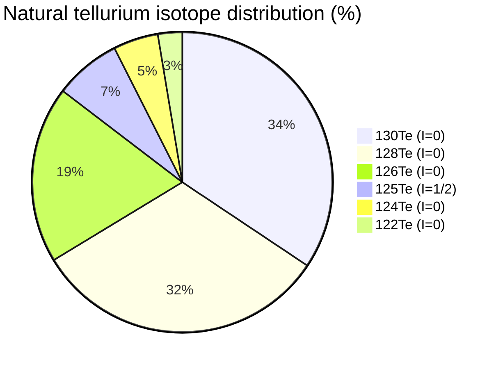

# Materials & Isotope Database

[← Documentation index](README.md)

This page is the reference for the two data registries that feed every computation in the app: the **materials database** (crystallographic parameters for the seven supported materials) and the **isotope database** (AME2020/NUBASE2020 masses and abundances plus bulk thermodynamic properties). Both exist twice, once per stack, and must stay in sync:

| Registry | Python | Rust |
|---|---|---|
| Materials | `src/waytogocoop/materials/database.py` (`MATERIALS`, `get_material`, `list_materials`) | `crates/moire-core/src/materials.rs` (`MATERIALS`, `by_name`, `substrates`, `overlayers`) |
| Isotopes | `src/waytogocoop/materials/isotopes.py` (`ELEMENTS`, `MATERIAL_COMPOSITION`) | `crates/moire-core/src/isotopes.rs` (`FE_ISOTOPES` etc., `material_composition`) |

## Materials database

All seven entries from `src/waytogocoop/materials/database.py`. Each is a frozen `Material` dataclass; lattice constants are in Angstrom, space groups in Hermann–Mauguin notation. The `role` field drives the UI dropdowns (`src/waytogocoop/components/material_selector.py` filters via `list_materials(role=...)`); `"both"` means the material can sit on either side of the interface, as in twisted homo-bilayers.

| Formula | Name | Lattice | a (A) | c (A) | Space group | Role |
|---|---|---|---:|---:|---|---|
| FeTe | Iron Telluride | square | 3.82 | 6.27 | P4/nmm | substrate |
| Sb2Te3 | Antimony Telluride | hexagonal | 4.264 | 30.458 | R-3m | overlayer |
| Bi2Te3 | Bismuth Telluride | hexagonal | 4.386 | 30.497 | R-3m | overlayer |
| Sb2Te | Antimony Ditelluride | hexagonal | 4.272 | 17.633 | R-3m | overlayer |
| Graphene | Graphene | hexagonal | 2.46 | 3.35 | P6/mmm | both |
| Graphene-AB | Bilayer Graphene (AB) | hexagonal | 2.46 | 6.70 | P63/mmc | substrate |
| Graphene-ABA | Trilayer Graphene (ABA) | hexagonal | 2.46 | 10.05 | P63/mmc | substrate |

### FeTe

> "Superconducting substrate with square lattice"

FeTe is the parent compound of the iron-chalcogenide superconductor family. Bulk FeTe is antiferromagnetic and non-superconducting because of excess interstitial iron; grown as a thin film with the excess iron removed (e.g. by annealing in Te vapor), stoichiometric FeTe superconducts with $T_c \approx 13.5$ K ([Yan et al. 2026](references.md#ref-yan-2026)). In the reference heterostructure its square Te sublattice ($a \approx 3.82$ Å) provides one of the two interfering lattices ([Wang et al. 2026](references.md#ref-wang-2026)).

### Sb2Te3

> "Topological insulator overlayer (quintuple layer)"

Sb2Te3 is a three-dimensional topological insulator: insulating in the bulk, with conducting surface states protected by time-reversal symmetry. A single quintuple layer (QL) is five atomic planes stacked Te–Sb–Te–Sb–Te, covalently bonded within the layer and van der Waals coupled between layers — hence the large $c \approx 30.5$ Å spanning three QLs. In the primary experiment, 1 QL of Sb2Te3 is grown epitaxially on a 6-unit-cell FeTe film; its hexagonal Te sublattice interferes with FeTe's square one to form a rhombic moire superlattice ([Wang et al. 2026](references.md#ref-wang-2026)).

### Bi2Te3

> "Topological insulator overlayer (quintuple layer)"

Bi2Te3 shares Sb2Te3's rhombohedral R-3m structure and quintuple-layer stacking but has a larger in-plane constant ($a \approx 4.386$ Å). Swapping it in for Sb2Te3 changes the lattice mismatch against FeTe, which alters the moire periodicity and — per the repo's description of the reference paper — yields a weaker CPDM magnitude, demonstrating tunability ([Wang et al. 2026](references.md#ref-wang-2026)).

### Sb2Te

> "Topological insulator overlayer variant"

A related antimony–tellurium binary with a shorter c-axis (17.633 Å) and an in-plane constant (4.272 Å) between those of Sb2Te3 and Bi2Te3. In the app it serves as a third hexagonal overlayer option for exploring how small changes in $a$ shift the mismatch-driven moire period.

### Graphene

> "Carbon monolayer for twisted-bilayer moire systems. Honeycomb basis approximated as first-order hexagonal Bravais — AA/AB stacking and flat-band physics are NOT resolved."

Monolayer graphene ($a = 2.46$ Å) carries role `"both"`, so it can be selected as substrate *and* overlayer to build twisted bilayer graphene in the generic moire viewer. Heed the database's own caveat: this materials-DB path renders the honeycomb lattice as a first-order hexagonal Bravais potential, which reproduces moire geometry but not sublattice physics. The true two-atom (A/B) basis — required for stacking registries and flat-band phenomenology ([Bistritzer & MacDonald 2011](references.md#ref-bistritzer-macdonald-2011), [Cao et al. 2018](references.md#ref-cao-2018)) — lives in `src/waytogocoop/computation/graphene.py` (`layer_potential_honeycomb`, `stack_layers`, `generate_stack_pattern_v2`) and is exercised by the dedicated `/graphene` page.

### Graphene-AB

> "Bernal (AB) stacked bilayer graphene substrate. The top-surface lattice (a=2.46 hexagonal) sets any interface moire, so the interface pattern matches monolayer graphene."

Bernal-stacked bilayer graphene as a substrate ($c = 6.70$ Å, i.e. two layers at the 3.35 Å graphite interlayer spacing). Because only the top surface touches the overlayer, any interface moire is geometrically identical to monolayer graphene's; the entry exists so multilayer stacks can be composed in the viewer and counted correctly in isotope-mass averages (4 C atoms per cell). The interlayer AB registry itself is modeled as reciprocal-space phase offsets in `computation/graphene.py`, not here.

### Graphene-ABA

> "Bernal (ABA) stacked trilayer graphene substrate. The top-surface lattice (a=2.46 hexagonal) sets any interface moire, so the interface pattern matches monolayer graphene."

The trilayer analogue ($c = 10.05$ Å, three layers; 6 C atoms per cell). The same top-surface argument applies. ABA/ABC stacking sequences and alternating-twist trilayer physics (the magic-angle hierarchy) are handled by the graphene computation module, with this database entry supplying only the surface lattice and composition.

## Isotope database (AME2020/NUBASE2020)

`src/waytogocoop/materials/isotopes.py` provides per-element isotope tables (frozen `Isotope` records: mass number, atomic mass, natural abundance, and an optional half-life for synthetic isotopes) and element-level bulk properties (`ElementData`, which also carries a separate `synthetic_isotopes` tuple — see the [synthetic isotopes](#synthetic-isotopes-exotic-mode-highly-speculative) section below). Data sources are the AME2020 atomic mass evaluation and NUBASE2020 isotope tables; bulk properties are approximate literature values. This database feeds the **speculative** isotope-effects module ([theory/isotope-effects.md](theory/isotope-effects.md)) — its outputs carry a `(SPECULATIVE)` tag and should be treated as exploratory illustrations, not quantitative predictions.

Nuclear spins below are not stored in the database; they are standard NUBASE2020 values listed here for reference.

### Iron

| Isotope | Mass (amu) | Natural abundance | Nuclear spin |
|---|---:|---:|---:|
| 54Fe | 53.9396 | 5.8% | 0 |
| 56Fe | 55.9349 | 91.7% | 0 |
| 57Fe | 56.9354 | 2.2% | 1/2 |
| 58Fe | 57.9333 | 0.3% | 0 |

57Fe, though rare, is the workhorse of Mössbauer spectroscopy — the reason 57Fe enrichment appears as a Tier-3 diagnostic configuration in the README's recommendations.

### Tellurium

| Isotope | Mass (amu) | Natural abundance | Nuclear spin |
|---|---:|---:|---:|
| 122Te | 121.903 | 2.6% | 0 |
| 124Te | 123.903 | 4.8% | 0 |
| **125Te** | **124.904** | **7.1%** | **1/2** |
| 126Te | 125.903 | 18.9% | 0 |
| 128Te | 127.904 | 31.7% | 0 |
| 130Te | 129.906 | 34.1% | 0 |

**125Te is the only spin-bearing stable Te isotope** ($I = 1/2$, 7.07% natural abundance) — all others in the table have $I = 0$. It is simultaneously the sole NMR/NQR handle on tellurium sites and a dilute nuclear-spin bath relevant to decoherence at the TI/SC interface; `te_125_spin_fraction` in `materials/isotopes.py` estimates its fraction for any enrichment setting. (The database carries the six most abundant isotopes; trace 120Te and 123Te, together under 1%, are omitted — NUBASE2020 classifies 123Te as unstable despite its extremely long predicted half-life.)

### Antimony

| Isotope | Mass (amu) | Natural abundance | Nuclear spin |
|---|---:|---:|---:|
| 121Sb | 120.904 | 57.2% | 5/2 |
| 123Sb | 122.904 | 42.8% | 7/2 |

The near 60/40 two-isotope split makes natural Sb the most isotope-disordered element in these heterostructures — the motivation for the README's 121Sb-pure Tier-2 configuration.

### Bismuth

| Isotope | Mass (amu) | Natural abundance | Nuclear spin |
|---|---:|---:|---:|
| 209Bi | 208.980 | 100% | 9/2 |

Effectively monoisotopic: no *stable* isotope-substitution knob exists for the Bi2Te3 cation sublattice. (The database does carry synthetic 207/208/210Bi — see below — but neither UI has a Bi mass slider; they are reachable only programmatically.)

### Carbon

| Isotope | Mass (amu) | Natural abundance | Nuclear spin |
|---|---:|---:|---:|
| 12C | 12.000 | 98.93% | 0 |
| 13C | 13.00335 | 1.07% | 1/2 |

Added alongside the graphene materials; 13C is the only spin-bearing stable carbon isotope.

### Synthetic isotopes (exotic mode, HIGHLY SPECULATIVE)

Separate from the stable tables above, the database carries synthetic (radioactive) isotopes — `synthetic_isotopes` on `ElementData` in `materials/isotopes.py`, the `*_SYNTHETIC` statics in `crates/moire-core/src/isotopes.rs`. They have **no natural abundance** (0.0) and are excluded from natural-average masses and the default slider ranges; they only appear as starred slider marks and nearest-isotope readouts when the "Exotic isotopes (HIGHLY SPECULATIVE)" switch is on ([theory/isotope-effects.md](theory/isotope-effects.md#highly-speculative-synthetic-and-exotic-isotopes)).

| Element | Isotope | Mass (amu) | Half-life |
|---|---|---:|---:|
| Fe | 52Fe | 51.9481 | 8.28 h |
| Fe | 55Fe | 54.9383 | 2.74 y |
| Fe | 59Fe | 58.9349 | 44.5 d |
| Fe | 60Fe | 59.9341 | 2.62e6 y |
| Te | 121Te | 120.9049 | 19.2 d |
| Te | 127Te | 126.9052 | 9.35 h |
| Te | 129Te | 128.9066 | 69.6 min |
| Te | 132Te | 131.9085 | 3.20 d |
| Sb | 119Sb | 118.9039 | 38.2 h |
| Sb | 124Sb | 123.9059 | 60.2 d |
| Sb | 125Sb | 124.9053 | 2.76 y |
| Bi | 207Bi | 206.9785 | 31.6 y |
| Bi | 208Bi | 207.9797 | 3.68e5 y |
| Bi | 210Bi | 209.9841 | 5.01 d |
| C | 11C | 11.0114 | 20.4 min |
| C | 14C | 14.0032 | 5700 y |

Most of these half-lives are far too short to grow and measure a film (60Fe, 14C, and 55Fe are the least implausible), and the model ignores radioactivity and self-heating entirely — this tier exists solely for what-if illustrations.

### Bulk thermodynamic properties

Per-element properties used by the isotope-effect models (Debye–Waller sharpening, BCS mass scaling):

| Element | Debye temp (K) | Grueneisen parameter | Cohesive energy (eV/atom) |
|---|---:|---:|---:|
| Fe | 260 | 1.5 | 4.0 |
| Te | 165 | 1.7 | 2.1 |
| Sb | 210 | 1.1 | 2.7 |
| Bi | 120 | 1.2 | 2.2 |
| C | 2100 | 1.8 | 7.4 |

The carbon Debye temperature is the *in-plane graphene* value (per the source comment in `materials/isotopes.py`), not bulk graphite's. `MATERIAL_COMPOSITION` maps each formula to its element counts (e.g. Sb2Te3 → 2 Sb + 3 Te; Graphene-ABA → 6 C), and `formula_unit_avg_mass` computes the abundance-weighted mean mass per atom, $\bar m = \sum_i f_i m_i$ averaged over the formula unit, with optional per-element mass overrides from the isotope sliders.

For how enrichment is actually done — centrifuge, electromagnetic, and laser separation, plus the README-originated order-of-magnitude cost estimates (e.g. 54Fe at roughly 5–10 EUR/mg) — see [process-technologies.md](process-technologies.md).

## Adding a material

Per the [Python ↔ Rust sync rule](../CONTRIBUTING.md#keeping-python--rust-physics-in-sync), a new material must land in **both stacks in the same PR**:

1. **Python**: add a `Material` entry to `MATERIALS` in `src/waytogocoop/materials/database.py`. The dataclass validates `a > 0`, `c >= 0`, `lattice_type` in `{"hexagonal", "square"}`, and `role` in `{"substrate", "overlayer", "both"}`. UI dropdowns pick it up automatically via `list_materials(role=...)`.
2. **Rust**: mirror the entry in the `static MATERIALS` slice in `crates/moire-core/src/materials.rs` with identical numbers.
3. **Isotope support** (needed for the isotope panel): add the composition to `MATERIAL_COMPOSITION` in `src/waytogocoop/materials/isotopes.py` and to `material_composition` in `crates/moire-core/src/isotopes.rs`; add any new elements to `ELEMENTS` / the Rust isotope tables with AME2020 masses and abundances.
4. **Tests, both sides**: bump the count assertions and add a property test — `tests/test_materials.py` (`test_materials_count` asserts 7) and the inline `#[cfg(test)]` module in `materials.rs` (`test_all_materials_count`, plus role-filter tests like `test_overlayers_count`).

Related: [theory/isotope-effects.md](theory/isotope-effects.md) for what the isotope data feeds into, and [process-technologies.md](process-technologies.md) for growth and enrichment context.
