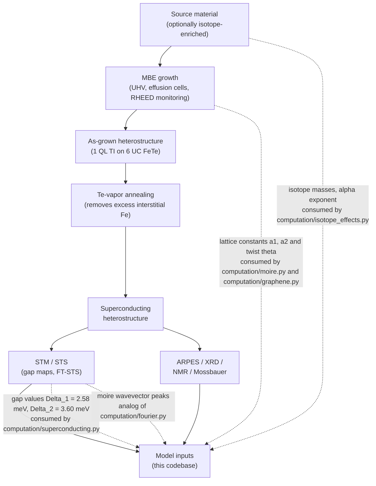

# Process Technologies

[← Documentation index](README.md)

This page describes the experimental technologies behind the physics this repository simulates: how the Sb2Te3/FeTe heterostructures of the primary paper ([Wang et al., Nature 652, 335 (2026)](references.md#ref-wang-2026)) are grown, treated, and measured, and how twisted-graphene devices — the comparison system in the graphene modules — are fabricated.

Each section closes with a status line stating whether the technology maps onto parameters this codebase models, or is purely context. Claims specific to the two 2026 Nature papers are limited to what this repository's README and in-app text state about them.

The same mapping as a look-up table (details and caveats in the sections below):

| Experimental handle | Repo parameter(s) | Where |
|---|---|---|
| Material choice at growth (MBE) | Lattice constants a1, a2 and lattice type | `src/waytogocoop/materials/database.py` |
| Growth-time or tear-and-stack rotation | Twist angle theta (degrees) | `src/waytogocoop/computation/moire.py`, `computation/graphene.py` |
| Te-vapor annealing of FeTe | None — superconducting substrate is assumed | contextual only |
| STS gap-map fitting | Gap defaults Delta_1 = 2.58 meV, Delta_2 = 3.60 meV | `src/waytogocoop/config.py`, `computation/superconducting.py` |
| FT-STS periodicity analysis | FFT + peak detection (simulated analog) | `src/waytogocoop/computation/fourier.py` |
| Isotope enrichment of source charges | Per-element masses, alpha exponent, 125Te spin fraction | `components/isotope_panel.py`, `computation/isotope_effects.py` (speculative) |
| Stacking-induced heterostrain | strain_percent, strain_angle_deg | `src/waytogocoop/computation/graphene.py` |
| Graphene stack on a periodic substrate | Supermoire overlayer + interface twist | `src/waytogocoop/computation/graphene.py` |

## Molecular beam epitaxy

Molecular beam epitaxy (MBE) is the growth technique that makes atomically precise heterostructures like "1 QL Sb2Te3 on 6 UC FeTe" possible. Invented at Bell Labs around 1970 by John Arthur and Alfred Cho, it is essentially evaporation elevated to atomic bookkeeping. Three ingredients give it that precision:

- **Ultra-high vacuum.** At base pressures of order $10^{-10}$ Torr, the mean free path of evaporated atoms far exceeds the chamber size — they travel as collision-free "molecular beams" — and a monolayer of background contaminants takes hours to accumulate, comfortably longer than a growth run.
- **Effusion cells with shutters.** Each element evaporates from its own resistively heated effusion cell at a flux set by the cell temperature; mechanical shutters switch beams on and off in a fraction of a second, so composition can change between one atomic layer and the next.
- **Sub-monolayer-per-second growth.** Deposition proceeds at well below a monolayer per second — slow enough to stop a film at a chosen atomic layer rather than a chosen thickness.

The layer count is not taken on faith: reflection high-energy electron diffraction (RHEED) monitors the surface during growth. A grazing-incidence electron beam diffracts off the top few atomic layers; a streaky RHEED pattern indicates a smooth, two-dimensional surface, while spots indicate 3D islanding.

Crucially, the specular RHEED intensity oscillates during layer-by-layer growth — one full oscillation per completed monolayer — so the grower can literally count unit cells as they form. This real-time layer counting is why specifications like *one quintuple layer* (QL) of Sb2Te3 on a *six-unit-cell* (UC) FeTe film — the geometry this repository's README attributes to the primary paper — are achievable at all.

Two TI-specific points matter for this system:

- **Van der Waals epitaxy.** Sb2Te3 and Bi2Te3 grow as quintuple layers (Te-Sb-Te-Sb-Te) that bond to the substrate only through weak van der Waals forces. This relaxes the usual lattice-matching requirement of epitaxy — which is precisely why a hexagonal Te sublattice can grow coherently on a square FeTe Te sublattice despite an 11.6% lattice mismatch, producing the moire superlattice instead of strain-relieving dislocations. Growth is performed under a Te overpressure (excess Te flux relative to Sb or Bi), because Te re-evaporates readily from the hot surface; substrate temperatures are typically reported in the 200–300 °C range for this material family.
- **Thin-film hybridization.** Below roughly 5–6 QL, the surface states on the top and bottom faces of a TI film overlap and hybridize, opening a thickness-dependent gap (Zhang et al., Nature Physics 6, 584 (2010), for Bi2Se3). At the 1 QL thickness used here, the film is far from the 3D-TI limit — one reason this repository treats the TI surface physics phenomenologically and flags its topological module as speculative.

**Modeled in this codebase:** what MBE fixes at growth time, the tool sweeps as free parameters — the in-plane lattice constants of `src/waytogocoop/materials/database.py` (`Material.lattice_constant`, e.g. FeTe 3.82 Å, Sb2Te3 4.264 Å, Bi2Te3 4.386 Å) and the twist angle (`DEFAULT_TWIST_ANGLE` in `src/waytogocoop/config.py`), consumed by `src/waytogocoop/computation/moire.py` and, for graphene stacks, `src/waytogocoop/computation/graphene.py`.

## FeTe films and Te-vapor annealing

FeTe is the parent compound of the iron-chalcogenide superconductor family, but as grown it does not superconduct. The compound naturally crystallizes iron-rich, as Fe(1+y)Te: the excess iron occupies interstitial sites between the Te layers, where it acts magnetically, stabilizes antiferromagnetic order, and suppresses superconductivity. For decades this made "superconducting FeTe" a contradiction in terms — superconductivity in the family was accessed by substituting Se (FeSe, Fe(Te,Se)) rather than by fixing FeTe itself.

The fix described in this repository's README is post-growth **Te-vapor annealing**: heating the as-grown film in a tellurium vapor atmosphere, which scavenges the excess interstitial iron and drives the film toward true 1:1 stoichiometry. Per the README and the companion paper it cites ([Yan et al., Nature 652, 342 (2026)](references.md#ref-yan-2026)), stoichiometric FeTe obtained this way is a superconductor with $T_c \approx 13.5$ K. That superconducting FeTe film is the substrate on which the TI overlayer of the primary paper is grown, so the annealing step is a prerequisite for everything this tool visualizes — the proximity-induced, moire-modulated gap only exists because the substrate superconducts.

**Contextual — not modeled.** The codebase assumes an already-superconducting substrate: there is no excess-iron parameter, and $T_c \approx 13.5$ K appears only as background in the README materials table. The annealing outcome enters indirectly, through the measured gap values used as defaults (next section).

## STM/STS: gap maps, and this tool's simulated analog

Scanning tunneling microscopy (STM) rasters an atomically sharp tip a few Å above the surface, holding the quantum tunneling current constant to map topography. Its spectroscopic mode (STS) is what matters here: with the tip parked at position $\mathbf{r}$, the differential conductance measured by lock-in detection is, to a good approximation, proportional to the local density of states,

$$
\frac{dI}{dV}(\mathbf{r}, V) \;\propto\; \mathrm{LDOS}(\mathbf{r}, E = eV).
$$

In a superconductor the LDOS shows a gap around the Fermi level bounded by coherence peaks at $\pm\Delta$. Fitting the spectrum at every pixel of a grid yields a **gap map** $\Delta(\mathbf{r})$. According to this repository's description of the primary paper, STM/STS on Sb2Te3/FeTe resolves two gaps, $\Delta_1 \approx 2.58$ meV and $\Delta_2 \approx 3.60$ meV, and both modulate periodically in space, locked to the moire superlattice — that periodic gap modulation *is* the Cooper-pair density modulation (CPDM) state ([Wang et al. 2026](references.md#ref-wang-2026)).

**The gap heatmaps this tool renders are simulated STS gap maps.** The Moire Viewer's $\Delta(\mathbf{r})$ field — `gap_modulation` in `src/waytogocoop/computation/superconducting.py`, with defaults `DELTA_1` and `DELTA_2` from `src/waytogocoop/config.py` — is the same quantity an experimentalist would plot from a fitted dI/dV grid, computed from the model instead of measured.

Two further STM-based techniques have direct counterparts or relevance here:

- **FT-STS.** Fourier-transforming a conductance or gap map turns spatially periodic modulations into sharp peaks at the corresponding wavevectors, so the moire reciprocal lattice can be read off directly. The Fourier Analysis page — `fft_2d` and `identify_peaks` in `src/waytogocoop/computation/fourier.py` — is the computational analog of FT-STS applied to the simulated maps (see [Fourier analysis](theory/fourier-analysis.md)).
- **Josephson STM.** With a superconducting tip, the Josephson current between tip and sample tunnels Cooper *pairs* rather than single quasiparticles, probing the pair density directly instead of inferring it from the quasiparticle gap. Hamidian et al., Nature 532, 343 (2016) used this to visualize a modulated pair density in a cuprate — the measurement style most directly sensitive to the "Cooper-pair density" in CPDM.

**Modeled in this codebase:** the gap fields of `src/waytogocoop/computation/superconducting.py` (`gap_modulation`, `cpdm_amplitude`) and the peak detection of `src/waytogocoop/computation/fourier.py` (`fft_2d`, `identify_peaks`) are simulated versions of the STS gap map and FT-STS analysis respectively.

## Isotope enrichment

> **Status note:** the repository module these parameters feed — `src/waytogocoop/computation/isotope_effects.py` — is **SPECULATIVE**. Its outputs carry a (SPECULATIVE) tag in both apps; treat them as exploratory illustrations, not quantitative predictions. See [Isotope effects](theory/isotope-effects.md). The enrichment *technology* described below is standard.

Isotope engineering starts at the enrichment plant, and the available routes shape which configurations are affordable:

- **Gas centrifuge.** The workhorse for bulk enrichment, but it requires a volatile feed compound. Tellurium has one — the stable hexafluoride TeF6 exists, and centrifuge enrichment of Te isotopes via TeF6 has been reported. Iron has no volatile fluoride, but iron pentacarbonyl, Fe(CO)5, has reportedly served as a centrifuge feed for Fe isotope separation. Centrifuge cascades scale well, which is why centrifuge-friendly elements tend to sit at the cheap end of the market.
- **Electromagnetic separation.** Calutron-type separators ionize the element and disperse the isotopes by mass in a magnetic field. Throughput is tiny and energy cost high, but the method is element-agnostic — no volatile compound needed — and historically it supplied most small-quantity research isotopes.
- **Laser methods.** AVLIS-type separation tunes a laser to an isotope-shifted atomic transition and selectively photoionizes one isotope out of a vapor, collecting the ions electrostatically. High selectivity per pass, at facility-scale complexity.

What a milligram of an enriched isotope costs is set by a handful of drivers:

- **Natural abundance of the target.** Rarer isotopes require more feed to be processed per output mg (compare 57Fe at 2.2% with 130Te at 34.1%).
- **Relative mass difference.** The separation factor per centrifuge stage grows with the fractional mass difference between isotopes, so heavy elements with closely spaced isotopes need longer cascades.
- **Feed chemistry.** An element with a convenient volatile compound rides the cheap centrifuge route; one without is stuck with calutron or laser separation.
- **Demand.** Isotopes with established markets (medical, detector, or qubit applications) are produced at scale and priced accordingly.

The tier figures quoted in this repository's README — e.g. ~5–10 EUR/mg for 54Fe, ~8–15 EUR/mg for 130Te, ~5 EUR/mg for 121Sb — are **the README's own order-of-magnitude estimates**, not supplier quotations, and should be read as such.

One practical point deserves emphasis: MBE is an extraordinarily isotope-thrifty consumer. A thin-film campaign consumes source material at the milligram scale, versus grams for a bulk crystal growth — so isotope-engineered *films* should be dramatically cheaper to realize than isotope-engineered bulk crystals. (This is an inference from the deposition geometry, not a costed claim.)

**Modeled in this codebase:** the per-element isotope mass sliders of `src/waytogocoop/components/isotope_panel.py` (Fe, Te, Sb; Bi is monoisotopic), consumed by `compute_isotope_effects` in `src/waytogocoop/computation/isotope_effects.py`; the BCS isotope exponent slider (default `DEFAULT_ISOTOPE_EXPONENT` = 0.4 in `src/waytogocoop/config.py`, range −0.5 to 1.0 spanning normal and inverse effects); and the 125Te nuclear-spin fraction, `te_125_spin_fraction` in `src/waytogocoop/materials/isotopes.py`.

## Graphene stack fabrication

The graphene modules model a very different fabrication world from MBE — one of tweezers, polymer stamps, and micrometer-sized flakes.

**Getting graphene.** Mechanical exfoliation — peeling flakes from graphite with adhesive tape — still yields the highest-quality crystals and remains the standard for correlated-physics devices, at the price of micron-scale flakes and zero scalability. Chemical vapor deposition grows wafer-scale monolayer graphene on copper foils (reported by Li et al., Science 324, 1312 (2009)), but transfer off the growth foil introduces polymer residue and grain boundaries, so CVD material is generally not the choice for magic-angle experiments.

**Building stacks.** Modern devices are assembled by polymer dry transfer: a stamp of PC or PPC on a PDMS dome picks flakes up one by one through van der Waals adhesion and releases them onto the growing stack, so the working interfaces never touch a solvent or polymer. Encapsulating the graphene in hexagonal boron nitride — atomically flat, inert single crystals, overwhelmingly sourced from Taniguchi and Watanabe at NIMS — protects it and enables near-intrinsic mobility (technique reported by Wang et al., Science 342, 614 (2013)).

**Setting the twist.** Twisted bilayers are made by **tear-and-stack**: the stamp tears a single flake in half, the stage rotates by the target angle, and the two halves — crystallographically aligned by construction — are restacked. Rotation-stage precision of order 0.1° (sub-0.1° in favorable setups) is commonly quoted. The catch is **twist-angle disorder**: flakes relax and shear during stacking, so the local angle typically varies at the 0.1–0.3° level across a device — comparable to the entire width of the magic-angle superconducting window. This disorder is widely regarded as the reproducibility limit of the field. The repository encodes the same sensitivity: the speculative flat-band model's gap-versus-twist Lorentzian has a half-width of only `THETA_SC_WIDTH_DEG` = 0.1° (`src/waytogocoop/config.py`), so a realistic disorder level spans the whole dome.

Placing a finished graphene stack on a periodic substrate adds a second interference — a **supermoire** — which is the fabrication scenario behind the repo's stack-on-overlayer mode ([Cao et al. 2018](references.md#ref-cao-2018) for magic-angle superconductivity; see [Graphene stacks](theory/graphene-stacks.md) and [BM model](theory/bm-model.md), after [Bistritzer & MacDonald 2011](references.md#ref-bistritzer-macdonald-2011)).

**Modeled in this codebase:** the twist angle (`twist_deg` in `stack_layers` / `generate_stack_pattern_v2`, `src/waytogocoop/computation/graphene.py`); uniaxial heterostrain (`strain_percent`, `strain_angle_deg` via `strained_g_vectors` — the modeling knob for stacking-induced strain); and the supermoire overlayer (`generate_supermoire_pattern`, with the overlayer and interface-twist controls in `src/waytogocoop/components/graphene_panel.py`).

## Characterization

Beyond STM/STS, several probes close the loop between growth and model:

- **ARPES.** Angle-resolved photoemission maps the occupied band structure $E(\mathbf{k})$ directly and is how the Dirac-cone surface state of the Bi2Se3-family TIs was first observed (Xia et al., Nature Physics 5, 398 (2009)). For films like those modeled here, ARPES verifies that the overlayer really hosts the expected topological surface state — the ingredient assumed by the [Fu-Kane-style](references.md#ref-fu-kane-2008) proximity picture in the speculative topological module.
- **57Fe Mossbauer spectroscopy.** The 14.4 keV nuclear resonance of 57Fe probes local magnetic order and hyperfine fields at the iron site — ideal for tracking the antiferromagnetism of FeTe. Only 57Fe is Mossbauer-active, and at 2.2% natural abundance a thin film gives a weak signal; this is exactly the rationale for the README's Tier-3 *57Fe-enriched FeTe* diagnostic configuration.
- **125Te NMR.** 125Te is the only spin-bearing stable Te isotope ($I = 1/2$, 7.07% natural abundance); its Knight shift and relaxation rates probe the local electronic and superconducting state at the Te site. The README cites 125Te NMR on Fe(Te,Se) under pressure (arXiv:2505.11732) as evidence that nematic rather than antiferromagnetic fluctuations dominate the superconducting state — the motivation for the Tier-3 *125Te-enriched* NMR configuration, and the flip side of eliminating the 125Te spin bath by 130Te enrichment.
- **XRD and RHEED.** X-ray diffraction pins down the film's lattice constants, phase purity, and thickness after growth; RHEED (see the MBE section) does the layer counting in situ. Between them they supply the structural numbers — $a_1$, $a_2$, layer counts — that this tool takes as inputs.

**Modeled in this codebase:** partially — `src/waytogocoop/computation/fourier.py` peak detection is the computational analog of diffraction/FT-STS periodicity analysis, and `te_125_spin_fraction` (`src/waytogocoop/materials/isotopes.py`) plus the isotope mass sliders quantify the NMR- and Mossbauer-relevant isotope fractions behind the README's Tier-3 configurations. ARPES and XRD are contextual.
