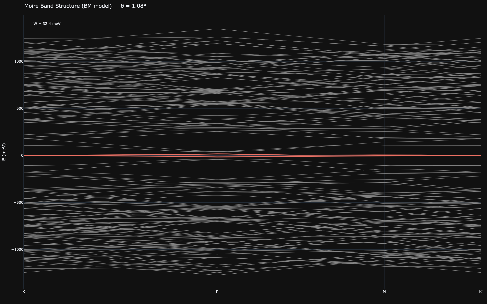
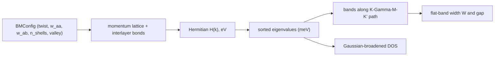
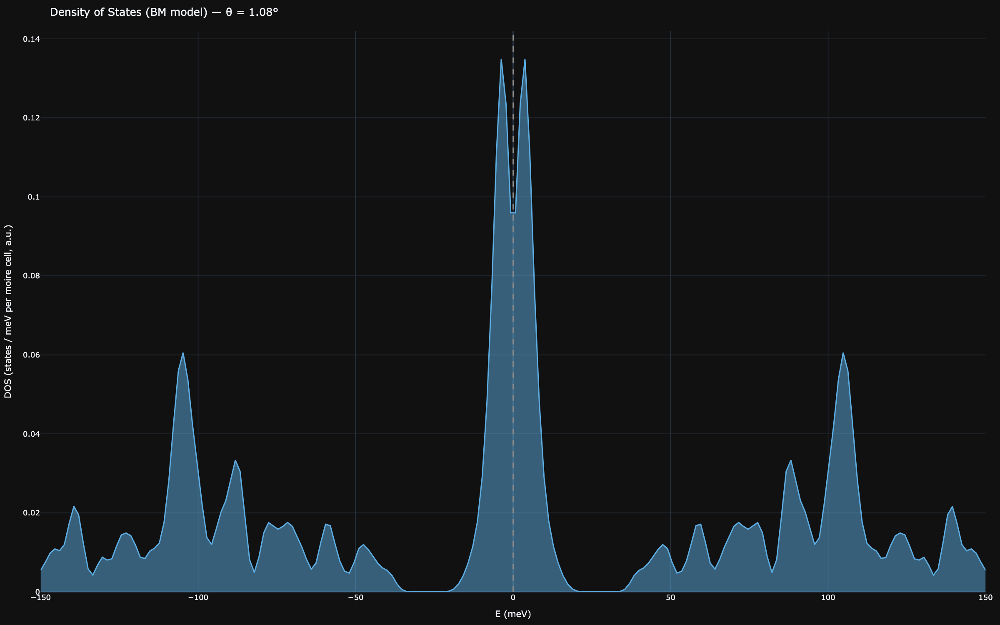

# The Bistritzer-MacDonald Continuum Model

[← Theory index](README.md) · [Documentation index](../README.md)

**Status: Validated** — established continuum band theory, cross-checked between the Python and
Rust implementations by a chiral-limit particle-hole-symmetry test anchor (see below). The
SPECULATIVE flat-band superconducting dome sometimes plotted alongside these results lives in the
[graphene stacks](graphene-stacks.md) module, not here.

## Overview

A magic-angle moire cell is enormous by atomic standards — at $\theta = 1.08°$ the twisted-bilayer
supercell contains on the order of $10^4$ carbon atoms, so direct tight-binding diagonalization is
expensive and unilluminating. The continuum model of
[Bistritzer & MacDonald (2011)](../references.md#ref-bistritzer-macdonald-2011) sidesteps the
atoms entirely: near one valley, each layer is just a Dirac cone, and the twist couples the two
cones through the three lowest-harmonic interlayer momentum transfers. The result is a small
momentum-space Hamiltonian (a few hundred rows) whose low-energy bands are essentially exact for
small twist angles.

The payoff is the flat band. Near the magic angle the two bands closest to charge neutrality
collapse to a few meV of bandwidth: kinetic energy is quenched, interactions dominate, and this is
the regime where [Cao et al. (2018)](../references.md#ref-cao-2018) found correlated insulators and
superconductivity. In this codebase the BM model supplies the *validated* band-structure and DOS
backdrop against which the speculative flat-band superconductivity model (in
`src/waytogocoop/computation/graphene.py`) is displayed. It appears in the web UI as the "Band
structure" and "DOS" view modes of the `/graphene` page (`src/waytogocoop/pages/graphene.py`), and
in the desktop app as the Bands / DOS graphene views — egui line charts rather than textures
(`crates/moire-desktop/src/ui/viewport.rs`, driven by `recompute_bm_model` in
`crates/moire-desktop/src/app.rs`).

*BM band structure at $\theta = 1.08°$ along K → Γ → M → K′. The two central bands are the flat
bands; the reported width W is their total energy span over the path.*

## Model

### Momentum-space geometry

The monolayer Dirac point sits at distance $k_D = 4\pi/(3a)$ from the zone centre, with
$a = 2.46$ Å the graphene lattice constant (`GRAPHENE_A` in `src/waytogocoop/config.py`). Twisting
the layers by $\theta$ separates their Dirac points by the moire wavevector

$$
k_\theta = 2\,k_D \sin(\theta/2), \qquad k_D = \frac{4\pi}{3a}.
$$

Interlayer tunneling transfers momentum by one of three vectors (the lowest moire harmonics),
which in this codebase's convention are

$$
\mathbf{q}_1 = k_\theta\,(0,\,-1), \quad
\mathbf{q}_2 = k_\theta\left(\tfrac{\sqrt{3}}{2},\,\tfrac{1}{2}\right), \quad
\mathbf{q}_3 = k_\theta\left(-\tfrac{\sqrt{3}}{2},\,\tfrac{1}{2}\right);
\qquad
\mathbf{b}_1 = \mathbf{q}_2 - \mathbf{q}_1, \quad
\mathbf{b}_2 = \mathbf{q}_3 - \mathbf{q}_1
$$

defines the moire reciprocal-lattice basis from their differences.

### Momentum lattice

The Hamiltonian lives on a lattice of Dirac-cone replicas: layer-1 plane-wave sites at
$\{m\,\mathbf{b}_1 + n\,\mathbf{b}_2\}$ and layer-2 sites offset by $\mathbf{q}_1$, at
$\{\mathbf{q}_1 + m\,\mathbf{b}_1 + n\,\mathbf{b}_2\}$, with two sublattices per site. Sites are
kept under the standard hexagonal truncation $|m|, |n|, |m + n| \le n_{\text{shells}}$, giving
$3N^2 + 3N + 1$ sites per layer for $N = n_{\text{shells}}$ (a fact pinned by
`test_hamiltonian_dim` in `tests/test_bm_model.py`). The default $n_{\text{shells}} = 3$
(`BM_SHELLS_DEFAULT` in `src/waytogocoop/config.py`) gives 37 sites per layer and a
$148 \times 148$ matrix, and per the module docstring converges the flat bands to well below the
meV scale probed here.

Each site $\mathbf{Q}$ carries a diagonal Dirac block at Bloch momentum $\mathbf{k}$ (measured
from the layer-1 Dirac point, in 1/Å):

$$
h(\mathbf{k} + \mathbf{Q}) = \hbar v_F \left[\,\xi\,(k_x + Q_x)\,\sigma_x + (k_y + Q_y)\,\sigma_y\,\right],
$$

with valley index $\xi = \pm 1$ and $\hbar v_F = 5.96$ eV·Å. That velocity is a deliberate
config choice: it follows from $\hbar v_F = (\sqrt{3}/2)\,t\,a$ with nearest-neighbour hopping
$t = 2.8$ eV ([Castro Neto et al. 2009](../references.md#ref-castro-neto-2009)), *not* the common
6.58 eV·Å — with 6.58 the first magic angle lands at 0.974°, outside the observed 1.0–1.2° window
(see the comment block at `HBAR_VF_GRAPHENE` in `src/waytogocoop/config.py`).

### Interlayer tunneling matrices

Layer-1 site $\mathbf{Q}$ couples to layer-2 site $\mathbf{Q} + \mathbf{q}_j$ through the
sublattice matrix

$$
T_j = w_{AA}\,\sigma_0 + w_{AB}\left[\cos\frac{2\pi (j-1)}{3}\,\sigma_x
+ \xi\,\sin\frac{2\pi (j-1)}{3}\,\sigma_y\right], \qquad j = 1, 2, 3.
$$

The amplitudes use the corrugation-corrected values of
[Koshino et al. (2018)](../references.md#ref-koshino-2018):
$w_{AA} = 0.0797$ eV $< w_{AB} = 0.0975$ eV (`W_AA_TBG`, `W_AB_TBG` in
`src/waytogocoop/config.py`). Physically, lattice relaxation shrinks the AA-stacked regions and
buckles the layers apart there, weakening AA tunneling relative to AB — the one relaxation effect
the model does absorb. Index bookkeeping, identical in both languages: since
$\mathbf{q}_j = \mathbf{q}_1 + \{0, \mathbf{b}_1, \mathbf{b}_2\}$, the layer-2 partner of layer-1
site $(m, n)$ under $T_j$ is $(m, n) + \delta_j$ with $\delta_j = (0,0), (1,0), (0,1)$.

**First-order model**: the $\pm\theta/2$ rotation of the Pauli matrices in the two layers' Dirac
blocks is neglected, exactly as in the original Bistritzer-MacDonald treatment — its effect on the
low-energy bands is higher order in $\theta$.

### The K → Γ → M → K′ path

Band structures are plotted along K → Γ → M → K′ of the moire Brillouin zone, expressed in the
layer-1-Dirac frame (see `_high_symmetry_points` in `src/waytogocoop/computation/bm_model.py` and
`k_path` in `crates/moire-core/src/bm_model.rs`):

$$
\mathrm{K} = (0, 0), \qquad
\Gamma = k_\theta\left(\tfrac{\sqrt{3}}{2}, \tfrac{1}{2}\right), \qquad
\mathrm{M} = \left(0, \tfrac{k_\theta}{2}\right), \qquad
\mathrm{K'} = (0, k_\theta).
$$

The K′ corner hides a subtlety worth knowing when reading the code: because the layer-2
momentum-lattice sites already carry the $\mathbf{q}_1$ offset, the layer-2 Dirac block at the
$\mathbf{Q} = \mathbf{q}_1$ site vanishes when $\mathbf{k} = -\mathbf{q}_1 = (0, +k_\theta)$. So
**the layer-2 Dirac cone sits at $-\mathbf{q}_1$, which is the K′ path corner**; the mirror point
$(0, -k_\theta)$ is *not* a Dirac point in this convention. Both test suites pin this orientation
(`test_layer2_dirac_cone_at_k_prime_tick`, in `tests/test_bm_model.py` and as a Rust twin). Γ is
the centre of the moire BZ hexagon whose adjacent corners are the two cones, and M the midpoint of
the edge between them; the segment lengths are $k_\theta$, $\tfrac{\sqrt{3}}{2} k_\theta$ and
$\tfrac{k_\theta}{2}$ respectively.

### Flat-band width and gap

The flat bands are identified as the two middle bands — indices $\dim/2 - 1$ and $\dim/2$ of the
ascending spectrum at every k-point. Two diagnostics are extracted along the path:

- **Flat-band width** $W$ = (max − min) over both flat bands along the path — the number quoted in
  figure annotations and used by the magic-angle bandwidth-minimum tests.
- **Flat gap** = the smaller of the band-edge gaps separating the flat bands from the remote bands
  above and below. Python reports a negative value when they overlap in energy; Rust clamps it at
  zero (documented on `flat_gap_mev` in both languages).

### Density of states

The DOS is a Gaussian-broadened histogram of eigenvalues collected on a uniform
$n_k \times n_k$ grid of fractional offsets over the parallelogram spanned by
$\mathbf{b}_1, \mathbf{b}_2$ (i.e. a uniform moire-BZ sampling):

$$
\mathrm{DOS}(E) = \frac{1}{N_k\,\sqrt{2\pi}\,\sigma}
\sum_{\mathbf{k},\,n} \exp\!\left[-\frac{\big(E - E_n(\mathbf{k})\big)^2}{2\sigma^2}\right],
\qquad N_k = n_k^2,
$$

with default broadening $\sigma = 2$ meV (`DOS_BROADENING_MEV` in `src/waytogocoop/config.py`),
a $\pm 150$ meV window and 200 bins (Python defaults; the Rust API takes these explicitly).
Normalizing per k-point makes the curve integrate to the average number of states per k-point in
the window. At the magic angle the flat bands pile up into a sharp peak near zero energy — the van
Hove structure that makes the flat-band regime interesting.

*BM density of states at $\theta = 1.08°$: the flat-band peak sits within a few meV of zero,
flanked by the remote-band continuum.*

### Chiral limit — the cross-language test anchor

In the chiral limit $w_{AA} = 0$ the model acquires an exact sublattice chiral symmetry, and the
spectrum is exactly particle-hole symmetric — every eigenvalue $E$ is paired with $-E$ at the same
$\mathbf{k}$ ([Tarnopolsky, Kruchkov & Vishwanath 2019](../references.md#ref-tarnopolsky-2019),
who showed the flat bands become perfectly flat at the magic angles in this limit).

This is the designated **test anchor shared by both implementations**:
`test_chiral_limit_particle_hole_symmetry` in `tests/test_bm_model.py` asserts
$E_i = -E_{\dim - 1 - i}$ to $10^{-6}$ meV at arbitrary k-points, and the inline Rust test of the
same name in `crates/moire-core/src/bm_model.rs` does the same at the moire Γ point. The symmetry
is exquisitely sensitive to the $T_j$ phases — any sign or phase error in the tunneling matrices
or the valley factor $\xi$ breaks it — so it pins the Hamiltonian conventions across the two
languages far more tightly than any bandwidth comparison could.

## Assumptions and validity

- **Single valley**: the Hamiltonian describes one valley ($\xi = \pm 1$); K and K′ valleys are
  time-reversal partners with identical eigenvalue sets at the moire K point
  (`test_valley_spectrum_symmetry`). No intervalley coupling.
- **First order in twist angle**: the $\pm\theta/2$ Pauli rotation is dropped (see above) — fine
  for the ~1° angles of interest, increasingly approximate above a few degrees.
- **No lattice relaxation beyond $w_{AA} < w_{AB}$**: the Koshino corrugation correction is the
  only relaxation effect included; there is no strain, no in-plane relaxation, and heterostrain
  lives entirely in the real-space [graphene stacks](graphene-stacks.md) module.
- **Bilayer only**: the model is strictly two-layer. When a trilayer stack is selected on the
  `/graphene` page, the Bands / DOS views show the bilayer result with ": bilayer approximation"
  appended to the figure title (`src/waytogocoop/pages/graphene.py`). The alternating-twist
  trilayer of [Park et al. (2021)](../references.md#ref-park-2021) enters the codebase only via
  the analytic $\times\sqrt{2}$ magic-angle rescaling in the graphene-stacks module.
- **Non-interacting**: these are single-particle bands. The superconducting dome plotted next to
  them comes from `compute_flat_band_sc` in `src/waytogocoop/computation/graphene.py` and is
  **SPECULATIVE** — its outputs carry a `(SPECULATIVE)` tag in figure titles and should be treated
  as exploratory illustrations, not quantitative predictions.
- **Truncation**: results depend on $n_{\text{shells}}$ in principle; the default of 3 converges
  the flat bands well below the meV scale relevant here (module docstring).
- **Parameter consistency**: the analytic magic-angle formula in the graphene-stacks module uses
  the original single BM amplitude $w = 0.110$ eV (`W_INTERLAYER_TBG`), which with
  $\hbar v_F = 5.96$ eV·Å puts the first magic angle at 1.076°; the BM numerics here default to the
  Koshino pair instead. Tests reconcile the two: the numerical Dirac velocity at 2.5° with
  $w_{AA} = w_{AB} = 0.110$ matches the perturbative $(1 - 3\alpha^2)/(1 + 6\alpha^2)$ ratio
  (`test_velocity_matches_first_order`), and the default-parameter flat-band width is minimized in
  the interior of a scan around 1.08° (`test_magic_angle_bandwidth_minimum`, both languages).

## Implementation

| Concept | Python | Rust |
|---|---|---|
| Config / defaults | `src/waytogocoop/computation/bm_model.py`, `BMConfig` (defaults from `config.py`) | `crates/moire-core/src/bm_model.rs`, `BMConfig` + `Default` impl |
| Momentum lattice + bonds | built inline in `build_bm_hamiltonian` (dict-indexed sites) | `momentum_lattice` (precomputed `MomentumLattice` with bond list) |
| Hamiltonian assembly | `build_bm_hamiltonian` (dense complex ndarray, eV) | `build_hamiltonian` (nalgebra `DMatrix<Complex<f64>>`, eV) |
| Eigensolver | `numpy.linalg.eigvalsh` (LAPACK) | nalgebra `symmetric_eigenvalues` self-adjoint path |
| Band structure | `compute_band_structure` → `BandStructure` | `compute_band_structure` → `BandStructure`, k-points parallelized with rayon |
| Flat-band width | `flat_band_width_mev` | `flat_band_width_mev` |
| DOS | `compute_dos` (dict result) | `compute_dos` → `DosResult` |
| Display | `create_band_structure_plot`, `create_dos_plot` in `src/waytogocoop/components/figure_factory.py` | egui_plot line charts in `crates/moire-desktop/src/ui/viewport.rs` |

On the Rust eigensolver: nalgebra's `symmetric_eigenvalues` is used directly on the complex
Hermitian matrix — it Householder-tridiagonalizes and rephases the off-diagonal to a real
symmetric tridiagonal problem, which is exact for Hermitian input; the Rust test
`test_eigensolver_known_hermitian` validates it against a known spectrum.

Minor cross-language differences, all documented in the sources and none affecting the physics
content of the plots: the flat gap is clamped at zero in Rust but may be negative in Python when
the bands overlap; the Rust DOS keeps eigenvalues up to $5\sigma$ beyond the energy window so
Gaussian tails from just-outside states still reach the edge bins, while Python keeps only
eigenvalues strictly inside the window (bin-centre conventions also differ slightly); and the
default k-path sampling is 16 points per segment in Python (`BM_KPOINTS_DEFAULT`) versus 12 in the
desktop app (`BM_N_K_PER_SEGMENT` in `crates/moire-desktop/src/app.rs`).

## References

- [Bistritzer & MacDonald, PNAS 108, 12233 (2011)](../references.md#ref-bistritzer-macdonald-2011)
  — the continuum model and the first magic angle; this module is a direct implementation.
- [Koshino et al., PRX 8, 031087 (2018)](../references.md#ref-koshino-2018) — corrugation-corrected
  tunneling amplitudes $w_{AA} < w_{AB}$ used as the defaults.
- [Tarnopolsky, Kruchkov & Vishwanath, PRL 122, 106405 (2019)](../references.md#ref-tarnopolsky-2019)
  — chiral limit with exactly flat, particle-hole-symmetric bands; basis of the cross-language test
  anchor.
- [Cao et al., Nature 556, 43 (2018)](../references.md#ref-cao-2018) — magic-angle
  superconductivity, the reason the flat bands matter.
- [Castro Neto et al., RMP 81, 109 (2009)](../references.md#ref-castro-neto-2009) — graphene
  electronic structure; source of the $t = 2.8$ eV hopping behind $\hbar v_F = 5.96$ eV·Å.
- [Park et al., Nature 590, 249 (2021)](../references.md#ref-park-2021) — alternating-twist
  trilayer, relevant to the bilayer-only caveat.
- Related theory pages: [graphene stacks](graphene-stacks.md) (magic-angle formula, stacking
  phases, the SPECULATIVE flat-band dome), [curvature](curvature.md) (strain and pseudo-fields).
