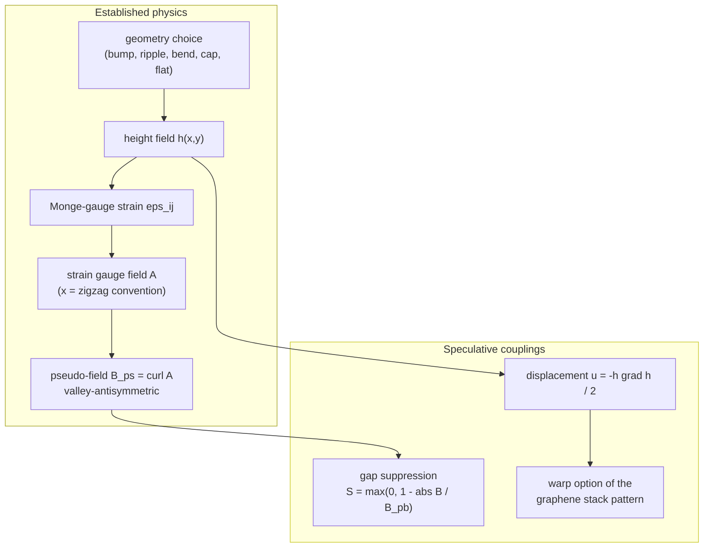

# Curved Sheets, Strain & Pseudo-Magnetic Fields

[← Theory index](README.md) · [Documentation index](../README.md)

**Status: mixed.** The core chain — height field → Monge-gauge strain → strain gauge field → pseudo-magnetic field — is established graphene physics with a solid literature basis. The two couplings built on top of it, the pseudo-field **gap suppression** and the curvature **displacement (warp) field**, are **SPECULATIVE** and carry a **(SPECULATIVE)** tag in the app UI. Treat those outputs as exploratory illustrations, not quantitative predictions.

## Overview

A graphene sheet is never perfectly flat: free-standing membranes show intrinsic ripples of a few Å over ~100 Å wavelengths ([Meyer et al. 2007](../references.md#ref-meyer-2007)), and substrate nanobubbles can bulge much more strongly. Any out-of-plane corrugation strains the sheet, and strain in graphene does something remarkable: it enters the low-energy Dirac Hamiltonian exactly like a vector potential. The resulting **pseudo-magnetic field** $B_{ps}$ is not an electromagnetic field — no time-reversal symmetry is broken — but Dirac electrons within one valley respond to it as if it were real, forming pseudo-Landau levels. In graphene nanobubbles, effective fields exceeding 300 T have been observed this way ([Levy et al. 2010](../references.md#ref-levy-2010)), and strain patterns can be *engineered* to produce nearly uniform pseudo-fields ([Guinea, Katsnelson & Geim 2010](../references.md#ref-guinea-2010)).

This module computes that chain for a set of parametrized sheet geometries: it evaluates a height field $h(x, y)$, derives the geometric strain, maps strain to the gauge field, and takes its curl. The result feeds two views of the `/graphene` page (pseudo-field heatmap and curved 3D surface) and the desktop app's curvature controls. Note the distinction from [heterostrain](graphene-stacks.md): heterostrain is *in-plane* strain applied to the lattice vectors of one layer; here the strain is purely a geometric consequence of *out-of-plane* bending.

## Model

### Height-field geometries

`height_field` (`src/waytogocoop/computation/curvature.py`) supports five geometries; $\phi$ is the in-plane orientation angle measured from the zigzag ($x$) axis, and $u = x\cos\phi + y\sin\phi$ is the rotated coordinate. Defaults come from `src/waytogocoop/config.py`.

| Geometry | Height field (plain text) | Default shape parameters |
|---|---|---|
| `flat` | h = 0 | — |
| `gaussian_bump` | h = h0 exp(-(x^2 + y^2) / (2 sigma^2)) | h0 = 5 Å, sigma = 50 Å |
| `sinusoidal_ripple` | h = h0 sin(2 pi u / lambda) | h0 = 2 Å, lambda = 100 Å |
| `cylindrical_bend` | h = R - sqrt(R^2 - min(abs u, R)^2) | R = 1000 Å |
| `spherical_cap` | h = sqrt(max(R^2 - x^2 - y^2, 0)) | R = 2000 Å |

The ripple defaults (`RIPPLE_HEIGHT_DEFAULT` = 2 Å, `RIPPLE_WAVELENGTH_DEFAULT` = 100 Å) are chosen to match the intrinsic ripples reported for suspended graphene ([Meyer et al. 2007](../references.md#ref-meyer-2007)). The spherical cap deliberately covers the whole window when $R$ is large compared to the window extent — that is the intended regime, and the constant height offset $\sim R$ is irrelevant because all of the physics below depends only on height *gradients* (see the `height_field` docstring note).

Each geometry probes a different regime of the pseudo-field physics derived below, and the test suites pin the character of each:

- **Gaussian bump** — the "nanobubble" archetype: a localized six-lobe alternating-sign field (~5.7 T at defaults) with near-zero net flux.
- **Sinusoidal ripple** — the analytically solvable case and the source of the quantitative scale anchor (34.49 T).
- **Cylindrical bend** — one-dimensional curvature; along zigzag it produces *exactly zero* field (only $\epsilon_{xx}$ is nonzero and it varies only along $x$, so the curl vanishes), while the same bend tilted 30° gives fields above 1 T.
- **Spherical cap** — gentle isotropic curvature; at the default $R = 2000$ Å its field is under 5% of the bump's, a smallness check the tests enforce.
- **Flat** — the null baseline: zero strain, zero field, unit gap-suppression factor everywhere.

### Monge-gauge strain

In the Monge gauge — the sheet described purely by its height profile, with **no in-plane relaxation** — the strain tensor of a corrugated membrane is quadratic in the slope:

$$
\epsilon_{ij} = \frac{1}{2}\,\partial_i h \,\partial_j h .
$$

`strain_tensor` evaluates this with central finite differences (`np.gradient`). Since $h$ and the grid axes are both in Å, the strain is dimensionless; for the default Gaussian bump (5 Å over 50 Å) the peak strain stays below 5% (asserted in `tests/test_curvature.py`, `TestStrain`). A ripple oriented exactly along zigzag has $\partial_y h = 0$, so $\epsilon_{yy} = \epsilon_{xy} = 0$ identically — a useful analytic anchor the tests exploit.

### Strain gauge field and pseudo-magnetic field

Strain modifies the carbon–carbon hopping amplitudes, and near the Dirac points this is equivalent to minimal coupling to a gauge field ([Vozmediano, Katsnelson & Guinea 2010](../references.md#ref-vozmediano-2010)). With the $x$ axis along the **zigzag** direction (the convention that fixes the component form),

$$
\mathbf{A} = \frac{\hbar \beta}{2 e a_{cc}}
\begin{pmatrix} \epsilon_{xx} - \epsilon_{yy} \\ -2\,\epsilon_{xy} \end{pmatrix},
\qquad
B_{ps} = \xi \left( \partial_x A_y - \partial_y A_x \right),
$$

where $a_{cc} = 1.42$ Å is the C–C bond length (`GRAPHENE_A_CC`), $\beta = -\,d\ln t / d\ln a$ is the dimensionless electron–phonon (hopping–strain) coupling, and $\xi = \pm 1$ is the valley index. The repo default is $\beta = 3.0$ (`GRAPHENE_BETA`), inside the literature range 2–3.4 quoted from [Vozmediano et al. 2010](../references.md#ref-vozmediano-2010) in `src/waytogocoop/config.py`. `pseudo_magnetic_field` builds $\mathbf{A}$ in T·m and takes the finite-difference curl per metre, giving $B_{ps}$ in Tesla.

Two structural properties matter more than any single number:

- **Valley antisymmetry.** The field is exactly opposite at the two valleys: $B_{ps}(K') = -B_{ps}(K)$. The code returns the field at the configured valley by multiplying by $\xi$, and `tests/test_curvature.py::TestValley` checks the negation is exact. This is why time-reversal symmetry survives — more on that below.
- **Threefold crystallographic anisotropy.** The gauge-field form ties $B_{ps}$ to the lattice orientation: for a sinusoidal ripple at angle $\phi$ from zigzag, the field follows a $\sin(3\phi)$ law. A ripple (or cylindrical bend) along zigzag ($\phi = 0$) produces *zero* field; the same corrugation along armchair ($\phi = 30°$) is maximal. `TestPseudoField::test_ripple_sin_3phi_law` verifies the ratio quantitatively.

For the ripple the whole chain closes analytically (quoted in the magnitude test's docstring): $\max|B_{ps}| = \frac{1}{2} P\, h_0^2 k^3 |\sin 3\phi|$ with $P = \hbar\beta/(2 e a_{cc})$ and $k = 2\pi/\lambda$. With the default 2 Å × 100 Å ripple at $\phi = 30°$ this gives **34.49 T** — the anchor value in both the Python and Rust test suites. That a gentle intrinsic-ripple-scale corrugation already yields tens of Tesla makes the 300+ T fields of sharp nanobubbles ([Levy et al. 2010](../references.md#ref-levy-2010)) plausible. The default Gaussian bump gives a milder ~5.7 T, arranged in six alternating-sign lobes with $\sin(3\theta)$ angular structure: the field vanishes along the zigzag axis through the bump centre and its net flux integrates to (nearly) zero, both asserted in the tests.

*Pseudo-magnetic field $B_{ps}$ of a sinusoidal ripple oriented 30° from zigzag (armchair direction, maximal $\sin 3\phi$), K valley. The signed field alternates with the corrugation; the K′ valley sees the exact mirror image.*

**Numerical detail — the 2-pixel border clamp.** Taking a curl of finite-difference gradients stacks two first-order one-sided differences at the grid edges, which produces spurious border fields up to ~100× the interior signal — the code comment in `pseudo_magnetic_field` records 0.88 T spurious vs 0.008 T true for the default spherical cap. Both implementations therefore deliberately overwrite the outermost two pixel rows/columns with the nearest interior values (Rust: `clamp_border` in `crates/moire-core/src/curvature.rs`), and both reject grids smaller than 8 points per axis so the clamp always has interior pixels to copy from.

### Why the pseudo-field is not a real field

The module docstring (`src/waytogocoop/computation/curvature.py`) states the boundary precisely, and it is worth quoting verbatim:

> CAVEAT — pseudo-field versus real field: the pseudo-magnetic field is
> valley-antisymmetric (+B at K, -B at K') and preserves time-reversal
> symmetry, so it does NOT orbitally depair singlet Cooper pairs the way a
> real magnetic field does.  The ``gap_suppression_factor`` ansatz below is a
> qualitative SPECULATIVE knob, not established pair-breaking physics.

A singlet Cooper pair combines electrons from opposite valleys, which see opposite pseudo-fields — the orbital pair-breaking mechanism of a real field (see [Magnetic field effects](magnetic.md)) simply does not apply. Everything above this line is established physics; everything below it is not.

## Speculative — gap suppression and displacement field

**Status: SPECULATIVE.** These couplings are qualitative visualization knobs, not validated models. Their outputs carry a **(SPECULATIVE)** tag in the app UI — exploratory illustrations, not quantitative predictions.

### Gap suppression

`gap_suppression_factor` applies a linear pair-breaking ansatz, clipped to $[0, 1]$:

$$
S(\mathbf{r}) = \max\!\left(0,\; 1 - \frac{|B_{ps}(\mathbf{r})|}{B_{pb}}\right),
$$

with the pair-breaking scale defaulting to $B_{pb} = 10$ T (`B_PAIRBREAK_DEFAULT`) — an **arbitrary model default with no experimental basis**, exposed as a slider precisely because it is a free knob. In the curved-sheet view this factor multiplies the speculative flat-band gap from [graphene stacks](graphene-stacks.md), painting "where curvature might weaken pairing *if* the pseudo-field depaired like a real field" onto the 3D surface. Because only $|B_{ps}|$ enters, $S$ is identical at both valleys (asserted in `tests/test_curvature.py::TestValley::test_gap_suppression_valley_independent`).

*Gaussian-bump height field colored by the speculative flat-band gap × suppression factor. The title carries the (SPECULATIVE) tag, matching the app convention.*

### Displacement (warp) field

`displacement_field` computes the leading-order in-plane projected displacement of an inextensible sheet bent into $h(x, y)$:

$$
\mathbf{u} = -\tfrac{1}{2}\, h\, \nabla h .
$$

Projecting the unstretched, bent sheet back onto the plane pulls material points inward toward height maxima. The result feeds the `displacement` argument of the graphene layer potentials — the **warp** switch on the `/graphene` page runs the curvature computation first, then passes $(u_x, u_y)$ into `generate_stack_pattern_v2` so the moire pattern itself distorts (curvature back-reaction). The Rust `displacement_field` plays the same role for `compute_graphene_stack_v2`. The function is flagged SPECULATIVE: it is a leading-order geometric estimate layered on the Monge-gauge picture (which itself assumes *no* in-plane relaxation), used here for qualitative pattern warping only.

## Assumptions and validity

- **Monge gauge, no relaxation**: strain comes purely from height gradients; real membranes relax in-plane, which redistributes (typically reduces) strain. Valid qualitatively for gentle corrugations with slope ≪ 1 — the default geometries respect this.
- **Continuum Dirac picture**: the gauge-field mapping assumes corrugation length scales ≫ $a_{cc}$, comfortably satisfied at 50–2000 Å.
- **$\beta$ uncertainty**: the prefactor scales linearly with $\beta$, known only to the range 2–3.4; the default 3.0 makes absolute field values indicative, not precise.
- **Fixed lattice frame**: $x$ = zigzag is baked into the gauge-field component form; the `orientation_deg` parameter rotates the *corrugation*, not the lattice, which is what produces the $\sin(3\phi)$ law.
- **Finite differences**: gradients and curls are first/second-order finite differences on a uniform grid; the border clamp removes the known edge artifact but the outer two pixels carry copied, not computed, values.
- The strain → pseudo-field chain is **established** (validated against the analytic ripple result and $\sin 3\phi$ law in both test suites); the gap-suppression and warp couplings are **speculative** by construction.

## Implementation

| Concept | Python | Rust |
|---|---|---|
| Geometries + height field | `src/waytogocoop/computation/curvature.py`, `height_field` | `crates/moire-core/src/curvature.rs`, geometry match inside `compute_curvature` |
| Monge strain | `strain_tensor` | `gradient_2d` + strain maps in `compute_curvature` |
| Pseudo-field + border clamp | `pseudo_magnetic_field` | curl in `compute_curvature` + `clamp_border` |
| Gap suppression (SPECULATIVE) | `gap_suppression_factor` | `gap_suppression_field` |
| Displacement / warp (SPECULATIVE) | `displacement_field` | `displacement_field` |
| Full pipeline | `compute_curvature_effects` → `CurvatureResult` | `compute_curvature` → `CurvatureResult` |
| Display | `create_pseudo_field_heatmap`, `create_3d_surface` in `src/waytogocoop/components/figure_factory.py` | `render_surface_3d_colored` in `crates/moire-desktop/src/render/surface3d.rs` |

The Rust `gradient_2d` reproduces `np.gradient` exactly (central differences interior, one-sided edges), so the two implementations share the 34.49 T ripple and ~5.7 T bump test anchors. On the rendering side, the desktop app's curved view uses `render_surface_3d_colored`, which takes the **height field and the color field as separate arrays** — the surface shape shows $h(x, y)$ while the colormap shows the pseudo-field or the suppressed gap, exactly mirroring the web UI's `create_3d_surface` call with independent `z` and `surfacecolor`.

## References

- [Vozmediano, Katsnelson & Guinea, Phys. Rep. 496, 109 (2010)](../references.md#ref-vozmediano-2010) — review of gauge fields in graphene; source of the strain gauge-field form and the $\beta$ = 2–3.4 range.
- [Guinea, Katsnelson & Geim, Nat. Phys. 6, 30 (2010)](../references.md#ref-guinea-2010) — strain engineering of nearly uniform pseudo-fields.
- [Levy et al., Science 329, 544 (2010)](../references.md#ref-levy-2010) — pseudo-fields exceeding 300 T observed in graphene nanobubbles; the experimental scale anchor.
- [Meyer et al., Nature 446, 60 (2007)](../references.md#ref-meyer-2007) — intrinsic ripples of suspended graphene; source of the ripple defaults.
- Related theory pages: [graphene stacks](graphene-stacks.md) (heterostrain, the warped stack pattern, and the speculative flat-band gap that the suppression factor multiplies), [BM model](bm-model.md) (the flat bands themselves), [magnetic field effects](magnetic.md) (how a *real* field depairs, for contrast).
