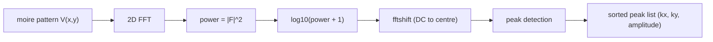

# Fourier Analysis of Moire Patterns

[← Theory index](README.md) · [Documentation index](../README.md)

## Overview

A moire pattern that looks intricate in real space is simple in reciprocal space: it is built from a
handful of plane waves, so its 2D Fourier transform concentrates into a few sharp peaks. The Fourier
Analysis page (`/fourier` in the web UI, the FFT tab in the desktop app) computes the power spectrum
of the moire pattern and automatically extracts those peaks, turning "how long is the moire period?"
into a direct readout: a peak at wavevector $\mathbf{k}$ corresponds to a real-space modulation of
wavelength $L = 2\pi/|\mathbf{k}|$.

The reason difference wavevectors dominate follows from how the pattern is constructed (see
[moire patterns](moire-patterns.md)). Each layer potential is a sum of cosines over its reciprocal
lattice vectors, and the combined pattern is their product. A product of cosines splits into sum and
difference terms:

$$
\cos(\mathbf{G}_1 \cdot \mathbf{r}) \cos(\mathbf{G}_2 \cdot \mathbf{r})
= \tfrac{1}{2}\cos\!\big[(\mathbf{G}_1 - \mathbf{G}_2)\cdot\mathbf{r}\big]
+ \tfrac{1}{2}\cos\!\big[(\mathbf{G}_1 + \mathbf{G}_2)\cdot\mathbf{r}\big].
$$

When the two lattices nearly match, $\mathbf{G}_1 - \mathbf{G}_2$ is short — these are the moire
wavevectors, appearing as a ring of satellite peaks close to the zone centre. The sum combinations
$\mathbf{G}_1 + \mathbf{G}_2$ live at atomic-scale wavevectors, usually beyond the Nyquist limit
$k_{\mathrm{Nyq}} = \pi/dx$ of the simulation grid.

This is the simulated analogue of Fourier-transform scanning tunneling spectroscopy (FT-STS): in the
experiments this tool models, STM/STS gap maps of the Sb2Te3/FeTe heterostructure show gap modulation
synchronized with the moire superlattice
([Wang et al. 2026](../references.md#ref-wang-2026)), and Fourier-transforming such maps is the
standard way to identify the modulation wavevectors. See the STM/STS section of
[process technologies](../process-technologies.md) for how those maps are measured.

*Log-scaled FFT power spectrum of the Sb2Te3/FeTe moire pattern. Moire peaks cluster around the
zone centre; the DC component sits at the origin.*

## Model

Given a real-valued pattern $V(x, y)$ sampled on an $N \times N$ grid with spacing $dx$ (in Å), the
pipeline is:

1. **2D FFT**: $F(\mathbf{k}) = \mathrm{FFT2}[V]$.
2. **Power spectrum**: $P(\mathbf{k}) = |F(\mathbf{k})|^2$.
3. **Log scaling**: $\log_{10}\!\big(P + 1\big)$ — the $+1$ offset avoids $\log 0$, and the log
   compresses the enormous dynamic range between the DC component and the moire satellites so both
   are visible in one colormap.
4. **fftshift**: quadrants are swapped so the DC component sits at the centre of the image rather
   than the corner.
5. **Axes**: $k_x, k_y = 2\pi \cdot \mathrm{fftshift}(\mathrm{fftfreq}(N, dx))$, i.e. angular
   wavevectors in 1/Å. Peaks therefore convert to real-space periods as $L = 2\pi/|\mathbf{k}|$
   with no extra factors. The spectral resolution is $\Delta k = 2\pi/(N \, dx)$, set by the
   physical extent of the simulated window.

### Peak detection

`identify_peaks` operates on the log-scaled spectrum (`src/waytogocoop/computation/fourier.py`):

- **Zero floor**: if the spectrum maximum is below `PEAK_POWER_FLOOR` ($10^{-30}$, set in
  `src/waytogocoop/config.py`), the spectrum is treated as empty and no peaks are returned.
- **Relative threshold**: a pixel must exceed `threshold_fraction` × (spectrum maximum); the default
  fraction is 0.3. Because the threshold is applied to the *log* spectrum, it is a much gentler cut
  than 30% of the raw power would be.
- **Local-maximum test**: a `scipy.ndimage.maximum_filter` with a square neighbourhood of size
  $\max(5, N/20)$ pixels finds local maxima; only pixels equal to their neighbourhood maximum
  survive. This collapses each finite-width peak blob to a single representative pixel.
- **DC exclusion**: a small square (half-width $\max(2, s/2)$ for neighbourhood size $s$) around the
  zone centre is masked out, so the trivially dominant DC component is never reported.
- **Output**: surviving peaks are returned as (kx, ky, amplitude) sorted by descending amplitude;
  the web UI tabulates the top 20.

## Assumptions and validity

- **Spectral leakage**: no window function is applied before the FFT. Since the moire period is
  generally incommensurate with the finite simulation window, peaks acquire finite width and faint
  streaking. The local-maximum detector tolerates this, but peak positions are quantized to the grid
  resolution $\Delta k$ — increase the physical extent to sharpen them.
- **Resolution vs. extent**: resolving two nearby moire wavevectors (e.g. the six rhombic-superlattice
  satellites at small twist) requires the extent to cover several moire periods.
- **Nyquist**: atomic-scale (sum-frequency) peaks are only visible if the grid spacing resolves them;
  at typical settings (200 px over 100 Å) they alias or fall outside the plotted range, which is fine
  — the moire peaks near the centre are the physically interesting content.
- This module is one of the **validated** components of the codebase (plane-wave superposition, gap
  modulation, FFT analysis) — it is standard signal processing, not a speculative physical model.

## Implementation

| Concept | Python | Rust |
|---|---|---|
| FFT + power spectrum | `src/waytogocoop/computation/fourier.py`, `fft_2d` (numpy `fft2`) | `crates/moire-core/src/fft.rs`, `compute_fft_2d` (rustfft, row-column passes) |
| Log scaling | log10(power + 1) | ln(power + 1), then normalized to [0, 1] |
| Wavevector axes | 2 pi * fftshift(fftfreq(N, dx)) | `fft_frequencies` (same convention) |
| Peak detection | `identify_peaks` (maximum_filter) | `identify_peaks` (explicit neighbourhood scan) |
| Display | `create_fft_heatmap` in `src/waytogocoop/components/figure_factory.py` | inferno texture in `crates/moire-desktop/src/app.rs` |

The two implementations differ only in presentation. Python keeps physical log10 values (shown in the
hover readout and colorbar) on physical 1/Å axes; Rust uses the natural log and rescales to [0, 1]
because its output feeds a colormap texture directly. Both scalings are monotonic, so peak locations
are identical. The Rust `identify_peaks` mirrors the Python algorithm — same $\max(5, N/20)$
neighbourhood, same relative threshold against the global maximum, same $10^{-30}$ zero floor, and a
matching DC-exclusion square — and returns amplitude-sorted `FftPeak` values; the interactive peaks
table itself is a web-UI feature.

**Colormap convention**: FFT power spectra always render in `inferno` (`hot` is the accepted
alternative) in both implementations — see the colormap convention in
[CONTRIBUTING.md](../../CONTRIBUTING.md).

## References

- [Wang et al., Nature 652, 335 (2026); arXiv:2602.22637](../references.md#ref-wang-2026) — the
  moire-engineered CPDM experiment whose STM/STS-derived modulation this analysis mimics (summary
  based on this repository's description of the paper).
- Related theory pages: [moire patterns](moire-patterns.md) (where the wavevectors come from),
  [gap modulation](gap-modulation.md) (the CPDM field whose periodicity the peaks quantify).
