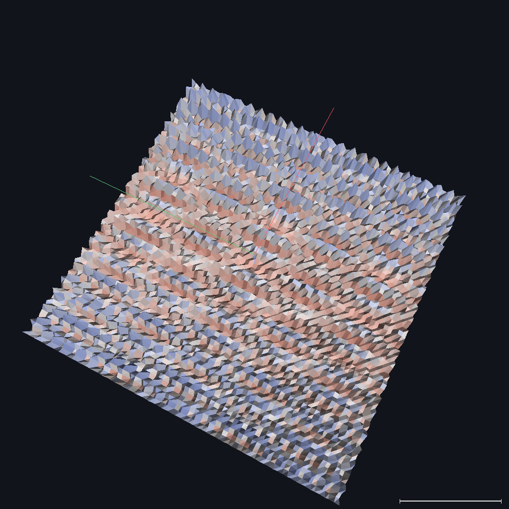
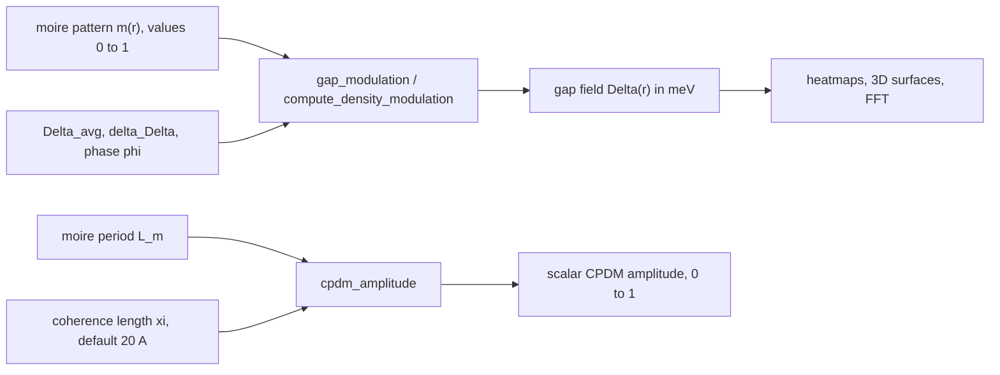

# Superconducting Gap Modulation and the CPDM State

[← Theory index](README.md) · [Documentation index](../README.md)

How this codebase turns a moire interference pattern into a spatially modulated
superconducting gap Δ(r), and how the modulation strength scales with the moire
period. The in-app About panel lists this module among the **validated** ones
("Gap modulation — BCS proximity with moire amplitude scaling"), in contrast to
the speculative modules whose outputs are tagged `(SPECULATIVE)` and should be
treated as exploratory illustrations, not quantitative predictions.

## Overview

Superconductivity arises when electrons bind into *Cooper pairs* — pairs with
opposite momenta and spins, held together by phonons or other bosonic
excitations ([Bardeen, Cooper & Schrieffer 1957](../references.md#ref-bardeen-1957)).
The pairs condense into a state described by a complex order parameter Δ, the
superconducting gap, whose magnitude measures the pair binding energy. In a
conventional homogeneous superconductor Δ is spatially uniform.

The heterostructure modeled here — one quintuple layer (1 QL) of the
topological insulator Sb2Te3 grown epitaxially on a six-unit-cell (6 UC) film
of FeTe — is not homogeneous. According to this repository's summary of the
reference paper ([Wang et al., Nature 652, 335 (2026); arXiv:2602.22637](../references.md#ref-wang-2026)),
STM/STS on this system reveals two distinct superconducting gaps,

$$
\Delta_1 \approx 2.58\ \text{meV}, \qquad \Delta_2 \approx 3.60\ \text{meV},
$$

annotated in `src/waytogocoop/config.py` as the smaller gap observed in the
topological surface states and the larger, bulk-like gap. Both gaps modulate
periodically in space, synchronized with the moire superlattice formed by the
hexagonal Te sublattice of Sb2Te3 (a ≈ 4.264 Å) on the square Te sublattice of
FeTe (a ≈ 3.82 Å). The Cooper-pair density rises and falls with a wavelength
set by the moire period — a **Cooper-pair density modulation (CPDM)** state.
(Superconductivity in FeTe itself requires stoichiometry: de-ironed films
superconduct with Tc ≈ 13.5 K — [Yan et al., Nature 652, 342 (2026)](../references.md#ref-yan-2026).)

## CPDM versus PDW

The distinction between a CPDM and the better-known pair-density wave (PDW) is
central to the reference paper's framing. As the [project README](../../README.md)
puts it:

> Unlike a pair-density wave (PDW) that spontaneously breaks translational
> symmetry, a CPDM state inherits its spatial modulation from an external
> periodic potential -- in this case, the moire superlattice.

A PDW is intrinsic and interaction-driven: Cooper pairs condense at finite
momentum and the modulation wavevector emerges spontaneously. A CPDM is
*imprinted*: its wavevector is fixed by the moire superlattice acting as an
external periodic potential on the pairing. This is what makes the state
engineerable — swapping the overlayer (Sb2Te3 → Bi2Te3) changes the lattice
mismatch, hence the moire period, hence both the wavelength and the amplitude
of the modulation (see [the model](#model) below).

## Model

### Gap field

The README-level model is a single-harmonic modulation at the moire
wavevectors:

$$
\Delta(\mathbf{r}) = \Delta_{\text{avg}}
  + \delta\Delta \cdot \cos(\mathbf{Q}_{\text{moire}} \cdot \mathbf{r} + \varphi),
$$

where $\mathbf{Q}_{\text{moire}}$ are the moire reciprocal vectors,
$\delta\Delta$ the modulation amplitude, and $\varphi$ a phase offset relative
to the moire potential. The code implements this through the normalized moire
intensity $m(\mathbf{r}) \in [0, 1]$ produced by the
[pattern generator](moire-patterns.md)
(`src/waytogocoop/computation/moire.py`, `generate_moire_pattern`):

$$
\Delta(\mathbf{r}) = \Delta_{\text{avg}}
  + \delta\Delta \cdot \cos\!\big(\varphi + \pi\, m(\mathbf{r})\big),
\qquad \varphi = \pi \ \text{(default)}.
$$

Because $m(\mathbf{r})$ is itself a superposition of $\cos(\mathbf{G}_i \cdot
\mathbf{r})$ terms with dominant Fourier weight at the moire wavevectors, the
composed field inherits the moire periodicity; expanding around $m = \tfrac12$
with $\varphi = \pi$ gives $\cos(\pi + \pi m) \approx \pi\,(m - \tfrac12)$,
recovering the linear single-harmonic form (the nonlinear mapping adds weak
higher harmonics). With $\varphi = \pi$ the mapping is monotonic — moire
intensity minima give the minimum gap, maxima the maximum — and the Python
defaults make the field sweep exactly between the two observed gaps:

$$
\Delta_{\text{avg}} = \tfrac12(\Delta_1 + \Delta_2) = 3.09\ \text{meV},
\qquad
\delta\Delta = \tfrac12(\Delta_2 - \Delta_1) = 0.51\ \text{meV}.
$$

*The gap field Δ(r) rendered as a 3D surface by the Rust desktop app. Height
and color encode the local gap in meV; the ridges repeat with the moire
period.*

### CPDM amplitude and the coherence-length cutoff

How *strong* can the modulation be? The code uses a scaling ansatz
(`cpdm_amplitude` in `src/waytogocoop/computation/superconducting.py`):

$$
A_{\text{CPDM}} = \exp\!\left(-\frac{\xi}{L_m}\right),
$$

where $\xi$ is the BCS coherence length (default 20 Å, a model default
annotated in `config.py` as a BCS-scale estimate for FeTe-based systems) and
$L_m$ the moire period. The physical picture: a Cooper pair has a spatial
extent of order $\xi$, so it averages the pairing potential over that scale.
Modulations much longer than the pair size survive
($L_m \gg \xi \Rightarrow A \to 1$); modulations shorter than the pair size are
washed out exponentially ($L_m \ll \xi \Rightarrow A \to 0$).

This is what makes the **Bi2Te3 substitution** a clean test of tunability.
Using the 1D mismatch formula L = (a1 · a2)/|a1 − a2| (see
[moire patterns](moire-patterns.md)) with FeTe (a = 3.82 Å):

| Overlayer on FeTe | a (Angstrom) | Mismatch (%) | Period L_m (Angstrom) | Amplitude exp(-xi/L_m), xi = 20 A |
|---|---|---|---|---|
| Sb2Te3 | 4.264 | 11.6 | 36.7 | 0.58 |
| Bi2Te3 | 4.386 | 14.8 | 29.6 | 0.51 |

Bi2Te3's larger lattice constant means a larger mismatch with FeTe, hence a
shorter moire period — and a shorter period means Cooper pairs average over
more of the modulation, weakening it (about 12% in this model). This matches
the README's description of the reference paper: replacing Sb2Te3 with Bi2Te3
"produces a moire pattern with altered periodicity and a weaker CPDM magnitude,
demonstrating tunability." The substrate-comparison page
(`src/waytogocoop/pages/substrate_comparison.py`) computes exactly this table;
the parameter-sweep page traces the full $A(L_m)$ curve.

## Assumptions and validity

- **Amplitude-only, single-field model.** Only the gap *magnitude* modulates;
  the order-parameter phase is assumed rigid (no supercurrents, no phase
  winding), and the two gaps enter as endpoints of one modulated field rather
  than as two coupled order parameters — no two-band or interband physics.
- **Not self-consistent.** Δ(r) is a prescribed function of the geometric
  moire intensity, not the solution of a Bogoliubov-de Gennes or Usadel
  proximity calculation.
- **The exponential ansatz is heuristic.** exp(−ξ/L_m) reproduces the correct
  limits (saturation for long periods, suppression for short ones), but the
  crossover shape has no microscopic derivation; relative comparisons
  (Sb2Te3 vs Bi2Te3) are more meaningful than absolute values.
- **Model defaults, not measurements.** ξ = 20 Å (`DEFAULT_COHERENCE_LENGTH`)
  is a BCS-scale estimate typical of short-coherence-length iron
  chalcogenides, not a measured value for this heterostructure; the 1D period
  formula is an approximate scale for the true rhombic hex-on-square geometry.
- **No temperature dependence.** Gaps are fixed at their low-temperature
  values; nothing here models Δ(T) or the transition at Tc.
- **Numerical guards.** `cpdm_amplitude` clamps the exponent
  (`EXPONENT_CLAMP = 100`) and returns 0 for non-positive or infinite periods;
  `gap_modulation` rejects negative gap inputs.

## Implementation

| Concept | Python | Rust |
|---|---|---|
| Gap field Delta(r) from moire pattern | `src/waytogocoop/computation/superconducting.py`, `gap_modulation` | `crates/moire-core/src/density.rs`, `compute_density_modulation` |
| CPDM amplitude exp(-xi/L_m) | `src/waytogocoop/computation/superconducting.py`, `cpdm_amplitude` | not mirrored as a helper; `crates/moire-core/src/magnetic.rs`, `field_tunable_cpdm` takes the zero-field amplitude as an input |
| Default constants | `src/waytogocoop/config.py`: `DELTA_1`, `DELTA_2`, `DELTA_AVG`, `DELTA_AMPLITUDE`, `DEFAULT_COHERENCE_LENGTH` | `crates/moire-core/src/density.rs`, `DensityConfig::default` |
| Field suppression of the CPDM (speculative) | `src/waytogocoop/computation/magnetic.py`, `field_tunable_cpdm` | `crates/moire-core/src/magnetic.rs`, `field_tunable_cpdm` |

One deliberate parametrization difference: the Python pages call
`gap_modulation(pattern, DELTA_AVG, DELTA_AMPLITUDE)` with the amplitude fixed
at (Delta_2 − Delta_1)/2 = 0.51 meV, so the default field spans exactly
[2.58, 3.60] meV; the Rust `DensityConfig` instead expresses the amplitude as a
*fraction* of the average gap (default 0.15, i.e. ≈ 0.46 meV), adjustable in
the desktop sidebar.

Downstream consumers: the moire viewer, substrate comparison, parameter sweep,
magnetic field, 3D proximity, and graphene pages all build on `gap_modulation`
and/or `cpdm_amplitude`; `computation/magnetic.py` uses `cpdm_amplitude` as the
zero-field baseline for its speculative field-tunable CPDM, and
`computation/isotope_effects.py` (`_coherence_modification`) rescales ξ under
isotope substitution, which propagates into the CPDM amplitude.

## References

- [Wang et al., Nature 652, 335 (2026); arXiv:2602.22637](../references.md#ref-wang-2026) —
  the reference paper: moire engineering of CPDM states in Sb2Te3/FeTe
  (claims herein sourced from this repository's README summary).
- [Yan et al., Nature 652, 342 (2026); arXiv:2603.16115](../references.md#ref-yan-2026) —
  superconductivity of stoichiometric FeTe (Tc ≈ 13.5 K).
- [Bardeen, Cooper & Schrieffer, Phys. Rev. 108, 1175 (1957)](../references.md#ref-bardeen-1957) —
  BCS theory: Cooper pairing and the gap Δ.

Related theory pages: [moire patterns](moire-patterns.md) ·
[Fourier analysis](fourier-analysis.md) ·
[magnetic field effects](magnetic.md) ·
[isotope effects](isotope-effects.md)
