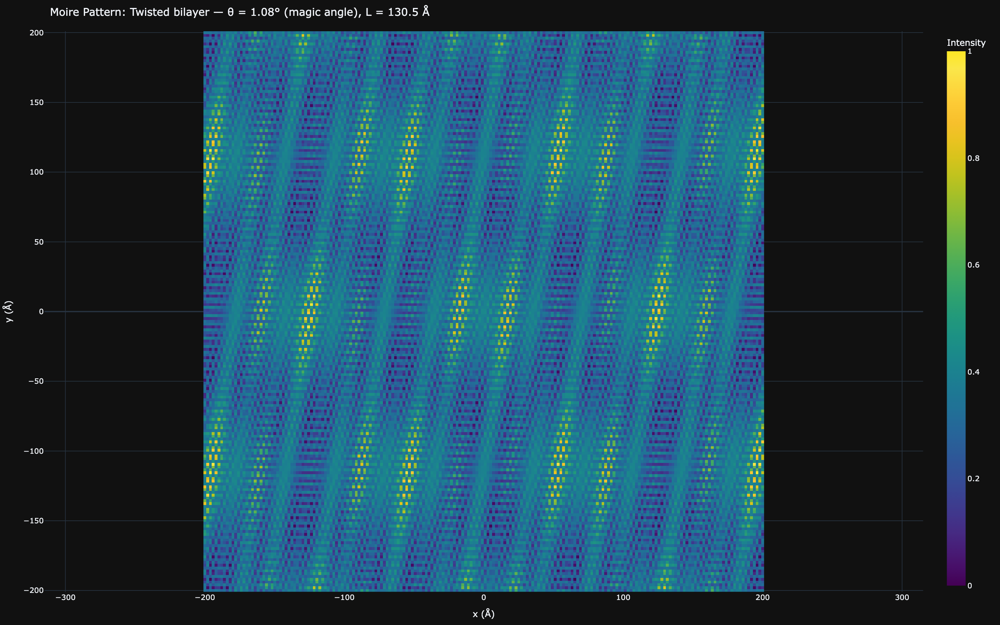
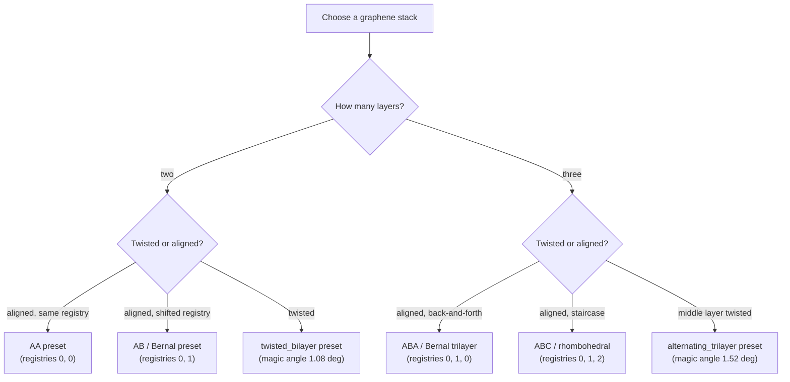
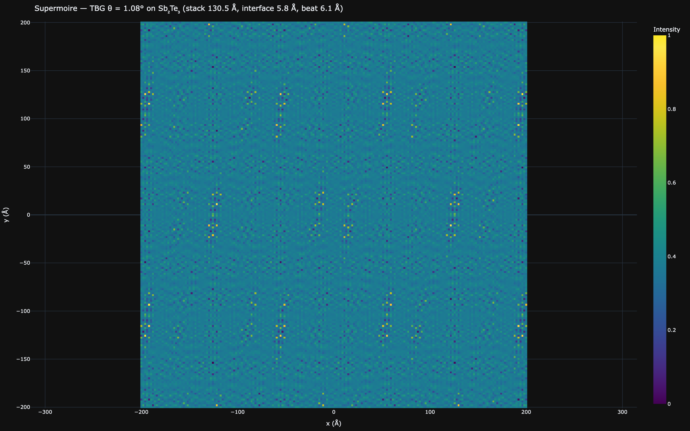

# Graphene Stacks: Registries, Heterostrain, Supermoire, and Magic Angles

[← Theory index](README.md) · [Documentation index](../README.md)

**Status: validated**, except the flat-band superconducting dome in
[Speculative components](#speculative-components-flat-band-superconductivity), which is
**SPECULATIVE** — its outputs carry a `(SPECULATIVE)` tag in figure titles in both apps. Treat
those as exploratory illustrations, not quantitative predictions.

## Overview

The core of this tool models a hexagonal topological insulator on a square iron-chalcogenide
substrate, where the moire superlattice imprints a Cooper-pair density modulation
([Wang et al. 2026](../references.md#ref-wang-2026)). Twisted graphene is the *other* famous moire
platform: there the moire potential does not modulate an existing superconductor but reconstructs
the band structure itself, producing flat bands that host superconductivity near the magic angle
([Cao et al. 2018](../references.md#ref-cao-2018),
[Park et al. 2021](../references.md#ref-park-2021)). The graphene module brings that second
platform into the same machinery — plane-wave superposition, period formulas, FFT analysis — and
the supermoire mode literally connects the two worlds by placing a graphene stack on an Sb2Te3
overlayer (the default overlayer lattice constant, 4.264 Å, is Sb2Te3 from the materials
database).

In the web UI this lives on the `/graphene` page (view modes: pattern, gap map, pseudo-field,
strain map, curved 3D sheet, FFT, band structure, DOS); in the desktop app, the graphene panel and
its viewport tabs. This page covers the stack geometry and magic-angle physics; companion pages
cover the [Bistritzer-MacDonald continuum model](bm-model.md) (bands and DOS) and
[curvature](curvature.md) (strain and pseudo-magnetic fields on curved sheets, whose displacement
field can be fed back into the stack pattern as a rigid warp of all layers).

*Moire pattern of twisted bilayer graphene at the magic angle (1.08°), moire period ≈ 130 Å.*

## Model

### Stacking registries as reciprocal-space phases

Each graphene layer contributes a first-shell plane-wave potential, exactly as in the
[core moire model](moire-patterns.md), but with a per-layer phase that encodes its stacking
registry:

$$
V(\mathbf{r}) = \sum_{n=1}^{6} \cos(\mathbf{G}_n \cdot \mathbf{r} - c_n \phi),
\qquad \phi = s \cdot \frac{2\pi}{3},
$$

where $s \in \{0, 1, 2\}$ is the registry index (0 = A, 1 = B, 2 = C) and the coefficient pattern
is $c_n = (1, 1, 0, -1, -1, 0)$. The coefficients follow from the repo's angle-ordered hexagonal
G shell $\{\mathbf{b}_1, \mathbf{b}_2, \mathbf{b}_2{-}\mathbf{b}_1, -\mathbf{b}_1, -\mathbf{b}_2,
\mathbf{b}_1{-}\mathbf{b}_2\}$ (with $\mathbf{b}_1$ at 0°, $\mathbf{b}_2$ at 60°): the B-registry
offset $\boldsymbol\tau = (\mathbf{a}_1 + \mathbf{a}_2)/3$ gives, using
$\mathbf{b}_i \cdot \mathbf{a}_j = 2\pi\delta_{ij}$, exactly
$\mathbf{G}_n \cdot \boldsymbol\tau = c_n \cdot 2\pi/3$. Encoding registry offsets as phases
rather than real-space shifts keeps the potential grid-frame independent and rotation-safe.

The full stack pattern is the **product** of the per-layer potentials, min-max normalized to
[0, 1] — the same construction as the substrate/overlayer product in the core model. Six presets
cover the standard stacks (`stack_layers` in `src/waytogocoop/computation/graphene.py`):

| Preset | Layers | Registry indices (bottom to top) | Twist |
|---|---|---|---|
| AA | 2 | 0, 0 | none |
| AB (Bernal) | 2 | 0, 1 | none |
| twisted_bilayer | 2 | 0, 0 | theta on top layer |
| ABA (Bernal trilayer) | 3 | 0, 1, 0 | none |
| ABC (rhombohedral) | 3 | 0, 1, 2 | none |
| alternating_trilayer | 3 | 0, 0, 0 | theta on middle layer |

**Honeycomb two-atom basis.** By default each layer is a single triangular Bravais lattice. The
optional honeycomb mode adds the B sublattice at
$\boldsymbol\delta = (\mathbf{a}_1 + \mathbf{a}_2)/3$, whose structure-factor phases
$\mathbf{G}_n \cdot \boldsymbol\delta = c_n \cdot 2\pi/3$ reuse the same coefficients as the
registry offset:

$$
V(\mathbf{r}) = \sum_{n} \Big[
\cos\!\big(\mathbf{G}_n \cdot (\mathbf{r} - \boldsymbol\tau)\big)
+ \cos\!\big(\mathbf{G}_n \cdot (\mathbf{r} - \boldsymbol\tau) - c_n \tfrac{2\pi}{3}\big)
\Big].
$$

This distinguishes A from B sites within a layer, at the cost of a busier atomic-scale texture.

### Uniaxial heterostrain

Real devices are rarely twist-only: transfer and relaxation typically leave one layer strained
relative to the other ([Huder et al. 2018](../references.md#ref-huder-2018)). Real-space positions
transform as $\mathbf{r}' = (I + E)\,\mathbf{r}$, so reciprocal vectors transform as
$\mathbf{G}' = (I + E)^{-T}\,\mathbf{G} \approx (I - E)\,\mathbf{G}$ to first order in the strain,
with the symmetric strain tensor

$$
E = R(\varphi)\,\mathrm{diag}(\epsilon,\; -\nu\epsilon)\,R(\varphi)^{T},
$$

i.e. elongation $\epsilon$ along the strain axis (angle $\varphi$ from the zigzag = x axis) and
Poisson contraction $\nu\epsilon$ transverse to it, with $\nu = 0.16$ for graphene
(`POISSON_GRAPHENE` in `src/waytogocoop/config.py`, from
[Blakslee et al. 1970](../references.md#ref-blakslee-1970)). The strain is applied **to layer
index 1 only** — experimentally, strain relaxation leaves one layer pinned to the substrate while
the transferred layer carries the uniaxial strain (Huder et al.) — and it deforms the G shell
*before* the twist rotation. Even sub-percent heterostrain visibly reshapes the moire lattice from
triangular toward a stretched, anisotropic superlattice.

### One period formula to rule them all

The core module has two periodicity formulas — mismatch-driven $L = a_1 a_2 / |a_1 - a_2|$ and
twist-driven $L = a / (2\sin(\theta/2))$. Once strain enters, neither applies directly, so the
graphene module uses a generalized form built from the two layers' effective (strained, twisted)
first G shells, paired in angle order:

$$
L = \frac{4\pi}{\sqrt{3}\; \min_i \big|\mathbf{G}^{\mathrm{sub}}_i - \mathbf{G}^{\mathrm{over}}_i\big|}.
$$

Both classic formulas are special cases: the first-shell magnitude is $|G| = 4\pi/(\sqrt{3}\,a)$,
so pure mismatch gives $|\Delta G| = \tfrac{4\pi}{\sqrt 3}\big|\tfrac{1}{a_1} - \tfrac{1}{a_2}\big|$
(recovering $L = a_1 a_2/|a_1 - a_2|$) and pure twist gives $|\Delta G| = 2|G|\sin(\theta/2)$
exactly (recovering $L = a/(2\sin(\theta/2))$). See `moire_period_from_g_shells` in
`src/waytogocoop/computation/graphene.py`; coincident shells return an infinite period.

### Supermoire: stack moire times interface moire

The supermoire mode multiplies the graphene-stack potentials by one more plane-wave potential —
a substrate/overlayer beneath the stack, by default hexagonal Sb2Te3 ($a = 4.264$ Å), optionally
twisted at the interface. Two moire wavelengths then coexist — the intra-stack one ($L_1$, from
the graphene twist) and the graphene/overlayer interface one ($L_2$, mismatch and interface twist
combined via the generalized period formula) — and their beat is the supermoire period
([Wang et al. 2019](../references.md#ref-wang-2019)):

$$
L_{\mathrm{sm}} = \frac{L_1 L_2}{|L_1 - L_2|},
$$

the same beat formula the [magnetic module](magnetic.md) uses for moire-vortex interference. The
UI reports all three periods. For a *square* overlayer the shells cannot be angle-order paired
with the hexagonal graphene shell, so the 1D mismatch formula is used for $L_2$ instead — an
approximation that ignores the interface twist.

*Supermoire: magic-angle twisted bilayer graphene on an Sb2Te3 overlayer. The stack, interface,
and supermoire beat periods are reported in the title.*

### Magic angles and flat bands

Twisting two graphene layers by $\theta$ separates their Dirac cones in momentum space by
$k_\theta = 2 k_D \sin(\theta/2)$, where $k_D = 4\pi/(3a)$ is the Dirac-point wavevector.
Interlayer tunneling of strength $w$ competes with the kinetic energy scale $\hbar v_F k_\theta$;
the dimensionless ratio $\alpha = w / (\hbar v_F k_\theta)$ controls everything. To first order in
the Bistritzer-MacDonald continuum model
([Bistritzer & MacDonald 2011](../references.md#ref-bistritzer-macdonald-2011)), the Dirac
velocity renormalizes as

$$
\frac{v^*}{v_F} = \frac{1 - 3\alpha^2}{1 + 6\alpha^2},
$$

which vanishes at $\alpha = 1/\sqrt{3}$ — the **first magic angle**, where the bands go flat.
Solving for the angle gives

$$
\theta_m = 2 \arcsin\!\left(\frac{\sqrt{3}\, w_{\mathrm{eff}}}{2\, \hbar v_F\, k_D}\right),
$$

with $w_{\mathrm{eff}} = w$ for the bilayer and $w_{\mathrm{eff}} = \sqrt{2}\, w$ for the
alternating-twist trilayer: the Khalaf-Vishwanath mapping decouples that trilayer into a
bilayer-like sector with enhanced tunneling plus a free Dirac cone, pushing the magic angle up by
$\sqrt{2}$ ([Khalaf et al. 2019](../references.md#ref-khalaf-2019)). With the repo defaults,
`magic_angle_deg` yields $\theta_m = 1.076^\circ$ (bilayer, displayed as 1.08°) and
$1.521^\circ$ (alternating trilayer, displayed as 1.52°).

**The deliberate choice $\hbar v_F = 5.96$ eV·Å.** The repo sets `HBAR_VF_GRAPHENE = 5.96` eV·Å,
computed as $(\sqrt{3}/2)\, t\, a$ with nearest-neighbor hopping $t = 2.8$ eV
([Castro Neto et al. 2009](../references.md#ref-castro-neto-2009)), i.e.
$v_F \approx 0.91 \times 10^6$ m/s — deliberately *not* the commonly quoted 6.58 eV·Å. The
rationale (documented in `src/waytogocoop/config.py` next to the constant): with 6.58 the first
magic angle lands at 0.974°, outside the observed 1.0–1.2° window, whereas 5.96 together with the
Bistritzer-MacDonald tunneling amplitude $w = 0.110$ eV (`W_INTERLAYER_TBG`) puts it at 1.076°,
matching both the experimental window and the repo's 1.08° test anchors in both languages.

## Assumptions and validity

- **Intensity maps, not electronic structure.** The stack patterns are first-shell interference
  intensities — good for geometry (periods, superlattice shape, strain distortion), silent on band
  structure; for actual moire bands see the [Bistritzer-MacDonald page](bm-model.md).
- **First-order velocity formula.** $v^*/v_F = (1 - 3\alpha^2)/(1 + 6\alpha^2)$ is perturbative:
  valid for small twists ($\theta \lesssim 3^\circ$), exactly zero at the magic angle, and *negative*
  just past it — an artifact of truncating the expansion, not band inversion. At large angles it
  saturates toward 1.
- **Small-strain linearization.** $\mathbf{G}' = (I - E)\,\mathbf{G}$ is first order in
  $\epsilon$; fine for the sub-percent to few-percent heterostrains of interest.
- **Layer-1 pinning.** Assigning all heterostrain to one layer is the standard experimental
  reading, not a relaxation calculation. In the supermoire view, heterostrain applies inside the
  graphene stack only — the overlayer potential does not include it (the UI notes this).
- **Square-overlayer supermoire** falls back to the 1D mismatch period and ignores the interface
  twist (see above).
- **Grid resolution.** Untwisted stacks (AA, AB, ABA, ABC) have only the atomic-scale period
  $a = 2.46$ Å and need a small window (grid spacing at most about $a/3$; the UI presets use a
  ~15 Å half-width for these). The magic-angle moire period (≈ 130 Å at 1.08°) needs a large one —
  the defaults (`GRAPHENE_EXTENT_DEFAULT` = 200 Å half-width, ~3 moire periods) target the
  twisted case.

## Speculative components: flat-band superconductivity

> **SPECULATIVE** — like the isotope, topological, and magnetic modules, the flat-band gap model
> is a simplified model not validated for these specific systems. Its outputs carry a
> `(SPECULATIVE)` tag in figure titles; the graphene page's own footnote reads: "Flat-band
> Delta/Tc and pseudo-field pair-breaking are qualitative toy models, not fits to experiment."
> Treat the results as exploratory illustrations, not quantitative predictions.

The band-structure inputs ($\alpha$, $v^*/v_F$, $\theta_m$) are established
Bistritzer-MacDonald / Khalaf-Vishwanath results; the gap model bolted onto them is a toy
phenomenology (`compute_flat_band_sc` in `src/waytogocoop/computation/graphene.py`): a Lorentzian
in twist angle times a filling dome,

$$
\Delta(\theta, \nu) = \Delta_{\max}\,
\frac{1}{1 + \left(\dfrac{\theta - \theta_m}{\Gamma_\theta}\right)^{2}}\, D(\nu),
\qquad
D(\nu) = \max\!\left(0,\; 1 - \left(\frac{|\nu| - \nu_{\mathrm{opt}}}{\nu_w}\right)^{2}\right),
\qquad
T_c = \frac{\Delta}{1.764\, k_B}.
$$

Model defaults (all in `src/waytogocoop/config.py`, with their provenance): $\Delta_{\max} = 0.30$
meV for the bilayer (≈ $1.764\,k_B T_c$ for $T_c \sim 2$ K,
[Cao et al. 2018](../references.md#ref-cao-2018)) and 0.44 meV for the alternating trilayer
($T_c \sim 2.9$ K, [Park et al. 2021](../references.md#ref-park-2021)); Lorentzian half-width
$\Gamma_\theta = 0.1^\circ$ (speculative — superconductivity is observed roughly over 0.9–1.2°);
optimal filling $\nu_{\mathrm{opt}} = 2.4$ electrons per moire cell (Cao 2018), speculative dome
half-width $\nu_w = 0.8$, flat band holding $|\nu| \le 4$. The $T_c$ line simply inverts the
weak-coupling BCS ratio $\Delta(0)/(k_B T_c) = 1.764$.

One honest cross-link back to the CPDM physics: applying the [gap-modulation](gap-modulation.md)
amplitude scaling $\exp(-\xi/L)$ to magic-angle TBG gives a CPDM contrast of only ~0.022, because
the coherence length (`XI_TBG` = 500 Å, a Ginzburg-Landau estimate from Cao 2018) far exceeds the
~130 Å moire period. The modulation washes out — expected physical behavior, and the reason the
Sb2Te3/FeTe system (where $\xi \sim 20$ Å is smaller than $L \sim 37$ Å, giving a strong CPDM
amplitude of ~0.6) is the interesting CPDM platform.

## Implementation

| Concept | Python | Rust |
|---|---|---|
| Stacking presets | `src/waytogocoop/computation/graphene.py`, `STACKING_PRESETS` + `stack_layers` | `crates/moire-core/src/graphene.rs`, `StackingKind` + `stack_layers` |
| Layer potential (registry phases) | `layer_potential` (coefficients in `_HEX_PHASE_COEFFS`) | `layer_potential` |
| Honeycomb two-atom basis | `layer_potential_honeycomb` (separate function) | `honeycomb: bool` flag on `layer_potential` |
| Heterostrain | `strained_g_vectors` | `strained_g_vectors` |
| Generalized moire period | `moire_period_from_g_shells` | `moire_period_from_g_shells` |
| Stack pattern | `generate_stack_pattern_v2` (v1 `generate_stack_pattern` delegates to it) | `compute_graphene_stack_v2` (`GrapheneStackConfigV2` input) |
| Supermoire | `generate_supermoire_pattern` | `compute_supermoire` (`SupermoireConfig` to `SupermoireResult`) |
| Magic angle, velocity ratio | `magic_angle_deg`, `dirac_velocity_ratio` | `magic_angle_deg`, `dirac_velocity_ratio` |
| Flat-band SC (SPECULATIVE) | `compute_flat_band_sc`, `filling_dome_factor` | `compute_flat_band_sc` (`FlatBandConfig` to `FlatBandResult`) |
| Display | `/graphene` page (`src/waytogocoop/pages/graphene.py`) + `create_moire_heatmap` in `src/waytogocoop/components/figure_factory.py` | `crates/moire-desktop/src/ui/graphene_panel.rs` + viewport textures |

Both implementations are mirrored by design ("changes here must land in both" —
`crates/moire-core/src/graphene.rs` module docs) and share test anchors: the 1.076°/1.521° magic
angles and the exactly-zero velocity ratio at the magic angle.

## References

- [Bistritzer & MacDonald, PNAS 108, 12233 (2011)](../references.md#ref-bistritzer-macdonald-2011)
  — continuum model; first magic angle where the Dirac velocity vanishes.
- [Cao et al., Nature 556, 43 (2018)](../references.md#ref-cao-2018) — superconductivity in
  magic-angle TBG ($T_c \sim 2$ K near filling $\nu \sim 2.4$); source of the dome-center and
  $\Delta_{\max}$ defaults.
- [Park et al., Nature 590, 249 (2021)](../references.md#ref-park-2021) — alternating-twist
  trilayer graphene ($T_c \sim 2.9$ K).
- [Khalaf et al., PRB 100, 085109 (2019)](../references.md#ref-khalaf-2019) — alternating-twist
  multilayer mapping; trilayer magic angle is $\sqrt{2}$ times the bilayer one.
- [Castro Neto et al., RMP 81, 109 (2009)](../references.md#ref-castro-neto-2009) — graphene band
  parameters behind the $\hbar v_F = 5.96$ eV·Å choice.
- [Huder et al., PRL 120, 156405 (2018)](../references.md#ref-huder-2018) — heterostrained twisted
  graphene layers; basis for the strain-one-layer-only convention.
- [Wang et al., Sci. Adv. 5, eaay8897 (2019)](../references.md#ref-wang-2019) — composite
  supermoire lattices in double-aligned graphene heterostructures.
- [Blakslee et al., J. Appl. Phys. 41, 3373 (1970)](../references.md#ref-blakslee-1970) — graphite
  elastic constants; graphene Poisson ratio $\nu = 0.16$.
- [Wang et al., Nature 652, 335 (2026); arXiv:2602.22637](../references.md#ref-wang-2026) — the
  moire-engineered CPDM experiment this tool centers on (summary based on this repository's
  description of the paper); the supermoire mode links the graphene stacks to its Sb2Te3 overlayer.
- Related theory pages: [moire patterns](moire-patterns.md) (the two classic period formulas),
  [Bistritzer-MacDonald model](bm-model.md) (bands, DOS, chiral-limit test anchor),
  [curvature](curvature.md) (warp displacement fed into `generate_stack_pattern_v2`),
  [gap modulation](gap-modulation.md) (the CPDM amplitude scaling used in the cross-link above).
