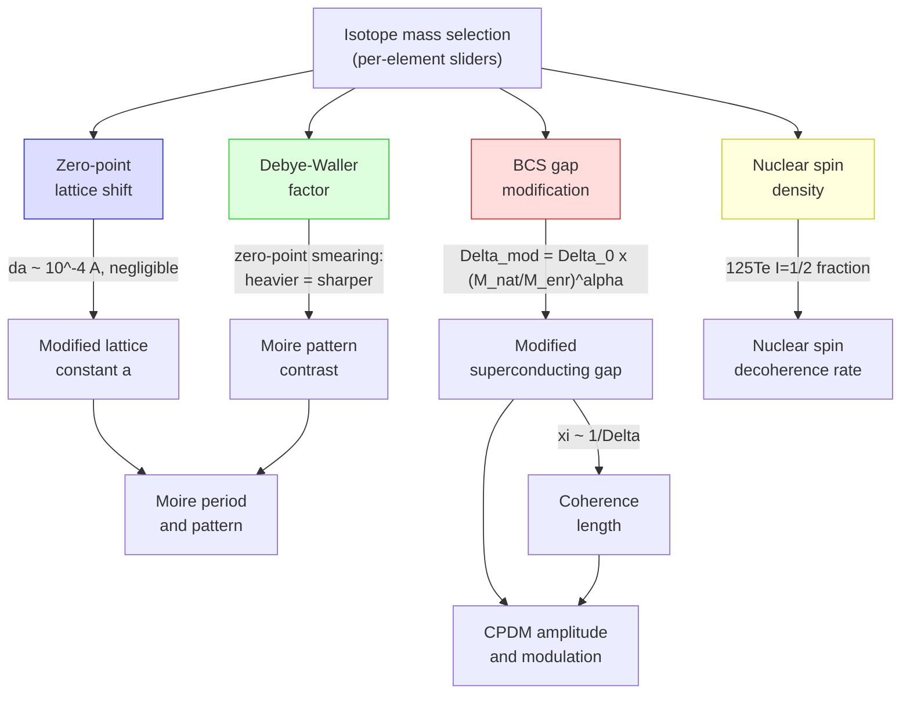

# Isotope Effects

[← Theory index](README.md) · [Documentation index](../README.md)

> **Status: SPECULATIVE.** The isotope-effect module uses simplified models — zero-point lattice expansion, the BCS isotope effect, and Debye-Waller damping — to estimate how isotopic substitution might affect moire patterns and superconducting gap modulation. No direct Te-isotope data exists for FeTe or Fe(Te,Se); the isotope exponent $\alpha$ is taken from consensus values measured on other iron-based superconductors. Results are qualitative and have not been validated against experiment for these heterostructures. In both apps the outputs carry a **(SPECULATIVE)** tag in the title: treat them as exploratory illustrations, not quantitative predictions.

## Overview

The isotope module asks a what-if question: beyond lattice-constant choice (Sb2Te3 vs Bi2Te3) and twist angle, could *isotopic enrichment* of the substrate or overlayer serve as a third knob for tuning the Cooper-pair density modulation (CPDM)? Isotope substitution changes atomic mass without changing chemistry, so it perturbs phonon-related quantities — zero-point motion, Debye-Waller factors, and (via the BCS mechanism) the pairing gap itself — while leaving the electronic structure essentially fixed.

Why this is speculative rather than validated:

- **No Te isotope effect on superconductivity has ever been measured for FeTe or Fe(Te,Se).** This is a key experimental gap; the module extrapolates from Fe-isotope measurements on *other* iron-based superconductors.
- Those measurements disagree among themselves — from a large positive exponent in FeSe to an *inverse* (negative) exponent in (Ba,K)Fe2As2 — so even the sign of the effect in FeTe is not certain.
- Iron-chalcogenide pairing is believed to be predominantly electronic, with phonons "dressing" the interaction (a "phonon-dressed unconventional superconductor", per the reference cited in the module docstring), so the textbook BCS mass-power-law is at best an effective parameterization.

The historical motivation is solid, though: the 1950 mercury isotope experiments ($T_c \propto M^{-1/2}$) were the smoking gun for phonon-mediated pairing, and the classic BCS value $\alpha = 1/2$ appears as a labeled mark on the module's exponent slider. See [History](../history.md) for that lineage.

## Model

Four mechanisms connect isotopic composition to the moire-modulated superconducting state. All are driven by a single user input per element: an effective atomic mass (amu), set by sliders in the UI and converted to a per-formula-unit average mass.

### 1. BCS gap modification (dominant effect)

The BCS isotope effect rescales both superconducting gaps by a mass power law:

$$
\Delta_{\mathrm{mod}} = \Delta_0 \left(\frac{M_{\mathrm{nat}}}{M_{\mathrm{enr}}}\right)^{\alpha}
$$

where $M_{\mathrm{nat}}$ and $M_{\mathrm{enr}}$ are the natural and enriched average masses per formula-unit atom of the **substrate** (the superconducting FeTe layer), and $\Delta_0$ is each unmodified gap ($\Delta_1 = 2.58$ meV, $\Delta_2 = 3.60$ meV — the two-gap structure of the model, see [Gap modulation](gap-modulation.md)). Lighter isotopes (e.g. 54Fe) increase the gap; heavier ones (e.g. 58Fe) decrease it — for positive $\alpha$.

The exponent $\alpha$ is the module's weakest link. Measured values across iron-based superconductors:

| System | Isotope exchanged | alpha | Source |
|--------|-------------------|-------|--------|
| FeSe | 54Fe / 56Fe | 0.81 +/- 0.15 | [Khasanov et al. (2010)](../references.md#ref-khasanov-2010) |
| SmFeAsO(1-x)F(x) | Fe | ~0.35 | [Liu et al., Nature 459, 64 (2009)](../references.md#ref-liu-2009) |
| (Ba,K)Fe2As2 | Fe | -0.18 (inverse) | [Shirage et al., PRL 103, 257003 (2009)](../references.md#ref-shirage-2009) |
| Corrected consensus, iron-based SCs | — | 0.35 – 0.4 | PRB 82, 212505 |
| FeTe | Te | unknown | no measurement exists |

The software defaults to $\alpha = 0.4$ (`DEFAULT_ISOTOPE_EXPONENT` in `src/waytogocoop/config.py`), with a slider range of $[-0.5, 1.0]$ so both normal and inverse effects can be explored. The slider carries labeled marks at $-0.18$ (inverse, Shirage), $0$, $0.4$ (consensus), $0.5$ (textbook BCS), and $0.81$ (FeSe) — see `src/waytogocoop/components/isotope_panel.py`, `create_isotope_panel`.

The gap change propagates to the coherence length through the BCS relation $\xi \sim \hbar v_F / \Delta$, implemented as a simple inverse scaling:

$$
\xi_{\mathrm{mod}} = \xi_0 \, \frac{\bar{\Delta}_{\mathrm{orig}}}{\bar{\Delta}_{\mathrm{mod}}}, \qquad \bar{\Delta} = \tfrac{1}{2}(\Delta_1 + \Delta_2)
$$

Because the CPDM amplitude scales as $\exp(-\xi / L_{\mathrm{moire}})$, a gap *increase* (lighter isotopes, $\alpha > 0$) shortens $\xi$ and **strengthens** the modulation — this chain is the main way isotope choice reaches the CPDM in the model.

### 2. Zero-point lattice shift

Isotopic mass changes the zero-point vibrational amplitude, which shifts the equilibrium lattice constant through anharmonicity (quasi-harmonic estimate):

$$
\delta a = -a \, \frac{3 \gamma_G k_B T_D}{4 E_{\mathrm{coh}}} \left(1 - \sqrt{\frac{M_{\mathrm{nat}}}{M_{\mathrm{enr}}}}\right)
$$

with the Gruneisen parameter $\gamma_G$, Debye temperature $T_D$, and cohesive energy $E_{\mathrm{coh}}$ taken as stoichiometry-weighted element averages from the isotope database. Heavier enrichment contracts the lattice slightly; lighter enrichment expands it.

For the heavy elements here (Fe ~56 amu, Te ~128 amu) the prefactor is well below 1% and the mass term is at the percent level even for full single-isotope enrichment, so $\delta a \sim 10^{-4}$ Å — **ppm-level, and negligible** compared to the ~0.44 Å Sb2Te3/FeTe mismatch that drives the moire pattern in the 11–15% mismatch regime. The mechanism is implemented for completeness (and honesty: the UI shows the number so you can see how small it is), but it does not meaningfully affect the moire period or the CPDM.

### 3. Debye-Waller factor

Isotopic mass also changes the zero-point mean-square atomic displacement, which modulates how sharply each lattice imprints its periodic potential. The module computes the ratio of Debye-Waller factors, enriched vs natural:

$$
\mathrm{DW}_{\mathrm{ratio}} = \exp\!\left(-G^2\, C \left(\frac{1}{\sqrt{M_{\mathrm{enr}} M_{\mathrm{nat}}}} - \frac{1}{M_{\mathrm{nat}}}\right)\right), \qquad
C = \frac{3\hbar^2}{4 k_B \Theta_{\mathrm{nat}}}
$$

where $G$ is the magnitude of the first reciprocal lattice vector ($4\pi/(a\sqrt{3})$ hexagonal, $2\pi/a$ square) and $\Theta_{\mathrm{nat}}$ the stoichiometry-weighted natural Debye temperature. The geometric-mean mass $\sqrt{M_{\mathrm{enr}} M_{\mathrm{nat}}}$ is not a typo. The per-atom zero-point mean-square displacement is $\langle u^2 \rangle_{\mathrm{zp}} = 9\hbar^2 / (4 M k_B \Theta_D(M))$, and the Debye temperature itself co-varies with isotope mass,

$$
\Theta_D(M) = \Theta_{\mathrm{nat}} \sqrt{\frac{M_{\mathrm{nat}}}{M}}
$$

because phonon frequencies scale as $1/\sqrt{M}$ at fixed force constants. Substituting, with the isotropic projection $\langle u_G^2 \rangle = \langle u^2 \rangle / 3$, gives the per-component exponent $2W(M) = G^2 C / \sqrt{M M_{\mathrm{nat}}}$ — a $1/\sqrt{M}$ dependence, weaker than the naive $1/M$.

The model is zero-point only, and that is the *right* model rather than a shortcut: the classical (high-temperature) thermal mean-square displacement $3 k_B T / (M \bar\omega^2)$ is isotope-independent, because $M \bar\omega^2$ is a force constant that does not depend on isotope mass. The isotope contrast in the Debye-Waller factor is therefore a purely quantum zero-point effect.

**Heavier enrichment gives a ratio above 1** — less zero-point smearing, a very slightly sharper imprinted potential; lighter enrichment gives a ratio below 1. The change is tiny: pure 130Te-enriched FeTe gives 1.0000450 (about 0.005% — this exact value is the cross-language parity anchor asserted in both test suites), and even the most favorable stable case in the codebase, 12C → 13C graphene with its large mass ratio and $\Theta_{\mathrm{nat}} = 2100$ K, reaches only ~0.05%. Because the displayed pattern is min-max normalized, the factor is reported as an info-panel readout rather than visibly changing the plot (see [moire patterns](moire-patterns.md)). The factor is computed separately for substrate and overlayer, since either layer can be enriched independently.

The $\Theta_D(M)$ co-variation is also surfaced directly as a readout: both UIs report the isotope-shifted Debye temperatures

$$
\Theta_{\mathrm{enr}} = \Theta_{\mathrm{nat}} \sqrt{\frac{M_{\mathrm{nat}}}{M_{\mathrm{enr}}}}
$$

for substrate and overlayer ("Θ_D (sub/over)" in the isotope info block; fields `theta_d_substrate` / `theta_d_overlayer` on the `IsotopeEffects` container in both languages). Example: 130Te-enriched FeTe drops from the natural 212.5 K to ≈ 210.6 K.

### 4. 125Te nuclear spin fraction

Among the six stable tellurium isotopes in the database (122, 124, 125, 126, 128, 130), **125Te is the only spin-bearing one** ($I = 1/2$, 7.07% natural abundance); the rest have $I = 0$. The module reports the 125Te fraction for the chosen Te mass setting using a two-isotope mixture model (`te_125_spin_fraction` in `src/waytogocoop/materials/isotopes.py`, mirrored in `isotopes.rs`). With no Te override the natural abundance 0.071 is returned. A target mass at or below the lightest (at or above the heaviest) stable isotope is treated as pure 122Te (130Te). Any mass in between is interpreted as a binary blend of the two adjacent **stable** isotopes bracketing it, weighted linearly:

$$
w_{\mathrm{lo}} = \frac{m_{\mathrm{hi}} - m_{\mathrm{target}}}{m_{\mathrm{hi}} - m_{\mathrm{lo}}}
$$

and the reported fraction is the mixture weight sitting on the 124.904 amu endpoint when one of the brackets is 125Te, else 0. So 124.904 amu → 1.0; 125.4035 amu → 0.5 (a 50/50 125Te/126Te blend); 127.0 amu → 0.0 (a 126Te/128Te blend, both spin-free). One documented gotcha: an override *equal to the natural average mass* (~126.62 amu) is interpreted as an enriched 126Te/128Te blend — fraction 0.0, not 0.071 — because only a `None` override means "natural composition". Synthetic Te isotopes are ignored by this helper; the interpolation runs over the stable list only.

This number matters in two directions:

- **Spin-bath elimination.** Enriching to 130Te (or any $I = 0$ isotope) removes the dilute nuclear spin bath — potentially relevant for decoherence of Majorana zero modes at the TI/SC interface (see [Topological effects](topological.md)), analogous to 28Si purification for silicon spin qubits.
- **Probe maximization.** Enriching *to* 125Te maximizes NMR/NQR sensitivity (125Te Knight shift). The README notes published 125Te NMR on Fe(Te,Se) under pressure (arXiv:2505.11732) indicating that nematic rather than antiferromagnetic fluctuations dominate the superconducting state — making 125Te a useful local probe of exactly the physics this tool visualizes.

## Highly speculative: synthetic and exotic isotopes

> **Status: HIGHLY SPECULATIVE.** Everything in this section is a what-if tier layered on top of an already speculative module. Synthetic isotopes are radioactive — several half-lives are far too short to grow or measure a film — and the hypothetical mass ranges correspond to no known nuclide. Radioactivity, self-heating, and decay into daughter elements are entirely ignored by the model, which treats mass as the only knob.

### Synthetic isotopes in the database

Alongside the stable tables, the isotope database carries synthetic (radioactive) isotopes with half-lives — `synthetic_isotopes` on `ElementData` and `half_life_s` on `Isotope` in `src/waytogocoop/materials/isotopes.py`; the `FE_SYNTHETIC` … `C_SYNTHETIC` statics in `crates/moire-core/src/isotopes.rs`. They have zero natural abundance and are deliberately excluded from the stable `isotopes` tables, so natural-abundance averages and the default (stable) slider ranges are unaffected.

| Element | Isotope | mass (amu) | half-life |
|---|---|---|---|
| Fe | 52Fe | 51.9481 | 8.28 h |
| Fe | 55Fe | 54.9383 | 2.74 y |
| Fe | 59Fe | 58.9349 | 44.5 d |
| Fe | 60Fe | 59.9341 | 2.62e6 y |
| Te | 121Te | 120.9049 | 19.2 d |
| Te | 127Te | 126.9052 | 9.35 h |
| Te | 129Te | 128.9066 | 69.6 min |
| Te | 132Te | 131.9085 | 3.20 d |
| Sb | 119Sb | 118.9039 | 38.2 h |
| Sb | 124Sb | 123.9059 | 60.2 d |
| Sb | 125Sb | 124.9053 | 2.76 y |
| Bi | 207Bi | 206.9785 | 31.6 y |
| Bi | 208Bi | 207.9797 | 3.68e5 y |
| Bi | 210Bi | 209.9841 | 5.01 d |
| C | 11C | 11.0114 | 20.4 min |
| C | 14C | 14.0032 | 5700 y |

### Hypothetical mass ranges

In exotic mode the mass sliders roam continuous ranges reaching far beyond the known isotopes, out toward the driplines (`EXOTIC_MASS_RANGES` in `src/waytogocoop/config.py`; `EXOTIC_MASS_RANGE_*` constants and `exotic_mass_range` in `isotopes.rs`):

| Element | Exotic range (amu) | Stable span for comparison |
|---|---|---|
| Fe | 45.0 – 75.0 | 53.94 – 57.93 |
| Te | 105.0 – 145.0 | 121.90 – 129.91 |
| Sb | 103.0 – 140.0 | 120.90 – 122.90 |
| C | 8.0 – 22.0 | 12.00 – 13.00 |

A mass between or beyond known isotopes is a pure what-if: it simply feeds the same four formulas above, and no nuclear physics is consulted.

### What the UI toggle does

Both UIs expose an "Exotic isotopes (HIGHLY SPECULATIVE)" switch, off by default — the `iso-exotic-mode` switch in `src/waytogocoop/components/isotope_panel.py` and the `exotic_mode` checkbox in `crates/moire-desktop/src/ui/isotope_panel.rs`. Turning it on:

- widens each mass slider from its stable-isotope span to the hypothetical range above;
- adds slider marks for the synthetic isotopes, starred to distinguish them from the stable marks (e.g. "55Fe*", web UI);
- opens a red warning alert repeating the feasibility caveat.

Turning it off restores the stable ranges and marks (the desktop app additionally clamps any out-of-range override back into the stable span). Independently of the switch, every mass slider carries a nearest-isotope readout (`nearest_isotope_info`, matching within 0.25 amu): "≈ 55Fe* (t½ ≈ 2.7 y)" for a synthetic match, "≈ 126Te" (web) / "≈ 126Te (stable)" (desktop) for a stable one, or "hypothetical mass — no known isotope". Half-lives are humanized by `humanize_half_life` ("69.6 min", "8.3 h", "44.5 d", "2.7 y", "2.6 My").

### Feasibility, honestly

Most of the listed half-lives are far too short to grow and measure a film. An MBE growth-plus-STM campaign takes days to weeks, so 11C (20.4 min), 129Te (69.6 min), 52Fe (8.28 h), and 127Te (9.35 h) would decay away before the first spectrum was taken; the days-scale entries (132Te, 210Bi, 119Sb) fare little better. The least implausible entries are the long-lived ones — 60Fe (2.62 My), 14C (5700 y), and 55Fe (2.74 y) — where the half-life at least exceeds the experiment. Even then, sample activity, radiolytic damage, self-heating, and the gradual transmutation of the lattice into daughter elements are all ignored: the model changes nothing but the mass. The hypothetical mass ranges are not even that — they are what-if numbers with no corresponding nuclide. Treat every output in this mode as an illustration of the model's mass dependence, nothing more.

## Assumptions and validity

- **$\alpha$ is unknown for FeTe.** The default 0.4 is the corrected consensus for iron-based superconductors; if FeTe behaves like FeSe ($\alpha = 0.81$), **the modeled gap effects may be underestimated by up to 2x**. If it behaves like (Ba,K)Fe2As2, the sign flips. The slider exists precisely because this is unconstrained.
- **The BCS power law is an effective parameterization.** Iron-chalcogenide pairing is likely unconventional; the module applies the mass power law to the gap directly, with no Eliashberg-level phonon-spectrum treatment. The inverse effect observed in (Ba,K)Fe2As2 is consistent with a "phonon-dressed unconventional superconductor" picture in which electronic pairing dominates but phonons dress the interaction.
- **Element-averaged bulk properties.** Debye temperature, Gruneisen parameter, and cohesive energy are approximate literature values per element, stoichiometry-averaged per formula — crude for strongly anisotropic layered compounds. See [Materials & isotope reference](../materials.md) for the tabulated values.
- **Mass enters only as a formula-unit average.** Partial enrichment is modeled as a single effective mass; isotope-disorder (mass-variance) phonon scattering and site-resolved effects are not modeled.
- **Gap modification applies to the substrate only** (the superconducting layer, FeTe); overlayer enrichment affects only its lattice constant and Debye-Waller factor.
- **Zero temperature, quasi-harmonic.** The lattice-shift and Debye-Waller expressions use zero-point estimates; no thermal occupation or anharmonic phonon renormalization beyond the Gruneisen term. For the Debye-Waller *ratio* this costs nothing — the classical thermal displacement is isotope-independent (section 3), so the zero-point contrast is the entire isotope effect.
- **Numerical guard:** the Debye-Waller exponent is clamped to $\pm 100$ (`EXPONENT_CLAMP` in `src/waytogocoop/config.py`) to prevent overflow at extreme mass settings.

Practical context: the README's order-of-magnitude cost estimates (e.g. 54Fe at roughly 5–10 EUR/mg, 130Te at roughly 8–15 EUR/mg — repository estimates, not quotes) suggest MBE-scale isotope-enriched films are affordable, since a film consumes milligrams. Enrichment methods (centrifuge, electromagnetic, laser) are covered in [Process technologies](../process-technologies.md).

## Implementation

| Concept | Python | Rust |
|---------|--------|------|
| Isotope & element database (AME2020/NUBASE2020) | `src/waytogocoop/materials/isotopes.py` (`ELEMENTS`, `Isotope`, `ElementData`) | `crates/moire-core/src/isotopes.rs` (`FE`, `TE`, `SB`, `BI`, `C` statics) |
| Formula-unit average mass | `isotopes.py`, `formula_unit_avg_mass` | `isotopes.rs`, `formula_unit_avg_mass` |
| Zero-point lattice shift | `src/waytogocoop/computation/isotope_effects.py`, `_lattice_shift` | `crates/moire-core/src/isotope_effects.rs`, `lattice_shift` |
| BCS gap modification | `isotope_effects.py`, `_gap_modification` | `isotope_effects.rs`, `gap_modification` |
| Coherence-length rescaling | `isotope_effects.py`, `_coherence_modification` | `isotope_effects.rs`, `coherence_modification` |
| Debye-Waller ratio | `isotope_effects.py`, `_debye_waller_ratio` | `isotope_effects.rs`, `debye_waller_ratio` |
| Isotope-shifted Debye temperature (theta_d fields) | `isotope_effects.py`, `_isotope_shifted_debye_temperature` | `isotope_effects.rs`, `isotope_debye_temperature` |
| 125Te spin fraction (two-isotope mixture) | `isotopes.py`, `te_125_spin_fraction` | `isotopes.rs`, `te_125_spin_fraction` |
| Synthetic-isotope tables + half-lives | `isotopes.py` (`ElementData.synthetic_isotopes`, `Isotope.half_life_s`) | `isotopes.rs` (`FE_SYNTHETIC` … `C_SYNTHETIC`, `Isotope::synthetic`) |
| Nearest-isotope classification + half-life display | `isotopes.py`, `nearest_isotope_info`, `humanize_half_life` | `isotopes.rs`, `nearest_isotope_info` (`IsotopeKind`), `humanize_half_life` |
| Exotic mass ranges | `config.py` (`EXOTIC_MASS_RANGES`) | `isotopes.rs` (`EXOTIC_MASS_RANGE_*`, `exotic_mass_range`) |
| Entry point (all effects, one call) | `isotope_effects.py`, `compute_isotope_effects` → `IsotopeEffects` | `isotope_effects.rs`, `compute_isotope_effects` → `IsotopeEffects` |
| UI controls (exotic switch, mass sliders, nearest-isotope readouts, alpha slider, comparison toggle) | `src/waytogocoop/components/isotope_panel.py` | `crates/moire-desktop/src/ui/isotope_panel.rs` |
| Defaults | `src/waytogocoop/config.py` (`DEFAULT_ISOTOPE_EXPONENT`) | `isotope_effects.rs` (`ISOTOPE_EXPONENT_DEFAULT`) |

Both implementations share the same formulas and defaults; the natural-abundance configuration is the identity (zero shifts, unit factors), which both test suites assert. The corrected Debye-Waller model is additionally pinned by a shared parity anchor — pure 130Te FeTe ⇒ DW ratio 1.0000450 (tolerance 5e-6) and Θ_D 210.61 K — asserted in both `tests/test_isotopes.py` and the inline Rust tests.

## References

- [Wang et al., Nature 652, 335 (2026); arXiv:2602.22637](../references.md#ref-wang-2026) — the moire-CPDM platform this module speculatively extends. (Post-cutoff paper; all claims here follow this repository's description.)
- [Yan et al., Nature 652, 342 (2026)](../references.md#ref-yan-2026) — superconductivity in stoichiometric FeTe ($T_c \approx 13.5$ K), the substrate whose isotope response is being modeled. (Same caveat.)
- [Khasanov et al. (2010), arXiv:1002.2510](../references.md#ref-khasanov-2010) — Fe isotope effect in FeSe, $\alpha = 0.81 \pm 0.15$.
- [Liu et al., Nature 459, 64 (2009)](../references.md#ref-liu-2009) — Fe isotope effect in SmFeAsO(1-x)F(x), $\alpha \approx 0.35$.
- [Shirage et al., PRL 103, 257003 (2009)](../references.md#ref-shirage-2009) — inverse Fe isotope effect in (Ba,K)Fe2As2, $\alpha = -0.18$.
- PRB 82, 212505 — corrected-consensus analysis, $\alpha \approx 0.35$–$0.4$, adopted as the model default.

Related pages: [Gap modulation](gap-modulation.md) · [Topological effects](topological.md) · [Materials & isotopes](../materials.md) · [Process technologies](../process-technologies.md) · [History](../history.md)
