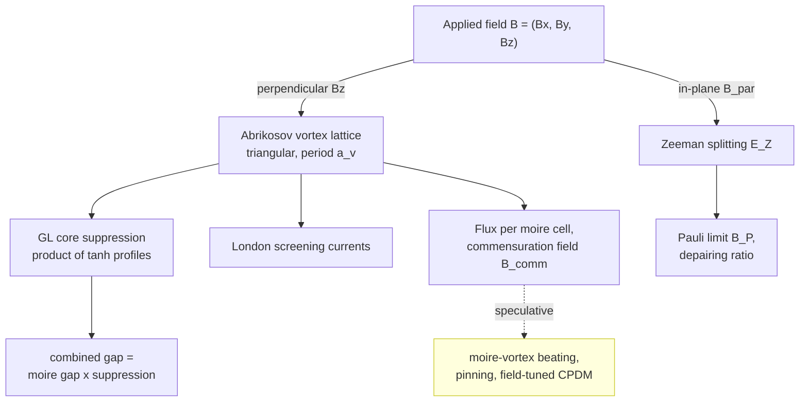
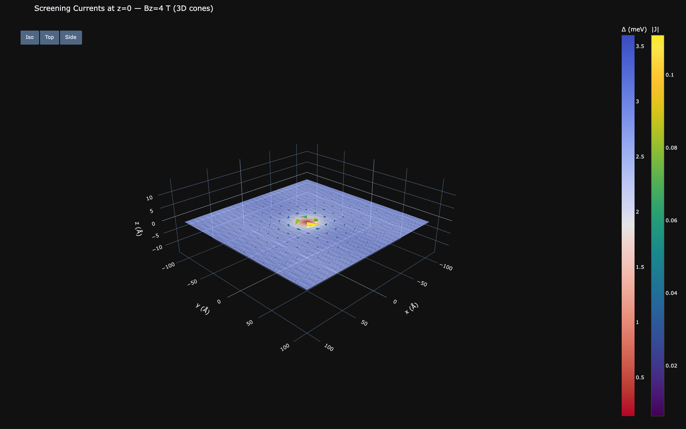

# Magnetic Field Effects

[← Theory index](README.md) · [Documentation index](../README.md)

**Status:** the vortex-lattice geometry, flux quantization, Zeeman, and screening formulas below are
textbook physics, but the in-app "About / Physics Reference" panel lists this module as a whole under
*Speculative modules*: "Abrikosov vortex lattice + Zeeman / Pauli limits — simplified models not
validated for these heterostructures." The default constants are FeTe/TI calibrations, and everything
in the [Speculative components](#speculative-components) section carries a `(SPECULATIVE)` tag in
figure titles. Treat those outputs as exploratory illustrations, not quantitative predictions.

## Overview

An external magnetic field interacts with the moire-modulated superconducting state through
channels split by orientation. A perpendicular component $B_z$ threads quantized flux through the
film, producing an Abrikosov vortex lattice whose cores locally kill the gap and whose screening
currents circulate on the London scale. An in-plane component
$\mathbf{B}_\parallel = (B_x, B_y)$ couples to spin via the Zeeman effect, pushing the system toward
Pauli pair-breaking (and feeding the topological phase criterion — see
[topological proximity](topological.md)). On top of these, the module implements clearly-flagged
speculative interactions between the vortex and moire lattices: beating, pinning, a field-tunable
CPDM amplitude, and a local susceptibility map.

In the web UI this is the Magnetic Field page (`/magnetic`,
`src/waytogocoop/pages/magnetic_field.py`) with view modes for the vortex overlay, combined gap,
screening-current cone field, susceptibility, and the (speculative) Majorana density maps; in the
desktop app it is the magnetic panel (`crates/moire-desktop/src/ui/magnetic_panel.rs`) driving the
same pipeline in `crates/moire-core/src/magnetic.rs`.

## Model

### Abrikosov vortex lattice

A type-II superconductor in a perpendicular field admits quantized flux tubes, each carrying one flux
quantum $\Phi_0 = h/(2e) = 2.068 \times 10^{-15}\,\mathrm{Wb}$, arranged in a triangular lattice
([Abrikosov 1957](../references.md#ref-abrikosov-1957)). The lattice period follows from flux
counting alone: each triangular unit cell of side $a_v$ has area $(\sqrt{3}/2)\,a_v^2$ and contains
exactly one $\Phi_0$, so $|B_z| \cdot (\sqrt{3}/2)\,a_v^2 = \Phi_0$, giving

$$
a_v = \sqrt{\frac{2\,\Phi_0}{\sqrt{3}\,|B_z|}} .
$$

At $B_z = 1\,\mathrm{T}$ this evaluates to $a_v \approx 489$ Å, shrinking as $1/\sqrt{|B_z|}$ (both
test suites pin these two facts). `generate_vortex_positions` fills the simulation viewport with the
triangular lattice — rows spaced $a_v\sqrt{3}/2$ apart, odd rows offset by $a_v/2$ — and returns an
empty set at zero field, where $a_v \to \infty$.

*Vortex cores (markers) overlaid on the moire-modulated gap field. At laboratory fields the vortex
spacing dwarfs the 36.7 Å moire period of the Sb2Te3/FeTe system.*

**Flux per moire cell.** Treating the moire superlattice cell as hexagonal with area
$A_m = (\sqrt{3}/2)\,L_m^2$, the number of flux quanta threading each cell is

$$
n = \frac{|B_z|\, A_m}{\Phi_0} .
$$

For $L_m = 36.7$ Å at 1 T this is $n \approx 0.006$ — one vortex per roughly 180 moire cells.

**Commensuration field.** Setting $a_v = L_m$ gives the field at which the two lattices match:

$$
B_{\mathrm{comm}} = \frac{2\,\Phi_0}{\sqrt{3}\, L_m^2},
$$

at which exactly one flux quantum threads each moire cell ($n = 1$). Because
$B_{\mathrm{comm}} \propto 1/L_m^2$, the short 36.7 Å moire period of Sb2Te3/FeTe puts it near
177 T — far beyond laboratory fields (the README quotes "exceeds 100 T"; the Rust test
`test_commensuration_field_large_for_small_period` asserts the same bound), so the two lattices are
strongly incommensurate at any accessible field in this system. Engineered systems with much larger
moire periods (small-angle twisted bilayers with $L_m > 100$ nm) bring $B_{\mathrm{comm}}$ into
reach. The result structs also report `is_commensurate`, true when $a_v/L_m$ is within 5% of unity.

### Vortex-core gap suppression

Each core locally destroys superconductivity over the Ginzburg-Landau coherence length $\xi$
(model default 20 Å for FeTe, `DEFAULT_COHERENCE_LENGTH` in `src/waytogocoop/config.py`). The module
uses the standard GL single-vortex profile, multiplied over all cores:

$$
s(\mathbf{r}) = \prod_{v} \tanh\!\left(\frac{|\mathbf{r} - \mathbf{r}_v|}{\xi}\right),
$$

which is 0 at each core and saturates to 1 a few $\xi$ away; as an optimization, vortices farther
than $5\xi$ from a grid point are treated as $\tanh \to 1$. The displayed field is the product of the
moire gap modulation (see [gap modulation](gap-modulation.md)) and this suppression:

$$
\Delta_{\mathrm{combined}}(\mathbf{r}) = \Delta_{\mathrm{moire}}(\mathbf{r}) \cdot s(\mathbf{r}) ,
$$

a gap landscape periodic at the moire wavelength but punctured by zeros at every vortex — the
starting geometry for the speculative vortex-core Majorana modes on the
[topological proximity](topological.md) page.

### Zeeman splitting and the Pauli limit

An in-plane field couples to the electron spin:

$$
E_Z = g\,\mu_B\,|\mathbf{B}_\parallel|,
$$

with $\mu_B = 5.788 \times 10^{-2}$ meV/T. The default $g = 30$ is the enhanced effective g-factor
for topological surface states, with a literature range of 20–50 cited in `config.py`
([Fu & Kane 2008](../references.md#ref-fu-kane-2008)); it is a model default, not a measured value
for this heterostructure. At $g = 30$ the splitting is $\approx 1.74$ meV per tesla, so in-plane
fields of a couple of tesla already produce Zeeman energies comparable to the gaps
$\Delta_1 = 2.58$ meV and $\Delta_2 = 3.60$ meV — which is why $E_Z$ is a key input to the
topological phase criterion.

Pair-breaking is quantified against the Pauli (Clogston–Chandrasekhar) paramagnetic limit, obtained
by equating the superconducting condensation energy with the normal-state spin-polarization energy:

$$
B_P = \frac{\Delta}{\sqrt{2}\,\mu_B} .
$$

For the repo's $\Delta_{\mathrm{avg}} = 3.09$ meV this gives $B_P \approx 37.8$ T. The reported
depairing ratio $|\mathbf{B}_\parallel| / B_P$ measures proximity to pair-breaking. Note that this
standard form of $B_P$ implicitly assumes $g = 2$; with the enhanced surface-state g-factor the
paramagnetic depairing field scales as $1/g$ and would be correspondingly lower — one of the
simplifications behind the module's speculative status.

### London screening currents

Each vortex is encircled by supercurrents that screen its flux. In the London limit the azimuthal
current density at distance $r$ from a core is

$$
J_\theta(r) \sim \frac{\Phi_0}{2\pi \mu_0 \lambda_L^2\, r}\, e^{-r/\lambda_L},
$$

summed vectorially over all vortices. The London penetration depth default is
$\lambda_L = 5000$ Å (~500 nm), a value typical of iron chalcogenides per the `config.py` comment
(`LAMBDA_L_FETE`). Since $\lambda_L$ vastly exceeds the default 100–200 Å simulation window, the
exponential factor is essentially 1 in view: the visible structure is the $1/r$ azimuthal falloff
and the cancellation between neighboring vortices. The code normalizes the resulting
$(J_x, J_y)$ field to peak magnitude 1 (arbitrary units) and renders it as a quiver plot in the web
UI — or, in the "currents" view mode, as a 3D cone field over the combined gap surface.

*Screening-current cone field circulating around vortex cores, drawn above the combined
(moire × vortex) gap surface.*

## Speculative components

> **SPECULATIVE** — The following phenomena use simplified models and have not been validated
> experimentally for these heterostructures. Their outputs carry a `(SPECULATIVE)` tag in figure
> titles; treat them as exploratory illustrations, not quantitative predictions.

**Moire-vortex beating.** Two incommensurate periodic lattices interfere into a secondary
superlattice with beating period

$$
L_{\mathrm{beat}} = \frac{L_m\, L_v}{|L_m - L_v|},
$$

rendered as a six-fold (hexagonal) plane-wave pattern normalized to [0, 1]
(`moire_vortex_beating`). The docstring proposes STM conductance modulation at $L_{\mathrm{beat}}$
as the observable. For Sb2Te3/FeTe at laboratory fields $L_v \gg L_m$, so
$L_{\mathrm{beat}} \approx L_m$ — a visibly distinct beating scale requires near-commensurate
periods, i.e. large-moire-period systems or fields approaching $B_{\mathrm{comm}}$.

**Commensuration pinning.** A cosine ansatz for the vortex pinning energy,

$$
E_{\mathrm{pin}} \sim \cos\!\left(\frac{2\pi L_m}{L_v}\right),
$$

peaking when $L_m/L_v$ is an integer ratio. Enhanced pinning at rational ratios would appear as
anomalies in critical current versus field (`commensuration_pinning_energy`).

**Field-tunable CPDM amplitude.** Vortex cores puncture the moire gap pattern, and the module models
the resulting loss of modulation contrast as a linear ramp to the upper critical field:

$$
A_{\mathrm{CPDM}}(B) = A_0 \left(1 - \frac{|B_z|}{B_{c2}}\right),
\qquad A_0 = e^{-\xi / L_m},
$$

where $A_0$ is the zero-field CPDM amplitude (`cpdm_amplitude` in
`src/waytogocoop/computation/superconducting.py`) and $B_{c2} = 47$ T is the model default for FeTe
(`BC2_FETE`, annotated in `config.py` as ~47 T at low temperature). The docstring is explicit that
this is a speculative ansatz with no experimental validation for moire systems.

**Local susceptibility.** A qualitative diamagnetic-response map tied to the local gap,

$$
\chi(\mathbf{r}) \sim -\frac{1}{\lambda_L^2}\left[1 - \left(\frac{\Delta(\mathbf{r})}{\Delta_{\max}}\right)^2\right],
$$

returned normalized to $[-1, 0]$ (the $1/\lambda_L^2$ prefactor drops out of the normalization).
Where the combined gap is fully suppressed — vortex cores — the response is most strongly
diamagnetic-deficient; the docstring notes that a real susceptibility would require a
self-consistent Bogoliubov–de Gennes calculation.

## Assumptions and validity

The module docstring in `src/waytogocoop/computation/magnetic.py` carries an explicit CAVEATS block
for non-FeTe/TI substrates, paraphrased here: several defaults are calibrated for the
FeTe/topological-insulator heterostructure the project was built around — `G_FACTOR_TSS` ≈ 30,
`LAMBDA_L_FETE` = 5000 Å (~500 nm), and `DEFAULT_COHERENCE_LENGTH` = 20 Å. For twisted bilayer
graphene and other non-TI substrates these are not physically appropriate — graphene sits near the
free-electron value $g \approx 2$ — and should be overridden with the UI sliders. The vortex-lattice
geometry, flux quantization, and Zeeman formulas themselves are material-agnostic and remain valid
once the constants are retuned.

Further simplifications to keep in mind:

- **Ideal lattice.** The vortex array is a perfect triangular lattice clipped to the viewport — no
  disorder, no thermal fluctuations, and no feedback from the moire potential on vortex positions
  (ironically, the speculative pinning energy is computed but never moves a vortex).
- **No self-consistency.** Suppression profiles are superimposed multiplicatively; overlapping cores
  at high fields are not solved self-consistently, and $\xi$ and $\lambda_L$ carry no field or
  temperature dependence.
- **Decoupled channels.** Perpendicular (orbital/vortex) and in-plane (spin/Zeeman) effects are
  treated independently; orbital depairing from the in-plane field is ignored, and the Pauli formula
  assumes $g = 2$ while the Zeeman energy uses the enhanced g-factor (see above).
- **Arbitrary units.** Screening currents and the susceptibility map are normalized shapes, not
  calibrated magnitudes.

## Implementation

| Concept | Python | Rust |
|---|---|---|
| Vortex period a_v | `src/waytogocoop/computation/magnetic.py`, `vortex_lattice_period` | `crates/moire-core/src/magnetic.rs`, `vortex_lattice_period` |
| Vortex positions | `generate_vortex_positions` (takes x/y extent + grid) | `generate_vortex_positions` (resolution derived downstream) |
| Core suppression | `vortex_suppression_field` (numpy meshgrid, 5 xi cutoff) | `vortex_suppression_field` (rayon-parallel, same cutoff) |
| Combined gap | `combined_gap_with_vortices` | `combined_gap_with_vortices` |
| Flux per cell, B_comm | `flux_per_moire_cell`, `commensuration_field` | same names |
| Zeeman / Pauli | `zeeman_energy`, `pauli_limiting_field`, `compute_zeeman` | same names |
| Screening currents | `screening_currents` | `screening_currents` |
| Speculative effects | `local_susceptibility`, `moire_vortex_beating`, `field_tunable_cpdm`, `commensuration_pinning_energy` | same names |
| Pipeline / display | callback in `src/waytogocoop/pages/magnetic_field.py`; figures via `create_vortex_overlay_heatmap`, `create_3d_cone_field`, `create_susceptibility_heatmap` in `src/waytogocoop/components/figure_factory.py` | `compute_magnetic_effects` in `magnetic.rs`; vortex markers via `overlay_scatter_points` / `overlay_cross_markers` in `crates/moire-desktop/src/render/overlay.rs` |

The two implementations mirror each other function-for-function. The main structural difference is
the entry point: the Dash page wires the individual functions inside its update callback, while the
Rust side bundles them into `compute_magnetic_effects`, whose `VortexLatticeResult` feeds the
desktop app's recompute pipeline. Python signatures take explicit `x`/`y` coordinate arrays; Rust
takes `resolution` + `physical_extent` and generates coordinates inline, parallelizing the
suppression product with rayon.

## References

- [A. A. Abrikosov, Sov. Phys. JETP 5, 1174 (1957)](../references.md#ref-abrikosov-1957) — the
  triangular vortex lattice of type-II superconductors; source of the $a_v$ and $B_{\mathrm{comm}}$
  geometry used throughout this module.
- [L. Fu and C. L. Kane, Phys. Rev. Lett. 100, 096407 (2008)](../references.md#ref-fu-kane-2008) —
  proximity effect and Majorana physics on TI surfaces; cited in `config.py` for the enhanced
  surface-state g-factor range (20–50) behind the g = 30 default.
- [Wang et al., Nature 652, 335 (2026); arXiv:2602.22637](../references.md#ref-wang-2026) — the
  moire-engineered CPDM experiment whose gap values and moire period anchor the worked numbers here
  (summary based on this repository's description of the paper).
- Related theory pages: [gap modulation](gap-modulation.md) (the zero-field CPDM this module
  perturbs), [topological proximity](topological.md) (vortex cores as speculative Majorana host
  sites, and the Zeeman input to the phase criterion).
