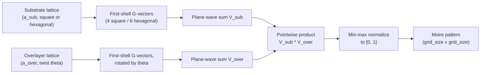

# Moire Pattern Geometry and Generation

[← Theory index](README.md) · [Documentation index](../README.md)

## Overview

A moire (moiré) pattern is the long-wavelength interference figure that emerges when two periodic structures are overlaid with a slight mismatch — either a difference in lattice constant or a relative twist angle. In crystalline bilayers this produces a *moire superlattice* whose period is much larger than either atomic lattice, introducing a new length scale that can reshape the electronic properties of the combined system.

In the heterostructure this project models, the hexagonal Te sublattice of a topological insulator (Sb2Te3, a ≈ 4.264 Å) sits on the square Te sublattice of FeTe (a ≈ 3.82 Å). Because the two layers have *different crystal symmetries*, the resulting moire superlattice is rhombic rather than square or hexagonal — a geometry treated in detail [below](#hexagonal-on-square-the-rhombic-moire). The moire pattern computed here is the input to the superconducting gap modulation Δ(r) (see [Gap modulation](gap-modulation.md)) and to the reciprocal-space analysis (see [Fourier analysis](fourier-analysis.md)).

## Model: plane-wave superposition

Each layer is represented by a scalar potential built from its first-shell reciprocal lattice vectors:

$$
V_\ell(\mathbf{r}) = \sum_{i=1}^{M_\ell} \cos\!\big(\mathbf{G}_i^{(\ell)} \cdot \mathbf{r}\big)
$$

- **Square lattice** (e.g. the FeTe Te sublattice): $M = 4$ vectors $(\pm 2\pi/a,\, 0)$ and $(0,\, \pm 2\pi/a)$.
- **Hexagonal lattice** (e.g. the Sb2Te3 Te sublattice): $M = 6$ vectors at $60^\circ$ intervals with magnitude $|\mathbf{G}| = 4\pi / (\sqrt{3}\, a)$.

A twist angle $\theta$ rotates the overlayer's G-vectors in reciprocal space. The moire pattern is the pointwise product of the two layer potentials, min–max normalized onto $[0, 1]$:

$$
P(\mathbf{r}) = \operatorname{norm}\big[\, V_{\mathrm{sub}}(\mathbf{r}) \cdot V_{\mathrm{over}}(\mathbf{r}) \,\big] \in [0, 1]
$$

The product is what makes the beat visible: expanding it with the product-to-sum identity generates terms $\cos((\mathbf{G}_i - \mathbf{G}_j')\cdot\mathbf{r})$, and whenever a substrate vector $\mathbf{G}_i$ nearly coincides with an overlayer vector $\mathbf{G}_j'$, the difference wavevector is small and the corresponding term varies slowly across the field of view — that slow envelope *is* the moire superlattice.

The default sampling window is a 200 × 200 grid spanning ±100 Å (`DEFAULT_GRID_SIZE`, `DEFAULT_PHYSICAL_EXTENT` in `src/waytogocoop/config.py`).

Every visualization surface in the project sits on top of this one computation: the web viewer (`src/waytogocoop/pages/moire_viewer.py`) renders the pattern directly, the parameter-sweep page (`src/waytogocoop/pages/parameter_sweep.py`) scans the period formulas across lattice constant and twist angle, and the desktop app re-runs the equivalent Rust pipeline on every parameter change (`crates/moire-desktop/src/app.rs`, the recompute-on-change pattern).

## Derivation: period from a twist angle

Take two copies of the *same* lattice (constant $a$), one rotated by $\theta$. A first-shell vector $\mathbf{G}$ of one layer pairs with its rotated partner $\mathbf{G}' = R(\theta)\,\mathbf{G}$ in the other. The beat term in the product of the two potentials oscillates at the difference wavevector

$$
\mathbf{Q} = \mathbf{G}' - \mathbf{G}, \qquad
|\mathbf{Q}| = 2\,|\mathbf{G}|\sin\!\left(\frac{\theta}{2}\right),
$$

the chord length between two points on a circle of radius $|\mathbf{G}|$ separated by angle $\theta$.

Each parent $\mathbf{G}_i$ maps to a beat vector $\mathbf{Q}_i$ rotated by the same construction, so the set $\{\mathbf{Q}_i\}$ forms a reciprocal star with the *same symmetry* as the parent lattice, just shrunk by the factor $|\mathbf{Q}|/|\mathbf{G}|$ (and rotated by $90^\circ + \theta/2$). The real-space moire lattice therefore obeys the same relation between lattice constant and first-shell reciprocal magnitude as the parent, and the symmetry-dependent prefactor cancels in the ratio:

$$
L = a \, \frac{|\mathbf{G}|}{|\mathbf{Q}|} = \frac{a}{2\sin(\theta/2)} \;\approx\; \frac{a}{\theta} \quad (\theta \ll 1).
$$

This is the formula behind twisted bilayer graphene: at the magic angle $\theta \approx 1.08^\circ$ with $a = 2.46$ Å it gives $L \approx 130$ Å (see [Graphene stacks](graphene-stacks.md) and [Bistritzer & MacDonald 2011](../references.md#ref-bistritzer-macdonald-2011), [Cao et al. 2018](../references.md#ref-cao-2018)).

## Derivation: period from lattice mismatch

Now take two *aligned* lattices of the same symmetry but different constants $a_1$, $a_2$. Corresponding first-shell vectors are parallel, with magnitudes $c/a_1$ and $c/a_2$, where $c$ is the symmetry constant ($c = 2\pi$ for square, $c = 4\pi/\sqrt{3}$ for hexagonal). The beat wavevector is their difference:

$$
|\mathbf{Q}| = \left|\frac{c}{a_1} - \frac{c}{a_2}\right| = c\,\frac{|a_1 - a_2|}{a_1 a_2}.
$$

The star $\{\mathbf{Q}_i\}$ again inherits the parent symmetry, so the moire period follows from the same constant $c$, which cancels:

$$
L = \frac{c}{|\mathbf{Q}|} = \frac{a_1 a_2}{|a_1 - a_2|}.
$$

Writing the fractional mismatch as $\delta = |a_1 - a_2| / a$ (with $a$ either lattice constant, to leading order) gives the compact small-mismatch form

$$
L \approx \frac{a}{\delta},
$$

which makes the two period formulas structurally identical: in both cases the moire magnification is the inverse of a small dimensionless detuning — angular ($\theta$, in radians) in one case, metric ($\delta$) in the other. For the Sb2Te3/FeTe pair, $\delta \approx 0.116$ makes the moire cell roughly an order of magnitude larger than either atomic lattice.

Note that both period formulas are independent of the lattice type — provided *both* layers share it. That proviso fails for the system this project is about.

**Combined mismatch and twist.** When both detunings are present and small, the beat-vector construction gives $|\mathbf{Q}|^2 \approx |\mathbf{G}|^2 (\delta^2 + \theta^2)$ — the two effects add in quadrature:

$$
L \approx \frac{a}{\sqrt{\delta^2 + \theta^2}}.
$$

The code does not use this combined expression; it reports simpler heuristics in the mixed case (see [Assumptions and validity](#assumptions-and-validity)).

## Hexagonal on square: the rhombic moire

For Sb2Te3 on FeTe the two G-stars have different symmetries: six hexagonal vectors at $60^\circ$ intervals with $|\mathbf{G}_{\mathrm{hex}}| = 4\pi/(\sqrt{3}\,a_{\mathrm{hex}})$, versus four square vectors at $90^\circ$ intervals with $|\mathbf{G}_{\mathrm{sq}}| = 2\pi/a_{\mathrm{sq}}$. No rotation maps one star onto the other, so the beat vectors $\mathbf{Q} = \mathbf{G}_{\mathrm{hex}} - \mathbf{G}_{\mathrm{sq}}$ come in *inequivalent* pairs: collinear G-pairs (relative angle $0^\circ$) give short beat vectors, while pairs meeting at $30^\circ$ give much longer ones. The small-$\mathbf{Q}$ set does not close into a square or hexagonal star, and the resulting superlattice is **rhombic** — a low-symmetry cell described by commensurate supercell vectors rather than by a single isotropic period.

Consequently the 1D mismatch formula is only a **scale estimate** for this system: it compares lattice-constant magnitudes along one common direction and ignores the angular mismatch between the two stars. This is exactly the caveat stated in the project README ("Key Equations" note) — the number below sets the length scale of the pattern, not its full 2D geometry.

**Worked example** (values used throughout this repo, from the reference heterostructure of [Wang et al. 2026](../references.md#ref-wang-2026)): 1 QL Sb2Te3 ($a_1 = 4.264$ Å, hexagonal Te sublattice) on 6 UC FeTe ($a_2 = 3.82$ Å, square Te sublattice):

$$
L = \frac{4.264 \times 3.82}{|4.264 - 3.82|} = \frac{16.29}{0.444} \approx 36.7 \text{ Å} \approx 3.7 \text{ nm},
$$

with a lattice mismatch of $(4.264 - 3.82)/3.82 \approx 11.6\%$. Substituting Bi2Te3 ($a_1 = 4.386$ Å) changes the mismatch and shifts the estimate to $L \approx 29.6$ Å — the tunability knob at the heart of moire engineering. Both values are locked in by unit tests in each language (`tests/test_moire.py`; `crates/moire-core/src/moire.rs`, tests `test_sb2te3_fete_period` / `test_bi2te3_fete_period`).

## Assumptions and validity

- **Rigid lattices, no relaxation.** Each layer is a fixed array of plane waves. Real moire bilayers — especially small-twist graphene — relax into domain patterns that sharpen stacking boundaries and redistribute spectral weight into higher harmonics. None of that is modeled here.
- **First-shell G-vectors only.** Only the shortest reciprocal vectors enter the sums (4 or 6 per layer). This captures the moire envelope and the primary atomic corrugation but drops all higher-order structure a real STM topograph would show.
- **Geometric interference proxy, not microscopic coupling.** The product $V_{\mathrm{sub}} \cdot V_{\mathrm{over}}$ is a visualization of where the two lattices beat in and out of registry. It is not derived from interlayer tunneling; for an electronic-structure treatment of a twisted bilayer, see the [Bistritzer–MacDonald model](bm-model.md).
- **Normalization discards absolute amplitude.** After min–max normalization, any uniform rescaling of the layer potentials leaves the displayed pattern unchanged. The Debye–Waller amplitude factors accepted by the generators (`dw_factor_substrate`, `dw_factor_overlayer`) therefore do not alter the normalized pattern itself; amplitude physics is applied downstream in the gap-modulation and isotope-effect pipeline.
- **The reported period is a heuristic.** `moire_period` is computed from the 1D formulas above, not measured from the generated pattern. In the combined mismatch-plus-twist case the two implementations use slightly different estimators: Python applies the twist formula with the average lattice constant $a_{\mathrm{eff}} = (a_1 + a_2)/2$ (documented in the `generate_moire_pattern` docstring as meaningful only for near-homo-bilayers), while Rust returns the smaller of the mismatch and twist estimates. For hexagonal-on-square pairs the number is, per the section above, a scale estimate only.

## Implementation

| Concept | Python | Rust |
|---|---|---|
| Mismatch period formula | `src/waytogocoop/computation/moire.py`, `moire_periodicity_1d` | `crates/moire-core/src/moire.rs`, `moire_periodicity_1d` |
| Twist period formula | `src/waytogocoop/computation/moire.py`, `moire_periodicity_with_twist` | `crates/moire-core/src/moire.rs`, `moire_periodicity_twist` |
| First-shell G-vectors | `_reciprocal_g_vectors_square`, `_reciprocal_g_vectors_hexagonal` | `reciprocal_g_vectors` (matches on `LatticeType`) |
| Plane-wave sum | `_plane_wave_sum` | inlined in `compute_moire` (rayon-parallel over rows) |
| Pattern generation | `generate_moire_pattern` (returns dict with x, y, pattern, moire_period) | `compute_moire` (MoireConfig to MoireResult, adds mismatch_percent) |
| Overlayer rotation | `src/waytogocoop/materials/lattice.py`, `apply_rotation` | `rotate_g_vectors`; also `Lattice2D::rotated` in `crates/moire-core/src/lattice.rs` |
| General lattice primitives | `src/waytogocoop/materials/lattice.py`, `lattice_vectors`, `reciprocal_vectors` | `crates/moire-core/src/lattice.rs`, `Lattice2D::square` / `hexagonal` / `reciprocal` |

Implementation notes:

- **Window convention differs.** Python's `physical_extent` is the *half-width* of the real-space window (default 100 Å gives a 200 Å field of view); Rust's `physical_extent` is the *full* viewport width (coordinates span ±extent/2). Callers set these consistently per app, but the same number means different windows in the two APIs.
- Degenerate inputs (equal lattice constants at zero twist) report an infinite period in both languages rather than dividing by zero.

## References

- [Wang et al., Nature 652, 335 (2026); arXiv:2602.22637](../references.md#ref-wang-2026) — the reference heterostructure (1 QL Sb2Te3 on 6 UC FeTe) whose rhombic moire geometry and mismatch-driven tunability this module models. Claims about this paper follow this repository's description of it.
- [Bistritzer & MacDonald, PNAS 108, 12233 (2011)](../references.md#ref-bistritzer-macdonald-2011) — continuum theory of twist-angle moire bands; the source of the twist-period geometry used above.
- [Cao et al., Nature 556, 43 (2018)](../references.md#ref-cao-2018) — magic-angle twisted bilayer graphene, the flagship application of the twist formula.

Related theory pages: [Gap modulation](gap-modulation.md) · [Fourier analysis](fourier-analysis.md) · [Graphene stacks](graphene-stacks.md) · [Bistritzer–MacDonald model](bm-model.md)
