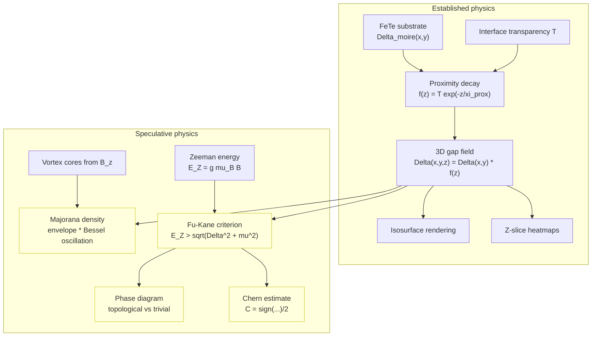
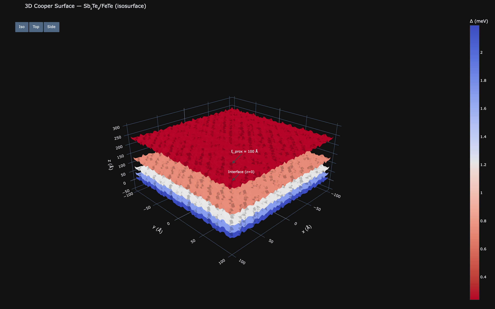
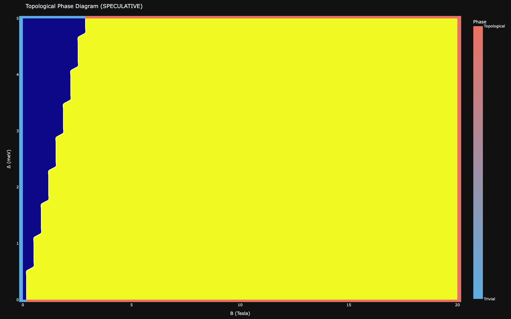
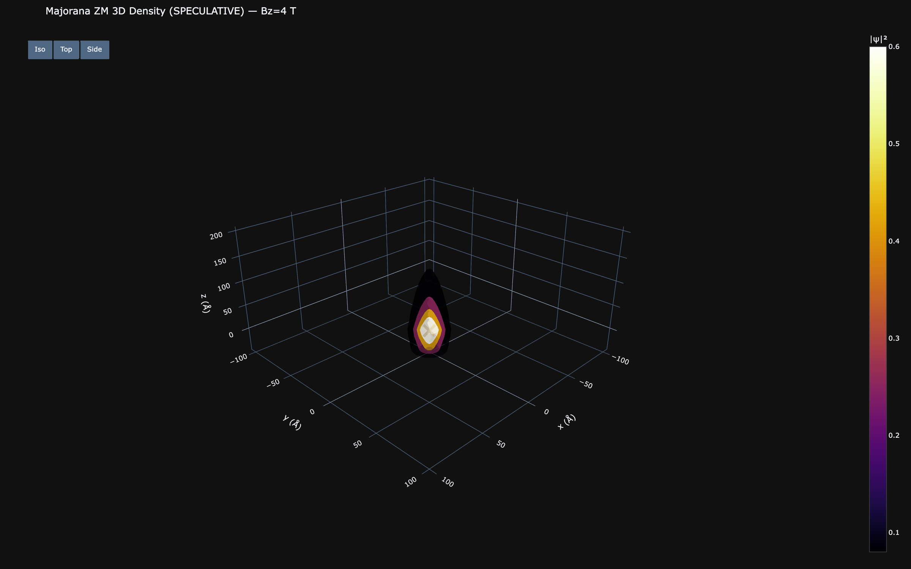

# Topological Proximity, Majorana Modes & Phase Diagrams

[← Theory index](README.md) · [Documentation index](../README.md)

**Status: SPECULATIVE.** The proximity decay profile itself is standard physics, but the 3D gap construction is a deliberately simplified (separable) model, and the Majorana zero-mode, phase-diagram, Chern-number, and magnetoelectric components are speculative 3D extensions of the 2D model. Speculative outputs carry a **(SPECULATIVE)** tag in the app UI. Treat them as exploratory illustrations, not quantitative predictions.

## Overview

The topological insulator overlayer in this heterostructure (Sb2Te3 or Bi2Te3) hosts symmetry-protected Dirac surface states ([Hasan & Kane 2010](../references.md#ref-hasan-kane-2010)) with a linear dispersion

$$
E(k) = \hbar v_F |k|,
$$

where the model default is $v_F = 5 \times 10^5$ m/s (`V_F_TI` in `src/waytogocoop/config.py`). When such a surface sits on a superconductor, Cooper pairs leak across the interface and induce a pairing gap in the surface states. Fu and Kane showed that this combination — conventional s-wave pairing projected onto a single helical Dirac cone — behaves like an effectively spinless $p_x + ip_y$ superconductor, whose vortex cores can bind Majorana zero modes ([Fu & Kane 2008](../references.md#ref-fu-kane-2008)).

That is the motivation for this module. The reference experiment ([Wang et al. 2026](../references.md#ref-wang-2026), as described in this repository's README) grows 1 quintuple layer of Sb2Te3 on 6 unit cells of FeTe and observes two gap scales, $\Delta_1 = 2.58$ meV and $\Delta_2 = 3.60$ meV, spatially modulated by the moire lattice. The code here takes that moire-modulated 2D gap $\Delta(x,y)$ (see [Gap modulation](gap-modulation.md)) and asks: how does it extend into the third dimension, and what topological phenomena might live on top of it?

## Model

### BTK interface transparency profile

The z-dependence of the induced gap uses a Blonder–Tinkham–Klapwijk-style interface transmission ([Blonder, Tinkham & Klapwijk 1982](../references.md#ref-blonder-1982)) attached to an exponential decay into the topological insulator:

$$
f(z) =
\begin{cases}
1 & z < 0 \quad \text{(inside the superconductor)} \\
T & z = 0 \quad \text{(at the interface)} \\
T \, e^{-z/\xi_{\mathrm{prox}}} & z > 0 \quad \text{(into the topological insulator)}
\end{cases}
$$

Model defaults (see `ProximityConfig` in `src/waytogocoop/computation/topological.py` and `src/waytogocoop/config.py`):

| Parameter | Default | Range / note |
|---|---|---|
| Interface transparency T | 0.8 | UI range 0.1–1.0; dimensionless BTK transmission |
| Proximity length xi_prox | 100 A | literature range 50–200 A (5–20 nm penetration) for proximity into TIs; model default, not a measured value for this heterostructure |
| z grid | 50 slices, -50 A to +300 A | negative z = inside FeTe, positive z = into the TI |

Implemented as `proximity_decay_profile` (`src/waytogocoop/computation/topological.py`; Rust: `crates/moire-core/src/topological.rs`). Both implementations reject invalid inputs — `xi_prox <= 0` or `T` outside (0, 1] — with a `ValueError` in Python and an `Err(String)` in Rust (propagated through `compute_gap_3d` and `compute_cooper_surface_3d`); the error cases are pinned by tests on both sides.

### 3D gap construction

The 2D moire-modulated gap is extended into a volume by simple multiplication:

$$
\Delta(x, y, z) = \Delta_{\mathrm{moire}}(x, y) \cdot f(z),
$$

and, when a perpendicular magnetic field punches vortices through the sample (see [Magnetic field effects](magnetic.md)), the vortex suppression field is applied before the z-extension:

$$
\Delta(x, y, z) = \Delta_{\mathrm{moire}}(x, y) \cdot \mathrm{suppression}(x, y) \cdot f(z).
$$

This is `gap_3d` and `cooper_surface_3d` in Python (`compute_gap_3d` / `compute_cooper_surface_3d` in Rust). The result is a `(n_z, n_y, n_x)` volumetric field rendered on the `/proximity3d` page as an isosurface (moire columns fading into the TI, punctured by vortex tubes) or as z-slice heatmaps.

The separable ansatz is the simplification to keep in mind: the lateral pattern is assumed to be rigidly carried into the TI with only an overall amplitude decay. A real proximity calculation would be self-consistent — including the inverse proximity effect (the TI weakening the superconductor near the interface), lateral spreading of the induced order parameter, and the momentum structure of the surface states.

## Fu-Kane criterion and phase diagram

An in-plane or perpendicular field contributes a Zeeman energy

$$
E_Z = g \, \mu_B \, B,
$$

with the model default $g = 30$ for topological surface states (`G_FACTOR_TSS`; literature range roughly 20–50). The simplified Fu-Kane-style criterion used here classifies the surface as

$$
\text{topological:} \quad E_Z > \sqrt{\Delta^2 + \mu^2}, \qquad
\text{trivial:} \quad E_Z < \sqrt{\Delta^2 + \mu^2},
$$

where $\mu$ is the chemical potential measured from the Dirac point (default 0). `phase_diagram_sweep` scans a $(B, \Delta)$ grid, evaluates $E_Z$ at each point, and returns a binary phase map; the `/phase` page renders it with the experimental $\Delta_{\mathrm{avg}}$ marked for reference. With the defaults ($g = 30$, $\mu = 0$), $E_Z \approx 1.74$ meV/T, so the model phase boundary at $\Delta_{\mathrm{avg}} = 3.09$ meV sits near $B \approx 1.8$ T — a consequence of the default parameters, not a prediction for the real material.

> **SPECULATIVE** — The Fu-Kane criterion and Chern number estimates use simplified models. Actual topological protection depends on subtler conditions (disorder, finite-size effects, orbital contributions).

## Majorana zero modes

> **SPECULATIVE** — The Majorana probability density uses a qualitative envelope model. The exact wavefunction requires a full Bogoliubov-de Gennes calculation, which is beyond the scope of this tool.

In the topological phase, each vortex core is expected to bind a Majorana zero mode. Rather than solving the Bogoliubov-de Gennes equations, the module draws a qualitative probability-density envelope around every vortex position $r_v$:

$$
|\psi_{\mathrm{MZM}}(r)|^2 \sim \sum_v e^{-2|r - r_v|/\xi_M} \, J_0\!\left(k_F |r - r_v|\right)^2,
$$

where

- $\xi_M = 50$ A is the Majorana localization length (`XI_MAJORANA_DEFAULT` — speculative; the real value depends on microscopic details such as vortex-core structure and spin-orbit strength),
- $k_F = 0.1$ A$^{-1}$ is an approximate surface Fermi wavevector (`K_F_TSS`; depends on Fermi-level tuning),
- $J_0$ is the zeroth-order Bessel function, giving the Friedel-like oscillatory tail,
- the factor of 2 in the exponent is because this is a probability *density*, which decays twice as fast as the wavefunction.

The result is normalized so the global peak equals 1. A 3D variant, `majorana_probability_density_3d` (Python only), multiplies the in-plane density by $e^{-2|z|/\xi_{\mathrm{prox}}}$ anchored at the interface, for the volumetric overlay on the `/magnetic` page.

This tells you *where* Majorana modes would sit (localized within about $\xi_M$ of each vortex core, with Bessel oscillations in the tails) — a plausible guide to STM search regions — but nothing quantitative about their energies, hybridization between neighboring vortices, or protection. All of that requires a self-consistent Bogoliubov-de Gennes treatment.

## Chern number estimate

The module also reports a heuristic topological invariant:

$$
C = \frac{1}{2}\,\mathrm{sign}\!\left(E_Z^2 - \Delta^2 - \mu^2\right),
$$

giving $C = +1/2$ in the topological phase, $C = -1/2$ in the trivial phase, and $C = 0$ exactly on the boundary (`chern_number_estimate`). This is a sign heuristic tied to the same criterion as the phase diagram, not an actual Chern number — a real calculation integrates Berry curvature over the Brillouin zone. A nonzero value would manifest as a quantized anomalous Hall plateau.

## Topological magnetoelectric polarization

Independently of the superconductivity, a 3D topological insulator carries an axion angle $\theta = \pi$, which produces a quantized magnetoelectric response ([Qi, Hughes & Zhang 2008](../references.md#ref-qi-2008)): an applied magnetic field induces a surface polarization

$$
P = \frac{e^2}{2\pi h}\, \theta \, B, \qquad \theta = \pi,
$$

returned in C/m² by `topological_magnetoelectric_polarization`. This is a bulk signature of the TI, observable through anomalous Hall magnetotransport; the implementation is a one-line evaluation of the formula and is flagged speculative because nothing here checks whether the assumptions behind it (unbroken bulk gap, controlled surface conduction) hold for this heterostructure.

## Assumptions & validity

- **Separable 3D model.** $\Delta(x,y,z) = \Delta(x,y) f(z)$ ignores the inverse proximity effect, lateral spreading, self-consistency, and the band structure of the TI. The proximity decay is standard physics; the specific 3D field is an illustration.
- **Model defaults, not measurements.** $g = 30$, $\xi_{\mathrm{prox}} = 100$ A, $\xi_M = 50$ A, $k_F = 0.1$ A$^{-1}$, and $v_F = 5 \times 10^5$ m/s are plausible defaults with literature-range comments in `src/waytogocoop/config.py`; none is a measured value for Sb2Te3/FeTe.
- **Simplified criterion.** The Fu-Kane inequality is applied pointwise with a uniform $\mu$ and a scalar $E_Z$; disorder, finite-size effects, and orbital depairing are not modeled.
- **Envelope Majorana model.** Peak positions are meaningful (vortex cores); amplitudes, energies, and inter-vortex hybridization are not.
- As the in-app About panel puts it: topological proximity / Majorana modes are "3D extensions of the 2D model," and speculative outputs should be treated as **exploratory illustrations, not quantitative predictions**.

## Implementation

| Concept | Python — src/waytogocoop/computation/topological.py | Rust — crates/moire-core/src/topological.rs |
|---|---|---|
| Decay profile f(z) | `proximity_decay_profile` | `proximity_decay_profile` |
| 3D gap extension | `gap_3d` | `compute_gap_3d` |
| Dirac dispersion | `dirac_dispersion` | `dirac_dispersion` |
| Full 3D Cooper surface | `cooper_surface_3d` | `compute_cooper_surface_3d` |
| Majorana density (2D) | `majorana_probability_density` | `majorana_probability_density` |
| Majorana density (3D) | `majorana_probability_density_3d` | — (Python only) |
| Fu-Kane phase index | `topological_phase_index` | `topological_phase_index` |
| Phase diagram sweep | `phase_diagram_sweep` | `phase_diagram_sweep` |
| Chern estimate | `chern_number_estimate` | `chern_number_estimate` |
| Magnetoelectric polarization | `topological_magnetoelectric_polarization` | `topological_magnetoelectric_polarization` |

Where these surface in the UIs:

- `src/waytogocoop/pages/proximity_3d.py` (`/proximity3d`) — isosurface and z-slice views built on `gap_3d`, plus a TI surface Dirac cone plot from `dirac_dispersion` with the proximity-induced gap marked.
- `src/waytogocoop/pages/phase_diagram.py` (`/phase`) — `phase_diagram_sweep` with sliders for B range, Delta range, mu, and g, plus a dual-axis extras figure driven by `chern_number_estimate` and `topological_magnetoelectric_polarization`.
- `src/waytogocoop/pages/magnetic_field.py` (`/magnetic`) — Majorana 2D/3D overlays on the vortex lattice.
- Rust desktop: the Majorana overlay is wired through `crates/moire-desktop/src/app.rs` and `ui/magnetic_panel.rs`.
- `chern_number_estimate` and `topological_magnetoelectric_polarization` drive the `/phase` extras figure and `dirac_dispersion` the `/proximity3d` cone plot on the web; all three remain library-level on the Rust desktop (computed and tested, not yet wired to a panel).

Minor cross-language differences: the `xi_prox <= 0` handling noted above, and the Rust Bessel $J_0$ is an Abramowitz & Stegun polynomial approximation (accurate to about $10^{-6}$) versus SciPy's `j0` in Python.

## References

- [Fu & Kane 2008](../references.md#ref-fu-kane-2008) — proximity-induced superconductivity on a TI surface; Majorana modes in vortices. The theoretical basis for this module.
- [Blonder, Tinkham & Klapwijk 1982](../references.md#ref-blonder-1982) — BTK interface transmission model behind the transparency parameter T.
- [Hasan & Kane 2010](../references.md#ref-hasan-kane-2010) — review of topological insulators and their Dirac surface states.
- [Qi, Hughes & Zhang 2008](../references.md#ref-qi-2008) — topological field theory; axion angle theta = pi and the magnetoelectric response.
- [Wang et al. 2026](../references.md#ref-wang-2026) — the primary paper (Nature 652, 335; arXiv:2602.22637); Sb2Te3/FeTe heterostructure and gap values, as described in this repository.
