# User Guide

[← Documentation index](README.md)

This guide walks through both front-ends of the tool page by page: the Python web UI (Plotly Dash) and the Rust native desktop app (egui/eframe). Both share the same physics — moire pattern generation, gap modulation, FFT analysis, and the speculative isotope/magnetic/topological/graphene modules — so numbers you read off one should match the other. The reference experiment is [Wang et al., Nature 652, 335 (2026)](references.md#ref-wang-2026) (arXiv:2602.22637).

Conventions used throughout:

- Lengths are in Angstrom (Å), fields in Tesla, gaps in meV.
- Outputs from speculative modules carry a **(SPECULATIVE)** tag in the figure title. Treat them as exploratory illustrations, not quantitative predictions (the in-app About panel says the same).
- Defaults quoted below come from `src/waytogocoop/config.py` (Python) and the `Default` impls in `crates/moire-core` / `crates/moire-desktop` (Rust).

## Web UI (Plotly Dash)

Launch:

```bash
python -m venv .venv && source .venv/bin/activate
pip install -e ".[dev]"
python -m waytogocoop.app        # serves http://localhost:8050
```

The navbar links the nine pages in the order documented below, plus a Light/Dark theme toggle (persisted in browser local storage). Every figure is a Plotly graph: use the modebar (top-right of each figure) to zoom, pan, rotate 3D views, or download a PNG.

**Shared controls.** Most pages compose the same two sidebar cards — a material selector (`src/waytogocoop/components/material_selector.py`, `create_material_selector`) and a parameter panel (`src/waytogocoop/components/parameter_panel.py`, `create_parameter_panel`). Hover the ⓘ badge next to a label for the built-in help text. Their controls and defaults:

| Control | Meaning | Default |
|---|---|---|
| Substrate | Substrate material (FeTe, Graphene, Graphene-AB, Graphene-ABA) | FeTe |
| Overlayer | Overlayer material (Sb2Te3, Bi2Te3, Sb2Te, Graphene) | Sb2Te3 |
| Twist angle (deg) | "Rotation of the overlayer relative to the substrate. 0° for an aligned heterostructure; small angles (<5°) produce long-period moire patterns." | 0.0 (range 0–30) |
| Grid size | "Number of samples per axis (NxN). Higher values produce sharper features but increase compute time." | 200 (range 50–1000) |
| Physical extent (Å) | "Side length of the real-space window in Ångstrom. Choose large enough to contain at least one moire period." | 100 (range 10–1000) |

Out-of-range numeric inputs turn red with an inline error and are ignored by the computation callbacks.

**URL sharing.** Every page with controls — Moire Viewer, Parameter Sweep, Fourier Analysis, Substrate Comparison, Magnetic Field, 3D Proximity, Phase Diagram, and Graphene — syncs its full control state into the address bar as `?q=<base64>` (`src/waytogocoop/state.py`, `register_url_sync`). Copy the URL at any moment to share the exact configuration; opening it restores every bound control. The Fourier page's "Open in Moire Viewer" button uses the same encoding to hand its material/parameter state to the viewer (`src/waytogocoop/components/controls.py`, `open_in_viewer_button`).

### Home (`/`)

Landing page: a short description of the moire-CPDM physics, the material database rendered as a table (formula, lattice type, lattice constants, space group, role), and shortcut cards to the Viewer, Sweep, and Fourier pages. The collapsed "About / Physics Reference" accordion at the bottom (`src/waytogocoop/pages/home.py`) is the canonical statement of which modules are validated (moire patterns, gap modulation, FFT analysis) and which are speculative (isotope effects, topological proximity/Majorana, vortex lattice + Zeeman/Pauli), with a link to the reference paper.

### Moire Viewer (`/viewer`)

The main interactive page: a real-space moire pattern figure and, below it, the superconducting gap modulation Delta(r) computed from the same pattern (`src/waytogocoop/pages/moire_viewer.py`; computation in `src/waytogocoop/computation/moire.py`, `generate_moire_pattern`, and `src/waytogocoop/computation/superconducting.py`, `gap_modulation`).


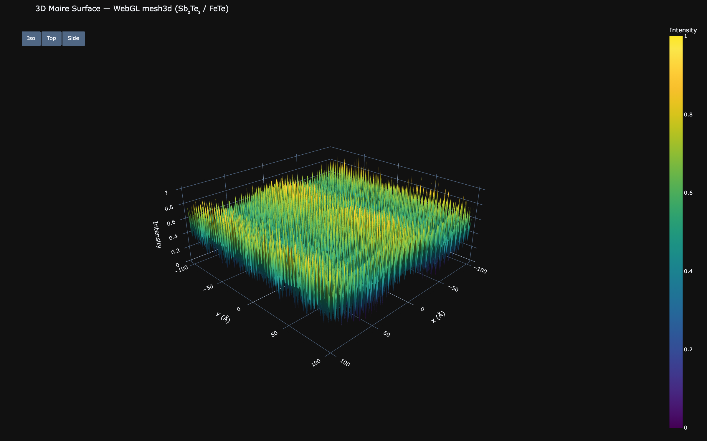

Presets (dropdown at the top of the sidebar): **Sb₂Te₃ / FeTe (paper default)**, **Bi₂Te₃ / FeTe aligned**, **Sb₂Te / FeTe (small moire)**, **Twisted Sb₂Te₃ (θ=1.2°)**. "Reset defaults" restores the paper-default configuration.

Page-specific controls, in addition to the shared table above:

| Control | Meaning | Default |
|---|---|---|
| View Mode | Heatmap, Contour Map, or 3D Surface for both figures | Heatmap |
| Isotope Effects: Enable | Turn on the speculative isotope pipeline | off |
| Exotic isotopes (HIGHLY SPECULATIVE) | Switch widening every mass slider from the stable span to a hypothetical exploration range (Fe 45–75, Te 105–145, Sb 103–140, C 8–22 amu), with starred marks for the synthetic isotopes (e.g. "55Fe*"); opens a red warning that outputs are what-if illustrations only | off |
| Fe / Te / Sb mass (amu) | Effective atomic mass per element; slider spans the stable isotopes (marks at each mass number), or the exotic range when the switch is on | natural-abundance average |
| C mass (amu) | Carbon mass; shown only when a graphene-family material is selected | natural-abundance average |
| Nearest-isotope readouts | Small text under each mass slider classifying the current value: "≈ 126Te" (stable), "≈ 55Fe* (t½ ≈ 2.7 y)" (synthetic, with half-life), or "hypothetical mass — no known isotope" | — |
| BCS isotope exponent (α) | Gap scaling exponent; slider marks at −0.18 (inverse), 0.4 (consensus), 0.5 (BCS), 0.81 (FeSe) | 0.4 (range −0.5 to 1.0) |
| Show natural vs. enriched comparison | Overlays difference contours on the heatmap and prints the period shift | off |

**Reading the output.** The "Computed Info" card reports the effective lattice constants (isotope-shifted when enabled), the lattice mismatch in percent, the twist angle, the moire period in Å, and the CPDM amplitude — the dimensionless factor exp(−ξ/L_moire) with coherence length ξ = 20 Å by default (`cpdm_amplitude`). With isotopes enabled, the isotope card lists the lattice shifts δa, modified gap values Delta_1/Delta_2, modified coherence length, Debye-Waller factors, the isotope-shifted Debye temperatures ("Θ_D (sub/over)" in Kelvin), and the ¹²⁵Te nuclear-spin fraction — all tagged speculative. The gap figure's color scale spans the modulation between the model defaults Delta_1 = 2.58 meV and Delta_2 = 3.60 meV.

Theory: [moire patterns](theory/moire-patterns.md), [gap modulation](theory/gap-modulation.md), [isotope effects](theory/isotope-effects.md).

### Parameter Sweep (`/sweep`)

Sweeps a single parameter — overlayer lattice constant or twist angle — and plots the resulting moire period and CPDM amplitude on shared axes (`src/waytogocoop/pages/parameter_sweep.py`; formulas `moire_periodicity_1d` and `moire_periodicity_with_twist` in `src/waytogocoop/computation/moire.py`).

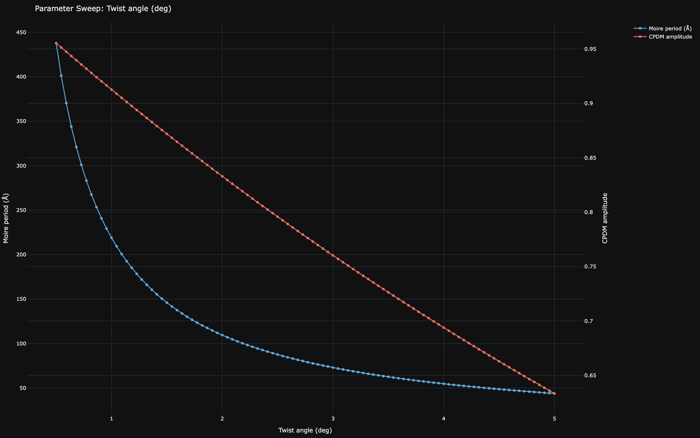

| Control | Meaning | Default |
|---|---|---|
| Sweep parameter | Overlayer lattice constant (Å) or Twist angle (deg) | Overlayer lattice constant |
| Substrate | Substrate lattice constant a (Å) | 3.82 |
| Range start / Range end | Sweep interval (Å or deg, matching the selected parameter) | 3.9 / 5.0 |
| Number of points | Sample count along the sweep | 100 (range 10–500) |
| Run Sweep | Manually re-trigger the sweep — it also recomputes automatically whenever any control above changes | — |

When sweeping the twist angle, remember to change the range to degrees (e.g. 0.1–5). Diverging periods near zero mismatch/twist are capped at 1.1× the largest finite value so the plot stays readable.

**Reading the output.** The period curve shows where the moire superlattice becomes long-wavelength (mismatch → 0 or twist → 0); the CPDM amplitude curve rises with period as exp(−ξ/L). In lattice-constant mode, dashed vertical lines mark the actual overlayer materials (Sb2Te3, Bi2Te3, Sb2Te) that fall inside the range, and a "Material Reference Points" card lists their exact period and CPDM values.

Theory: [moire patterns](theory/moire-patterns.md), [gap modulation](theory/gap-modulation.md).

### Fourier Analysis (`/fourier`)

2D FFT of the moire pattern with automatic peak detection (`src/waytogocoop/pages/fourier_analysis.py`; `fft_2d` and `identify_peaks` in `src/waytogocoop/computation/fourier.py`). Controls are the shared material + parameter cards plus a **Peak Detection** card.

| Control | Meaning | Default |
|---|---|---|
| Threshold (fraction of max power) | Minimum peak power as a fraction of the spectrum maximum; lower values surface more (weaker) peaks | 0.3 (range 0.05–0.95) |

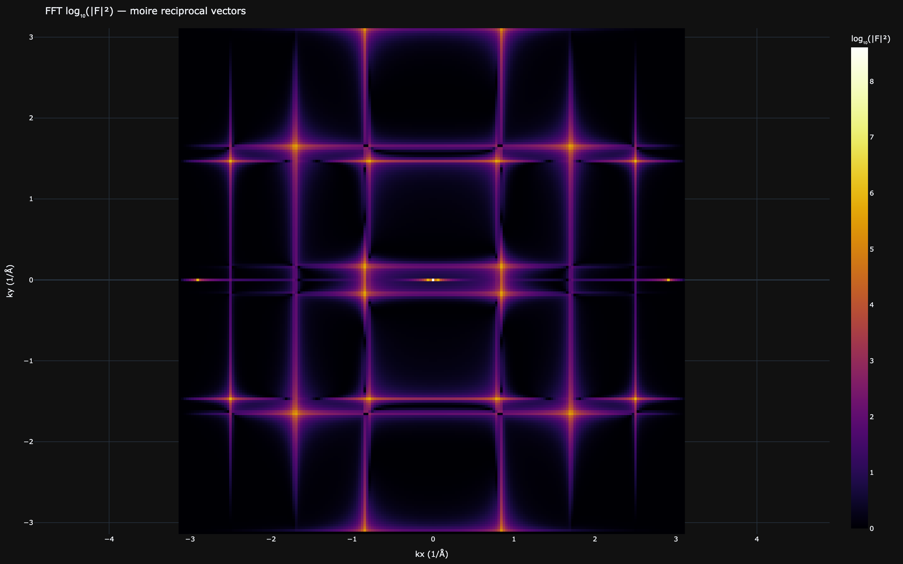

**Reading the output.** The heatmap is the log-scaled power spectrum in (kx, ky), centered on k = 0; the moire superlattice shows up as satellite peaks close to the origin (long real-space period = small |k|), while the atomic lattices produce rings further out. The "Detected Peaks" table lists up to 20 peaks with kx, ky (1/Å) and amplitude — a peak at |k| corresponds to a real-space period 2π/|k|. Drag the threshold slider down to reveal weaker satellites or up to keep only the dominant peaks. The "Open in Moire Viewer" button jumps to `/viewer` with the same material and parameter state.

Theory: [Fourier analysis](theory/fourier-analysis.md).

### Substrate Comparison (`/comparison`)

All three telluride overlayers on FeTe side by side with one set of shared controls (`src/waytogocoop/pages/substrate_comparison.py`). Each of the three columns (Sb2Te3, Bi2Te3, Sb2Te) shows its moire pattern, its gap map, and an info block.

| Control | Meaning | Default |
|---|---|---|
| View Mode | Heatmap, Contour Map, or 3D Surface (applies to all six figures) | Heatmap |
| Twist angle (deg) | Applied to every overlayer | 0.0 (range 0–30) |
| Grid size | Samples per axis, lower default keeps 6 figures responsive | 100 (range 50–500) |
| Physical extent (Å) | Real-space window | 100 (range 10–1000) |

**Reading the output.** Compare the three info blocks: lattice mismatch (%), moire period (Å), and CPDM amplitude. Sb2Te3 (a = 4.264 Å) gives the ~36.7 Å period of the paper configuration; Bi2Te3's larger mismatch shortens it to ~29.6 Å, while Sb2Te (a = 4.272 Å) sits at ~36.1 Å, nearly on top of Sb2Te3 — the page makes the mismatch-period-amplitude trade-off directly visible.

Theory: [moire patterns](theory/moire-patterns.md).

### Magnetic Field (`/magnetic`)

**Status: includes SPECULATIVE features.** The Abrikosov vortex lattice, Zeeman/Pauli limits, susceptibility, and Majorana views are simplified models not validated for these heterostructures — exploratory illustrations, not quantitative predictions.

Vortex lattices and field effects layered on top of the moire gap modulation (`src/waytogocoop/pages/magnetic_field.py`; `src/waytogocoop/computation/magnetic.py`). The sidebar adds the magnetic panel (`src/waytogocoop/components/magnetic_panel.py`, `create_magnetic_panel`) to the shared cards.


| Control | Meaning | Default |
|---|---|---|
| Perpendicular field Bz (T) | Sets the vortex density | 0.5 (range 0–20) |
| Upper critical field Bc2 (T) | Field scale for the speculative field-tunable CPDM and the Field Response sweeps | 47 (range 1–100) |
| Bx / By (T) | In-plane field components (collapsible "In-Plane Field" section); drive the Zeeman readouts | 0.0 (range −10 to 10) |
| Proximity coherence length (Å) | Decay length into the TI; feeds the Majorana 3D view (collapsible "Proximity / Topological" section) | 100 (range 10–500) |
| Interface transparency | SC-TI interface coupling factor | 0.8 (range 0.1–1.0) |
| g-factor | Effective g-factor of the topological surface states | 30 (range 1–50) |
| View | Vortex Lattice, Combined Gap, Screening Currents (3D cones), Susceptibility (speculative), Majorana 2D (speculative), Majorana 3D (speculative), Moire-Vortex Beating (speculative) | Vortex Lattice |

The g = 30 default and Bc2 = 47 T Pauli/upper-critical scales are model defaults from `config.py` with literature ranges noted in its comments (g ~ 20–50 for TI surface states), not measured values for this heterostructure.

**Reading the output.** The info panel reports: **vortex period** a_v (triangular Abrikosov lattice spacing at the chosen Bz; "No vortices" when Bz = 0); **flux per moire cell** in units of Phi_0 = h/2e; **commensuration field** (the Bz at which a_v matches the moire period L_m); the ratio **a_v / L_m** (watch for values near 1 — moire-vortex beating); **Zeeman energy** g·mu_B·|B_parallel| in meV; the **Pauli limit** field; and the **depairing ratio** |B_parallel|/B_P. Below those, three speculative field-response scalars: **A_CPDM(Bz)** (the field-suppressed CPDM amplitude at the current Bz), **E_pin(Bz)** (the commensuration pinning energy), and **L_beat** (the moire-vortex beat period when finite).

**Moire-Vortex Beating view (SPECULATIVE).** Selecting this view renders the interference superlattice between the moire and vortex lattices, with the beat period L_beat = L_m·a_v / |L_m − a_v| in the title. At Bz = 0 there are no vortices, so the beating is undefined and the figure shows a "No vortices at Bz = 0 — beating undefined (SPECULATIVE)" placeholder.

**Field Response (SPECULATIVE).** Two line plots sit below the info panel, updated for every view: **Field-Tunable CPDM** — A_CPDM(B) = A_CPDM(0)·(1 − |B|/Bc2) swept from 0 to Bc2, with dashed markers at the current Bz and at Bc2 — and **Commensuration Pinning Energy** — E_pin ~ cos(2π L_m / a_v(B)) over the same range, with a dashed marker at Bz and a baseline at zero. Both are simplified ansätze, not quantitative predictions.

Theory: [magnetic field](theory/magnetic.md), [topological](theory/topological.md).

### 3D Proximity (`/proximity3d`)

**Status: SPECULATIVE.** The 3D extension of the 2D gap model (exponential decay into the topological insulator) is a qualitative proximity model — exploratory illustration, not a quantitative prediction.

Volumetric view of the Cooper-pair density decaying from the interface (z = 0) into the TI (`src/waytogocoop/pages/proximity_3d.py`; `gap_3d` in `src/waytogocoop/computation/topological.py`). The grid is capped at 80×80 in-plane with 30 z-layers spanning −50 to 300 Å to keep the volume render responsive.


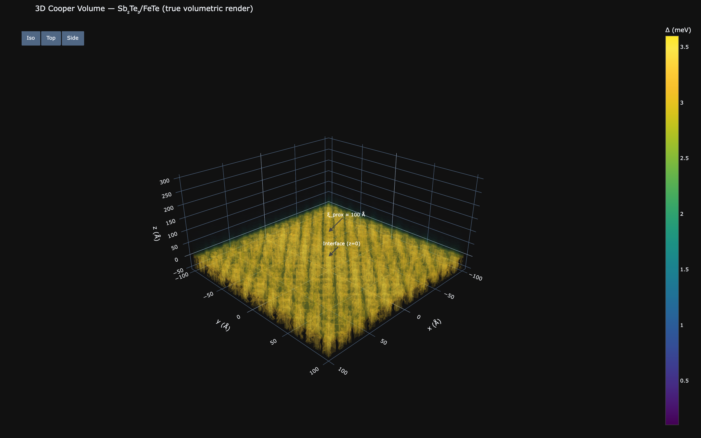

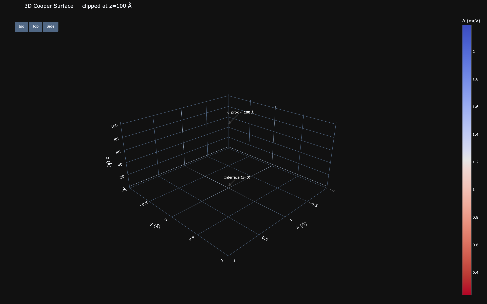

| Control | Meaning | Default |
|---|---|---|
| Proximity coherence length (Å) | Decay length xi_prox of the gap into the TI | 100 (range 10–500) |
| Interface transparency | Multiplies the gap at the interface | 0.8 (range 0.1–1.0) |
| View mode | Isosurface, Volume, or Z-Slice (2D heatmap) | Isosurface |
| Iso-level range | Isosurface band as a fraction of the peak gap | [0.2, 0.8] |
| Clip plane (z, Å) | Removes z > clip_z so the interior is visible; at 300 (max) clipping is off | 300 (off) |
| Play iso sweep | Animates the iso-range midpoint 0.25 → 0.75 and back (350 ms ticks) | paused |
| Z-slice index | Which of the 30 layers the 2D view shows | 15 (range 0–29) |

**Reading the output.** Annotations mark the interface plane (z = 0) and the height z = xi_prox inside the volume. The middle figure is the z-decay profile — the laterally averaged gap versus z, which should fall to 1/e of its interface value at z ≈ xi_prox. Below it, the **TI Surface Dirac cone** plots the two branches ±E(k) = ±ħ·v_F·|k| of the topological surface state (established physics, `dirac_dispersion`), with dashed lines at ±(Delta_avg · transparency) marking the proximity-induced gap and dotted lines at ±k_F. The info card echoes xi_prox, transparency, the z-range, the selected slice, the iso-range converted to meV (with the peak Delta), the clip state, and the gap min/max on the current slice. This page has full URL sharing: every control above is encoded in `?q=`.

Theory: [topological](theory/topological.md).

### Phase Diagram (`/phase`)

**Status: SPECULATIVE.** The page banner says it directly: "All results on this page are SPECULATIVE — simplified Fu-Kane criterion, qualitative only."

Topological phase boundaries in the (B, Delta) plane plus a vortex-moire commensuration sweep (`src/waytogocoop/pages/phase_diagram.py`; `phase_diagram_sweep` in `src/waytogocoop/computation/topological.py`).


| Control | Meaning | Default |
|---|---|---|
| B field range (T) | Sweep bounds for the field axis | 0–100 |
| Delta range (meV) | Sweep bounds for the gap axis | 0.1–10.0 |
| Chemical potential mu (meV) | Shifts the phase boundary | 0.0 (range −5 to 5) |
| g-factor | Zeeman coupling used in the criterion | 30 (range 1–50) |
| Grid resolution | Points per axis of the phase map | 80 (range 20–200) |

**Reading the output.** The colormap classifies each (B, Delta) point as trivial or topological under the simplified criterion; the dashed horizontal line marks the model's Delta_avg = 3.09 meV (midpoint of Delta_1 = 2.58 and Delta_2 = 3.60 meV) so you can read off the crossing field for the modeled heterostructure. The second figure sweeps the vortex lattice period a_v against B and marks the moire period L_m — where the curves cross, vortex and moire lattices are commensurate. The third figure (dual-axis, SPECULATIVE) plots the **Chern number** estimate C(B) = ½·sign(E_Z² − Delta² − mu²) as a step curve on the primary axis — with a "C flips" marker at the field where it changes sign — and the **magnetoelectric polarization** P(B) = (e²/2πh)·θ·B (θ = π) on the secondary axis.

Theory: [topological](theory/topological.md), [magnetic field](theory/magnetic.md).

### Graphene (`/graphene`)

**Status: partially SPECULATIVE.** Pattern generation, band structure, DOS, and strain maps are standard models; the flat-band gap/Tc dome and the pseudo-field pair-breaking are qualitative toy models, not fits to experiment — the sidebar flags them in red and the figure titles carry the (SPECULATIVE) tag.

Stacked and twisted graphene: moire patterns for six stackings, Bistritzer-MacDonald band structures and DOS, heterostrain, supermoire on a telluride overlayer, and curved-sheet pseudo-magnetic fields (`src/waytogocoop/pages/graphene.py`; computation in `src/waytogocoop/computation/graphene.py`, `bm_model.py`, `curvature.py`).


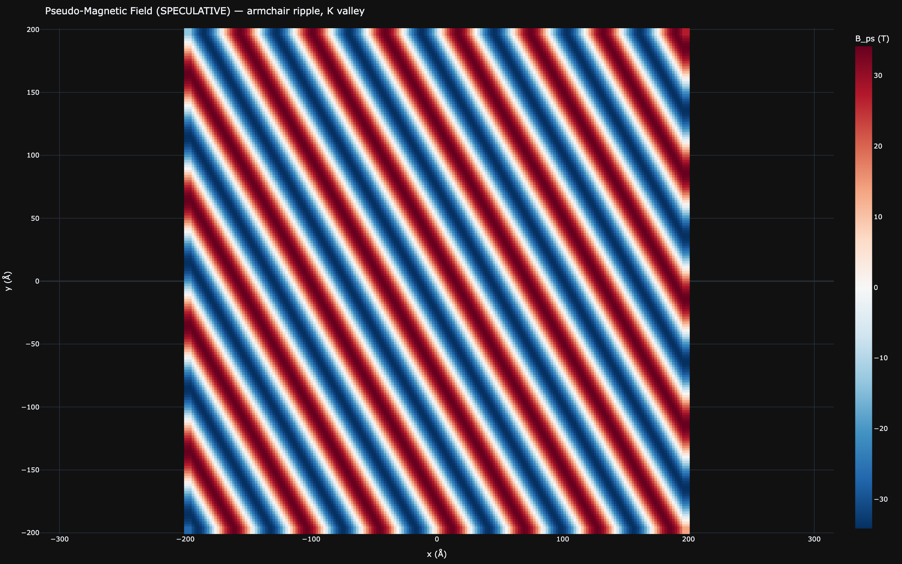

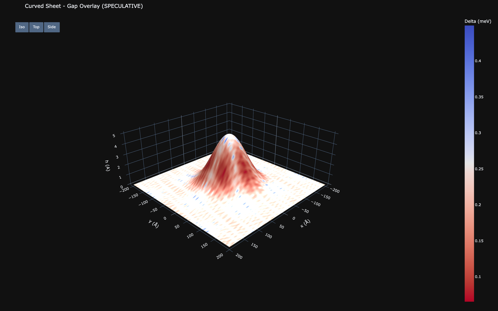


Presets: **Magic-angle TBG** (θ = 1.08°, also the page default), **Alt-twist trilayer** (θ = 1.52°), **AB (Bernal) bilayer**, **Armchair ripple pseudo-field**, **Gaussian bump (curved 3D)**, **Supermoire on Sb2Te3**, **Magic-angle flat bands**.

| Control | Meaning | Default |
|---|---|---|
| Stacking | AA, AB (Bernal), Twisted bilayer, ABA, ABC, Alternating-twist trilayer | Twisted bilayer |
| Filling \|nu\| | "Electron filling of the flat band per moire unit cell; superconductivity domes around \|nu\| ~ 2-3 in magic-angle graphene." | 2.4 (range 0–4) |
| Honeycomb 2-atom basis | Include the B-sublattice term in each layer potential | off |
| Valley | K or K-prime (flips the pseudo-field sign) | K |
| Heterostrain eps (%) | Uniaxial strain on layer 2; distorts the moire lattice anisotropically | 0 (range 0–2) |
| Strain angle (deg from zigzag) | Tension axis of the heterostrain | 0 (range 0–90) |
| Supermoire overlayer | None, or a telluride (Sb2Te3, Bi2Te3, Sb2Te) under the stack | None |
| Interface twist (deg) | Twist between graphene stack and supermoire overlayer | 0 (range 0–30) |
| Twist angle (deg) | Stack twist; slider marks at the magic angles 1.08 and 1.52 | 1.08 (range 0–5, step 0.01) |
| Grid size | Samples per axis | 200 |
| Physical extent (Å) | Real-space window (~3 moire periods at the magic angle) | 200 (range 10–400) |
| Curvature geometry | Flat, Gaussian bump, Sinusoidal ripple, Cylindrical bend, Spherical cap | Flat |
| Height h0 (Å) | Curvature amplitude | 5 (range 0–20) |
| Feature size (Å) | One slider feeding sigma / wavelength / radius, whichever the geometry uses | 100 (range 20–2000) |
| Orientation phi (deg from zigzag) | Ripple/bend axis; marks at 0 = zigzag, 30 = armchair | 30 (range 0–60) |
| Warp moire pattern | Back-reaction of the curvature displacement on the stack (SPECULATIVE) | off |
| View mode | Pattern, Gap map (speculative), Pseudo-field (speculative), Strain map, Curved 3D sheet, FFT, Band structure, DOS | Pattern |

**Reading the output.** The Computed Info card reports: the stack and layer count; the Dirac velocity ratio v*/v_F (→ 0 at the magic angle); the moire period — or, in supermoire mode, three periods (stack, interface, supermoire beat); the flat bandwidth W in meV (Bands/DOS views only); theta_magic for the current layer count (≈ 1.08° bilayer, ≈ 1.52° trilayer); the speculative Delta_max, Tc, and dome factor; the CPDM amplitude computed with the TBG coherence length ξ = 500 Å; and the curvature readouts max |B_ps| (T) and max strain. The lower figure is always the flat-band curve: v*/v_F and the speculative gap dome versus twist angle, with your current angle marked. Band structure and DOS use the BM continuum model ([Bistritzer & MacDonald 2011](references.md#ref-bistritzer-macdonald-2011)) and are bilayer-only — trilayer stacks show the bilayer result with "bilayer approximation" flagged in the title. The filling dome around nu ≈ 2–3 follows [Cao et al. 2018](references.md#ref-cao-2018). Full URL sharing is wired for every control.

Theory: [graphene stacks](theory/graphene-stacks.md), [BM model](theory/bm-model.md), [curvature](theory/curvature.md).

## Desktop app (Rust egui)

Launch:

```bash
cargo build --release
cargo run --release -p moire-desktop
```

The window has three regions: a **menu bar** on top, a scrollable **sidebar** on the left (all controls plus the Results info panel), and the **viewport** filling the rest. Everything follows a recompute-on-change pattern (`crates/moire-desktop/src/app.rs`, `MoireApp`): touch a control and the full pipeline (isotope effects → moire → density → FFT → textures) reruns on the next frame. Parameter state persists between sessions via eframe storage; `Ctrl+R` returns everything to defaults.

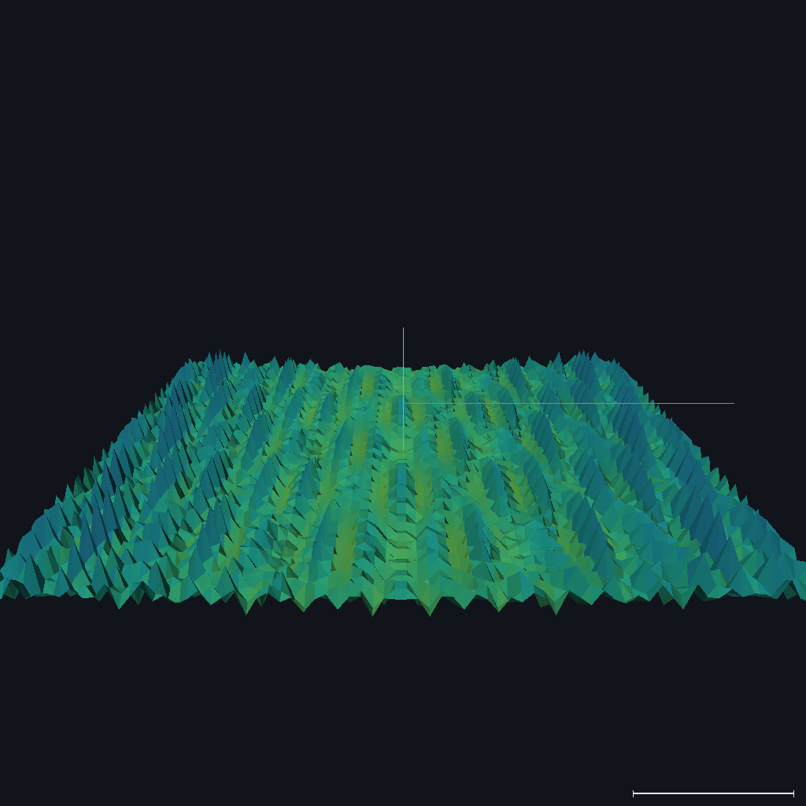

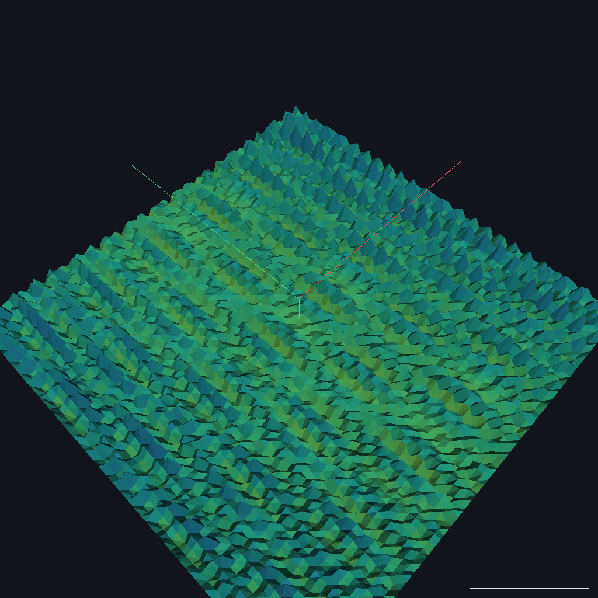

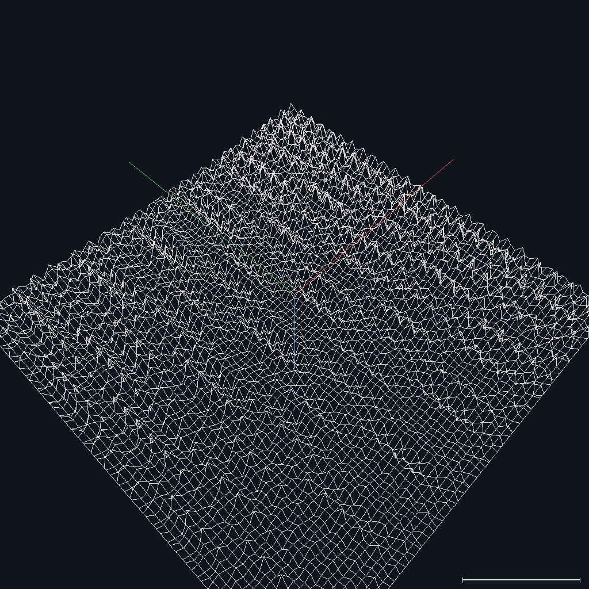

### Viewport: tabs and 2D/3D toggle

Six tabs (`crates/moire-desktop/src/ui/viewport.rs`, `show_viewport`): **Moire Pattern**, **Density Modulation**, **Fourier Spectrum**, **Magnetic**, **Cooper 3D**, **Graphene** — followed by a **2D / 3D** toggle that applies to every tab. 2D shows a colormapped texture with axes and a colorbar; 3D renders the same field as a height surface (drag to rotate, scroll to zoom). The Cooper 3D tab renders the proximity-decayed gap through four views (see the Cooper 3D panel below); the web app's isosurface and volume renders remain web-only, but the z-slice browser and decay profile now have desktop equivalents. The Fourier tab additionally offers a collapsible **FFT peaks (top 20)** table below the spectrum (kx, ky, |k|, wavelength, amplitude). In the Graphene tab, the Bands and DOS views are drawn as line plots (egui_plot) rather than textures, so the 2D/3D toggle is inert there — as is the Cooper 3D tab's Decay profile view.

### Sidebar controls

Top to bottom (`crates/moire-desktop/src/ui/sidebar.rs`, `show_sidebar`):

| Control | Meaning | Default |
|---|---|---|
| Theme | Dark / Light | Dark |
| Substrate / Overlayer | Material dropdowns showing formula and lattice constant | FeTe / Sb2Te3 |
| Twist angle (deg) | Overlayer rotation | 0.0 (range 0–30) |
| Resolution | Grid: 128×128, 256×256, or 512×512 | 256×256 |
| Viewport size (Å) | Physical extent of the window | 200 (range 50–500) |
| World axes + scale bar | 3D overlay toggle | on |
| Wireframe | 3D mesh overlay toggle (also key `W`) | off |
| Clip plane | Checkbox + slider removing the surface above a height (normalized coordinates) | off |
| Delta 1 / Delta 2 (meV) | The two gap values of the modulation model | 2.58 / 3.60 (range 0.5–10) |
| Modulation amplitude | Relative strength of the moire modulation | 0.15 (range 0–1) |

A **Colormap** combo (Auto / viridis / inferno / coolwarm / plasma) sits with the 3D overlay toggles: Auto keeps each view's semantic default (viridis for unsigned fields, coolwarm for signed, inferno for FFT), while a named choice overrides every texture, 3D surface, comparison thumbnail, and colorbar globally.

Below these sit the isotope, magnetic, Cooper 3D, and graphene panels, then a **Compare All Substrates** button that opens the Substrate Comparison window (all overlayers vs. the current substrate, moire + density thumbnails with mismatch and period) and a **Phase Diagram (speculative)** button that opens the Fu-Kane phase-diagram window — a binary topological/trivial map over (B, Delta) with the experimental Delta_avg marked, B-max / Delta-max / mu sliders, and a vortex-period commensuration plot underneath. The **Results** panel at the bottom of the sidebar mirrors the web info cards: materials, mismatch, moire period, viewport/resolution, gap range, and — when active — magnetic, Cooper 3D, and isotope readouts, each speculative group labeled in red.

### Isotope panel

`crates/moire-desktop/src/ui/isotope_panel.rs`, `show_isotope_panel`. Enable checkbox ("Enable (Speculative)"), then an "Exotic isotopes (HIGHLY SPECULATIVE)" checkbox — off by default; switched on, it widens the mass sliders from the stable spans to the hypothetical exploration ranges (Fe 45–75, Te 105–145, Sb 103–140, C 8–22 amu) and shows a red what-if warning; switched off again, out-of-range overrides are clamped back into the stable spans. Then Fe and Te mass sliders; an Sb slider appears only for Sb-bearing overlayers and a C slider only when graphene is selected. Every mass slider carries a nearest-isotope readout — "≈ 56Fe (stable)", "≈ 55Fe* (t½ ≈ 2.7 y)" for a synthetic match, or "hypothetical mass — no known isotope". The BCS isotope exponent α slider (range −0.5 to 1.0, default 0.4) matches the web panel, and "Reset to natural" clears all overrides and switches exotic mode off. Results feed the same speculative readouts (δa, modified gaps, coherence length, Debye-Waller factors, Θ_D (sub/over) Debye temperatures, ¹²⁵Te spin fraction) in the Results panel.

### Magnetic panel

`crates/moire-desktop/src/ui/magnetic_panel.rs`, `show_magnetic_panel`. Bz slider (0–20 T, default 0 in the desktop app), a **View** selector for the Magnetic tab — **Combined gap** (coolwarm), **Susceptibility** (local chi in plasma), **Screening |j|** (Meissner current magnitude in plasma) — collapsible In-Plane Field (Bx, By) and Topological (g-factor) sections, plus "Show vortex cores" — cross markers overlaid on the Magnetic tab's texture. The g-factor slider feeds the Zeeman computation directly. The proximity sliders (xi_prox, interface transparency) and the Majorana checkbox moved to the Cooper 3D panel, which is where they take effect. When a graphene substrate is selected the panel shows a warning that the defaults (g ≈ 30, ξ = 20 Å) are FeTe/TI-calibrated. Readouts: vortex period, flux per moire cell, a COMMENSURATE badge when a_v matches the moire period, Zeeman energy, and Pauli limit.

### Cooper 3D panel

`crates/moire-desktop/src/ui/cooper_panel.rs`, `show_cooper_panel` — controls for the Cooper 3D tab. A view combo selects **Interface gap** (the vortex-suppressed gap at z = 0⁺, i.e. transparency × combined gap), **Z-slice** (the same field at any depth, chosen with a z-slice slider; slices are normalized against the full 3D range, so they visibly dim into the TI), **Decay profile** (an egui_plot line of f(z) with dashed markers at the interface and at xi_prox), and **Majorana** (SPECULATIVE — the z-resolved vortex-bound probability density; requires Bz > 0 for vortices to exist). Below the combo sit the **Proximity xi** and **Interface transparency** sliders (moved here from the Magnetic panel — they shape f(z)), the z-slice slider (active only in the Z-slice view), the "Show Majorana density (speculative)" checkbox, and a **Play** button that sweeps the z-slice through the volume at ~3 Hz — the desktop counterpart of the web's animated iso sweep.

### Graphene panel

`crates/moire-desktop/src/ui/graphene_panel.rs`, `show_graphene_panel`. Mirrors the web page: the same seven presets, stacking dropdown, honeycomb-basis checkbox, valley selector, twist slider (0–5°) with a **Magic angle** button that snaps to theta_magic for the current layer count, heterostrain magnitude/angle, filling slider, and collapsible Supermoire Substrate (overlayer + interface twist, with the three periods printed) and Sheet Curvature (SPECULATIVE) sections — the curvature section shows only the parameters its geometry uses (amplitude+sigma, amplitude+wavelength, or radius, plus orientation for ripple/bend) and the warp checkbox. The view selector offers **Pattern, Gap, B_ps, Strain, FFT, Bands, DOS** (seven views — the web's "Curved 3D sheet" mode is instead reached by choosing a non-flat geometry and switching the viewport to 3D, which renders the height field colored by the active view). Readouts: flat bandwidth and flat-remote gap (Bands/DOS), moire period, v*/v, speculative Delta and Tc, max |B_ps|.

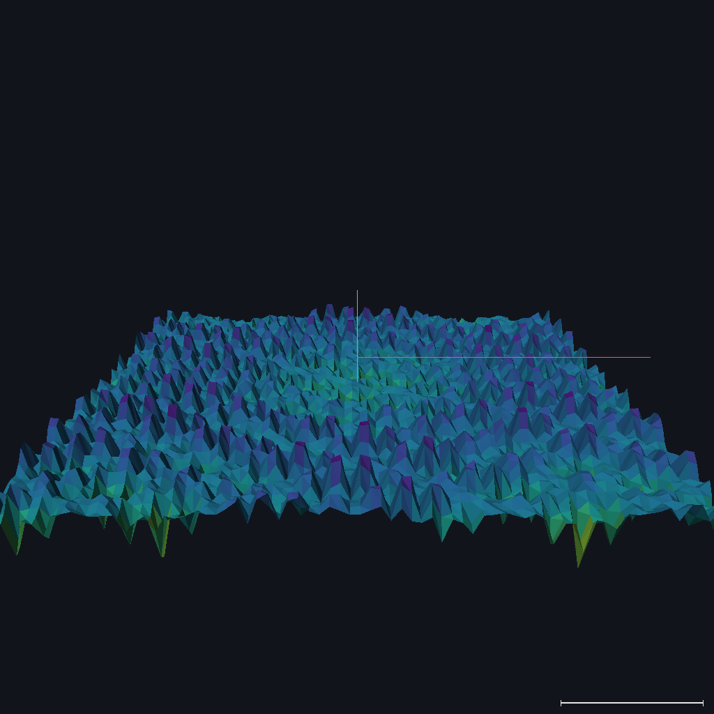

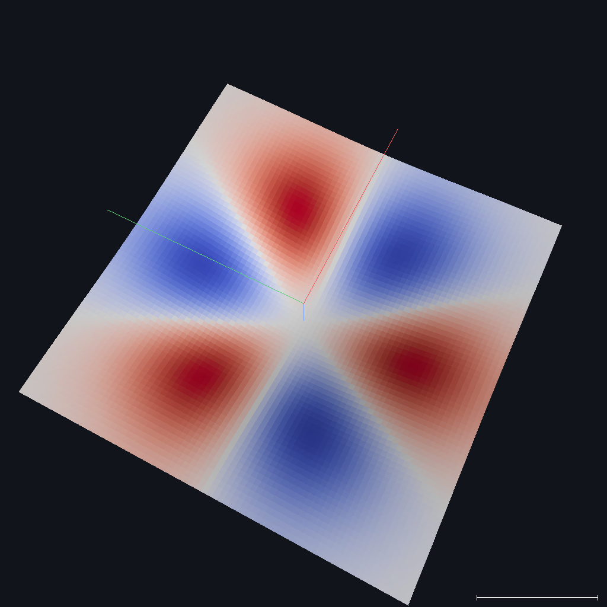

### Menus and keyboard shortcuts

Menu bar (`crates/moire-desktop/src/ui/menu.rs`): **File** (Save screenshot…, Quit), **Edit** (Reset parameters), **View** (Reset 3D camera, Wireframe, World axes + scale bar, Switch to light/dark), **Help** (About…, a link to arXiv:2602.22637). The About dialog (F1) mirrors the web About accordion — validated vs. speculative modules and this shortcut list.

| Shortcut | Action |
|---|---|
| Ctrl+S (Cmd+S on macOS) | Save screenshot — a timestamped PNG (`moire-screenshot-<unix-time>.png`) in the working directory; the current 3D view is re-rendered at 1024×1024. Bands/DOS/decay-profile line plots are not captured. |
| Ctrl+R (Cmd+R) | Reset parameters to defaults (theme is kept) |
| R | Reset the 3D camera |
| W | Toggle the wireframe overlay |
| F1 | Open the About dialog |

## Web vs desktop feature matrix

Built from the Dash pages versus the desktop tab and view lists (`crates/moire-desktop/src/ui/viewport.rs`, `graphene_panel.rs`).

| Feature | Web (Dash) | Desktop (egui) |
|---|---|---|
| Moire pattern (2D / 3D) | `/viewer` — heatmap, contour, 3D surface | Moire Pattern tab + 2D/3D toggle |
| Gap modulation map | `/viewer`, `/comparison` | Density Modulation tab; Delta_1/Delta_2/amplitude sliders |
| FFT power spectrum | `/fourier` | Fourier Spectrum tab |
| FFT peak table | yes (kx, ky, amplitude) | Fourier tab — collapsible "FFT peaks (top 20)" table (kx, ky, \|k\|, lambda, amplitude) |
| Parameter sweep | `/sweep` | not available |
| Substrate comparison | `/comparison` page | Compare All Substrates window |
| Vortex lattice overlay | `/magnetic` (Vortex Lattice / Combined Gap views) | Magnetic tab + Show vortex cores |
| Screening currents, susceptibility | `/magnetic` (3D cones, chi heatmap) | Magnetic tab — Susceptibility (chi) + Screening (\|j\|) views (2D plasma magnitude maps; no 3D cones) |
| Moire-vortex beating + field-response sweeps (speculative) | `/magnetic` (Beating view, Field-Tunable CPDM + pinning sweeps, Bc2 slider) | not available |
| Majorana density (2D / 3D, speculative) | `/magnetic` views | Cooper 3D tab, Majorana view — z-resolved, vortex-bound (speculative) |
| 3D proximity volume (isosurface / volume / z-slice, decay profile) | `/proximity3d` | Cooper 3D tab — interface gap + Z-slice browser + decay profile (no isosurface/volume) |
| TI surface Dirac cone plot | `/proximity3d` | not available |
| Topological phase diagram | `/phase` | Phase Diagram window (speculative) — Fu-Kane (B, Delta) map + commensuration plot |
| Chern number / magnetoelectric sweep (speculative) | `/phase` | not available |
| Isotope effects (speculative) | viewer isotope panel | sidebar isotope panel |
| Graphene stacks, heterostrain, supermoire | `/graphene` | Graphene tab + panel |
| BM band structure and DOS | `/graphene` Bands/DOS views (Plotly) | Graphene Bands/DOS views (egui_plot) |
| Curved-sheet 3D render | "Curved 3D sheet" view mode | non-flat geometry + 3D toggle (height colored by active view) |
| Presets | `/viewer` (4), `/graphene` (7) | graphene panel (7) |
| Shareable state | URL `?q=` on every control page | no URLs; state persists across sessions |
| Wireframe / world axes | no | yes (3D view) |
| Clip plane | `/proximity3d` z-clip | 3D clip-plane slider |
| Animated iso sweep | `/proximity3d` Play button | Cooper 3D tab — Play z-sweep (Z-slice view) |
| Colormap picker | no (per-figure Plotly defaults) | sidebar global override: Auto / viridis / inferno / coolwarm / plasma |
| Screenshot export | Plotly modebar camera button | Ctrl+S timestamped PNG |
| Light/dark theme | navbar toggle | sidebar toggle / View menu |
